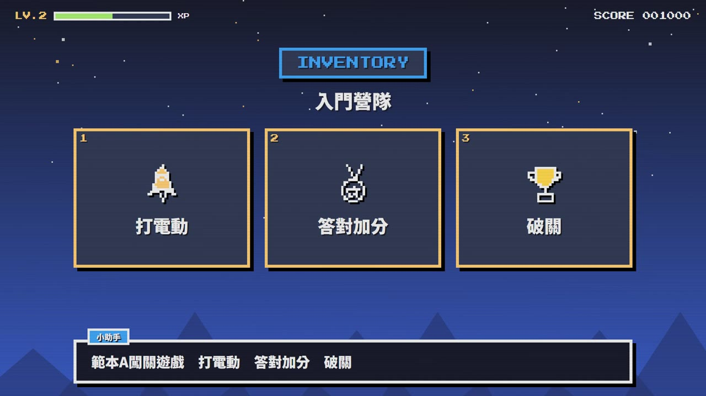
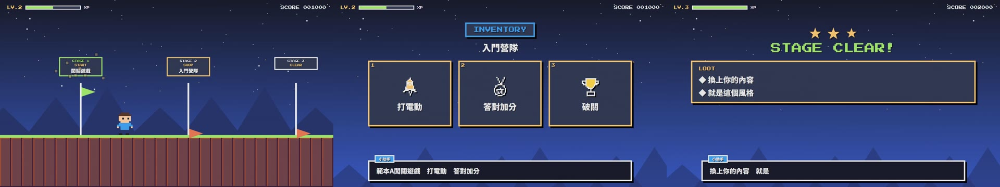

# 範本A_闖關遊戲：闖關遊戲 LEVEL UP

> 來源：2026-10-01 招生片三概念試做，使用者評價「這三個提示詞的風格流程都很好」。
> 觸發：使用者說「**範本A／闖關遊戲範本／遊戲風**」，或在選範本時選 A。
> 用法：**丟任何文本 → 拆成共用場景語彙 → 選本範本 → 產出同一風格的影片**。

## 長什麼樣（10 秒示範片）

[](示範/示範.mp4)



示範片：[`示範/示範.mp4`](示範/示範.mp4)（主題「測試範本」、edge-tts 配音）；示範分鏡：[`示範/storyboard.json`](示範/storyboard.json)；沒有這個 skill 時用：[`提示詞_範本A完整版.md`](提示詞_範本A完整版.md)

## 適合
國中生、程式入門、營隊、需要「好玩」的內容；榮耀類內容氣勢較弱

## 原始提示詞（招生片版本，逐字保存）
```
Create a 60-second recruitment video programmatically, coded and rendered with whatever tools you need.
The entire video IS a retro video game: the viewer is the player, a "Lv.1 Rookie" junior-high student, and joining the
IT Department of Example Senior High School (範例高中資訊科) is pressing START. Title: "你的未來，自己寫".

1. Press Start: a pixel title screen, blinking "PRESS START", a coin-insert sound; the player sprite drops in.
2. World Map: a side-scrolling world map with four stages — C/Python, AI Vision, ESP32 IoT, Robot Arm.
   The player walks between stage nodes; each clear pops "SKILL UNLOCKED" with an XP bar filling and a level-up jingle.
3. Boss Stage: the National Skills Competition — medals drop as loot; a "HALL OF FAME" leaderboard reveals
   10 WorldSkills competitors and 12 national golds; regional gold/silver/bronze sweep shown as a 3-star clear.
4. Next World: 26 admissions to national universities appear as unlocked new worlds (Taiwan Tech, YunTech, NKUST).
5. Continue?: "NEW GAME: 範例資訊科 — YES ▶", the cursor blinks on YES.

Visuals: chunky pixel art, parallax side-scrolling camera, HUD with HP/XP bars, score popups, screen shake on hits.
Audio: upbeat 8-bit chiptune at 150 BPM with crisp coin, jump, power-up and level-up sound effects on every event.
Narration: a friendly senior student, like a game guide talking to the new player.
```

## 流程與品檢（2026-10-06，所有範本一致）
不改畫面風格，只是讓影片更順、少出錯：
1. **逐字審稿**：`final_qa/review_prep.py storyboard.json` → Claude 逐句審 → `final_qa/review_report.py` → 給使用者 ⛔
2. **分鏡預覽**：`make_video.py storyboard.json --template A --preview`（edge-tts 暫配、不花額度）→ `qa/分鏡預覽/分鏡預覽.html` ⛔
3. **正式出片**：`make_video.py storyboard.json --template A`，自動跑唸法標準題 → 建置（Gemini 過壞音檔關卡）→ AI 耳朵 → 兩個 AI 交叉聽 → 句內停頓 → 版面品檢
4. 概念忠實度（下表）→ 抽檢回報加進品檢規則 → 收工紀錄（`進度.md`）

配音：專案自己的 `.env.local` 有 `GEMINI_API_KEY` 才用 Gemini Flash TTS，否則 edge-tts。

## 概念忠實度檢查（交付前逐項打勾，用「連續格」看，不是只看單格）
自動品檢只管技術正確（重疊、出界、唸錯），**管不到「這還是不是原本那個概念」**。以下是本範本的招牌特徵，少一項就不算這個範本。

| # | 招牌特徵（來自原始提示詞） | 怎麼驗 | 通用版現況 |
|---|---|---|---|
| 1 | 整支影片就是一款復古遊戲：像素畫、HUD（HP／XP 條）、分數彈出 | 總覽圖 | ✅ |
| 2 | 世界地圖：主角在關卡節點之間**走過去**（橫向捲動、視差） | 場景交界抽連續格，要看到移動 | ✅ 2026-10-02 補上：每個場景＝地圖上一關，上一關旁白講完→插旗變綠＋金幣→主角走到下一關→像素溶解進場（`walkWindows`） |
| 3 | 每個事件都有音效（金幣、跳、升級） | 聽 | ✅ `tpl_sfx.py A` |
| 4 | SKILL UNLOCKED／XP 條填滿／升級、打擊時畫面震動 | 連續格 | ✅ 2026-10-02 補上：過關跳 SKILL UNLOCKED、LV／XP／SCORE 依過關數成長（之前 XP 只是時間進度條） |
| 6 | 像素畫：圖示是**像素圖**、主角開場掉進畫面 | 總覽圖 | ✅ 2026-10-02 修正：圖示改 `PixelIcon`（線稿點陣化），之前是彩色 emoji |
| 5 | 字幕＝RPG 對話框 | 總覽圖 | ✅ |

## 範本設定
| 項目 | 設定 |
|---|---|
| Composition | `TemplateA`（`engine/template/src/tpl/TemplateA.tsx`） |
| 配樂 | `"music": {"genre": "chiptune", "bpm": 140, "key": "C"}` |
| 旁白 | 學長姐口吻；招生用女聲曉臻 +15%，教學用男聲雲哲 +18%；`narrator` 決定對話框名牌 |
| 字幕 | RPG 對話框（名牌＋逐字打出） |
| 音效 | 投幣、升級和弦、錯誤蜂鳴、過關號角（`tpl_sfx.py A`） |
| 切點 | `"snapBars": true`（場景補足整數小節） |

## 場景對應
| 場景 | 畫面 |
|---|---|
| title | WORLD 開場：字掉落彈跳＋PRESS START |
| scenario | QUEST 任務板：大圖示＋任務清單逐項打勾，最後一項紅色「?!」 |
| definition | NEW ITEM GET!：道具卡，標亮字閃金光，註解＝道具屬性 |
| cards | INVENTORY：鎖住的「?」格依旁白解鎖、噴金幣 |
| vs | VS 對戰：ENEMY／HERO／PLAYER |
| stat | STATUS：數字一格一格跳 |
| quiz | QUIZ BATTLE：游標跳動→CORRECT! +100 XP |
| recap | STAGE CLEAR!：LOOT＋RESULT＋NEXT ▶ |
| qaEnd | FINAL BOSS QUIZ：血條倒數 |

## 執行步驟
1. **拿到文本**（講義、旁白稿、活動資料）→ 依 [`../範本風格_場景語彙.md`](../範本風格_場景語彙.md) 拆成 9 種場景，寫出 `storyboard.json`（旁白一行一句）。
2. **給使用者審文本** ⛔（場景表：型別、畫面重點、旁白）。
3. 建專案並一行做完：
   ```bash
   python <skill>/engine/scripts/new_project.py <專案> --no-install   # 再 npm install 或 junction 共用 node_modules
   cd <專案> && cp <你的分鏡>.json storyboard.json
   python <skill>/engine/scripts/make_video.py storyboard.json --template A --name <片名>
   ```
   `make_video.py` 會：同步 skill 最新範本程式 → 檢查圖示都有線稿 → 建置 → 範本音效 → 版面＋旁白品檢（有必修就停）→ 算圖 → 響度 −14 → 成片品檢，最後印出本範本的概念忠實度清單。
4. 看 `qa/pre_A.md`、`qa/post_A.md` 與總覽圖；**再用連續格逐項核對下面的「概念忠實度檢查」**。

## 參考實作
- 招生片完整版（為那支片客製的場景）：`concepts/levelup/（招生片完整版 LevelUpFull、1-1 教學 LessonLevelUp）`
- 通用渲染器（任何文本）：`engine/template/src/tpl/TemplateA.tsx`
- 範例分鏡：`engine/examples/template_1-3_storyboard.json`（同一份分鏡三個範本都能用）
