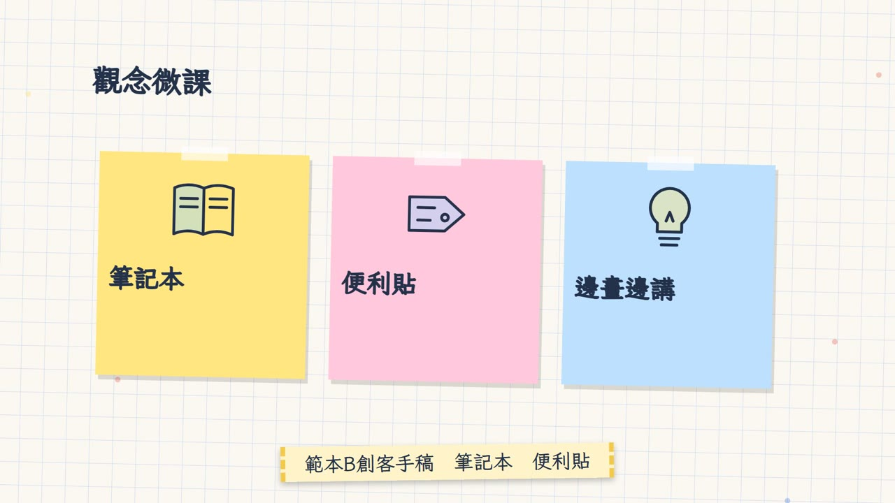
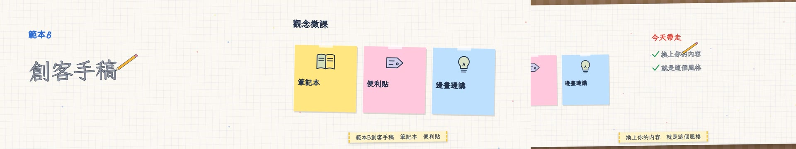

# 範本B_創客手稿：創客手稿 Maker's Notebook

> 來源：2026-10-01 招生片三概念試做，使用者評價「這三個提示詞的風格流程都很好」。
> 觸發：使用者說「**範本B／手稿範本／筆記本風**」，或在選範本時選 B。
> 用法：**丟任何文本 → 拆成共用場景語彙 → 選本範本 → 產出同一風格的影片**。

## 長什麼樣（10 秒示範片）

[](示範/示範.mp4)



示範片：[`示範/示範.mp4`](示範/示範.mp4)（主題「測試範本」、edge-tts 配音）；示範分鏡：[`示範/storyboard.json`](示範/storyboard.json)；沒有這個 skill 時用：[`提示詞_範本B完整版.md`](提示詞_範本B完整版.md)

## 適合
觀念教學、微課、「我也做得到」的溫暖內容；最後會拉遠看整本筆記

## 原始提示詞（招生片版本，逐字保存）
```
Create a 60-second recruitment video programmatically, coded and rendered with whatever tools you need.
One continuous camera move glides across a giant maker's desk and grid notebook, where an invisible pen draws everything
in real time — for the IT Department of Example Senior High School (範例高中資訊科). Title: "你的未來，自己寫".

1. First Line: a pen writes print("Hello") on the notebook; the ink lines grow into the hand-lettered title.
2. Sketch to Reality: hand-drawn sketches of C/Python code, an AI eye recognising doodles, an ESP32 wiring diagram and
   a robot arm — each sketch "comes alive": lines animate, LEDs light up, the arm moves on the page.
3. The Trophy Page: polaroid photos and tape slide onto the page; numbers are hand-written and circled with a marker —
   10 WorldSkills competitors, 12 national golds, a regional gold/silver/bronze sweep stamped like stickers.
4. Next Chapter: university names are written on sticky notes and pinned to a map — 26 admissions to national universities.
5. Your Page: the camera pulls back to a blank page; the pen writes "你的未來，自己寫" and stops, waiting for you.

Visuals: SVG line drawing (stroke reveal), paper texture, tape, sticky notes, polaroids, marker circles, hand-lettering;
the camera never cuts — it pans, zooms and rotates across one huge canvas.
Audio: warm lo-fi / acoustic hip-hop at 90 BPM with pencil-scribble, paper-slide and tape sound effects.
Narration: a senior student, calm and encouraging, like showing you their own notebook.
```

## 流程與品檢（2026-10-06，所有範本一致）
不改畫面風格，只是讓影片更順、少出錯：
1. **逐字審稿**：`final_qa/review_prep.py storyboard.json` → Claude 逐句審 → `final_qa/review_report.py` → 給使用者 ⛔
2. **分鏡預覽**：`make_video.py storyboard.json --template B --preview`（edge-tts 暫配、不花額度）→ `qa/分鏡預覽/分鏡預覽.html` ⛔
3. **正式出片**：`make_video.py storyboard.json --template B`，自動跑唸法標準題 → 建置（Gemini 過壞音檔關卡）→ AI 耳朵 → 兩個 AI 交叉聽 → 句內停頓 → 版面品檢
4. 概念忠實度（下表）→ 抽檢回報加進品檢規則 → 收工紀錄（`進度.md`）

配音：專案自己的 `.env.local` 有 `GEMINI_API_KEY` 才用 Gemini Flash TTS，否則 edge-tts。

## 概念忠實度檢查（交付前逐項打勾，用「連續格」看，不是只看單格）
自動品檢只管技術正確（重疊、出界、唸錯），**管不到「這還是不是原本那個概念」**。以下是本範本的招牌特徵，少一項就不算這個範本。

| # | 招牌特徵（來自原始提示詞） | 怎麼驗 | 通用版現況 |
|---|---|---|---|
| 1 | 一鏡到底：整本筆記本一個鏡頭滑過，不硬切，最後拉遠看整本 | 場景交界抽 5 格連續格 | ✅ |
| 2 | 看不見的筆即時畫出一切：**筆尖永遠在正在畫的那一筆上**，沒在畫就收起 | 每場景抽 3 格（畫字中、畫圖中、空檔），筆尖要貼在筆跡尖端 | ✅ 2026-10-02 修正（`lib/penkit`）；之前是通用公式，筆浮在空白處 |
| 3 | 草圖逐筆描出，畫完「活起來」（上色＋閃燈／轉動／擴散） | 圖示畫完後再抽 2 格，要有變化 | ✅ `lib/sketches`；**不准用 emoji 代替線稿**（沒有對應線稿時才退回圓框＋emoji，並把新線稿補進庫） |
| 4 | 便利貼、紅筆圈、螢光筆、蓋章 | 總覽圖 | ✅ |
| 5 | 字幕＝紙膠帶 | 總覽圖 | ✅ |

## 範本設定
| 項目 | 設定 |
|---|---|
| Composition | `TemplateB`（`engine/template/src/tpl/TemplateB.tsx`） |
| 配樂 | `"music": {"genre": "acoustic", "bpm": 90, "key": "G"}` |
| 旁白 | 溫暖、像拿筆記本給你看；建議女聲曉臻 +12～15% 或男聲雲哲 +15% |
| 字幕 | 紙膠帶條（霞鶩文楷） |
| 音效 | 鉛筆沙沙聲、紙張滑入、貼紙「啪」（`tpl_sfx.py B`） |
| 切點 | `"snapBars": true`（場景補足整數小節） |

## 場景對應
| 場景 | 畫面 |
|---|---|
| title | 手寫大標＋紅筆底線＋英文副標 |
| scenario | 大圓圈圖示＋手繪核取方塊逐項打勾，最後一項紅叉 |
| definition | 標籤貼紙＋大字描出＋螢光筆畫過標亮字＋便利貼註解 |
| cards | 便利貼一張張貼上（圖示＋標題＋說明） |
| vs | 兩個手繪框，右上角蓋 ✕／✓ 印章 |
| stat | 手寫巨大數字＋紅筆圈起來 |
| quiz | 選項框，揭曉時紅筆圈出答案 |
| recap | 「今天帶走」打勾清單＋箭頭「下一節」 |
| qaEnd | 2×2 選項框，時間到紅筆圈答案 |

## 執行步驟
1. **拿到文本**（講義、旁白稿、活動資料）→ 依 [`../範本風格_場景語彙.md`](../範本風格_場景語彙.md) 拆成 9 種場景，寫出 `storyboard.json`（旁白一行一句）。
2. **給使用者審文本** ⛔（場景表：型別、畫面重點、旁白）。
3. 建專案並一行做完：
   ```bash
   python <skill>/engine/scripts/new_project.py <專案> --no-install   # 再 npm install 或 junction 共用 node_modules
   cd <專案> && cp <你的分鏡>.json storyboard.json
   python <skill>/engine/scripts/make_video.py storyboard.json --template B --name <片名>
   ```
   `make_video.py` 會：同步 skill 最新範本程式 → 檢查圖示都有線稿 → 建置 → 範本音效 → 版面＋旁白品檢（有必修就停）→ 算圖 → 響度 −14 → 成片品檢，最後印出本範本的概念忠實度清單。
4. 看 `qa/pre_B.md`、`qa/post_B.md` 與總覽圖；**再用連續格逐項核對下面的「概念忠實度檢查」**。

## 參考實作
- 招生片完整版（為那支片客製的場景）：`concepts/notebook/（招生片完整版 NotebookFull）`
- 通用渲染器（任何文本）：`engine/template/src/tpl/TemplateB.tsx`
- 範例分鏡：`engine/examples/template_1-3_storyboard.json`（同一份分鏡三個範本都能用）
