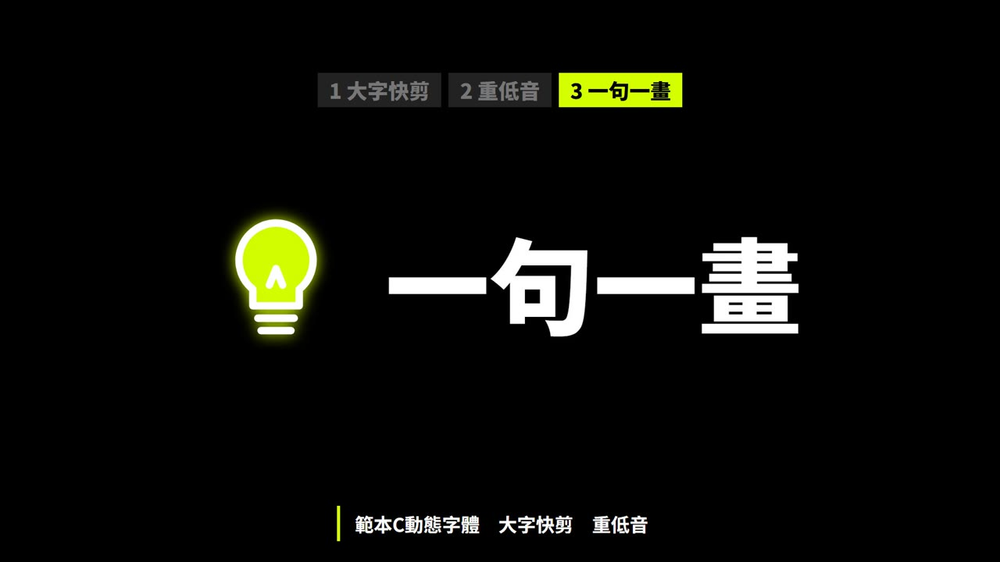
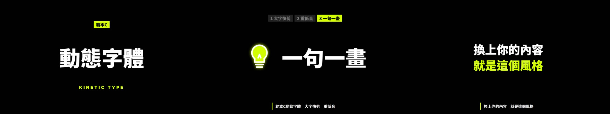

# 範本C_動態字體快剪：動態字體快剪 Kinetic Type

> 來源：2026-10-01 招生片三概念試做，使用者評價「這三個提示詞的風格流程都很好」。
> 觸發：使用者說「**範本C／快剪範本／動態字體**」，或在選範本時選 C。
> 用法：**丟任何文本 → 拆成共用場景語彙 → 選本範本 → 產出同一風格的影片**。

## 長什麼樣（10 秒示範片）

[](示範/示範.mp4)



示範片：[`示範/示範.mp4`](示範/示範.mp4)（主題「測試範本」、edge-tts 配音）；示範分鏡：[`示範/storyboard.json`](示範/storyboard.json)；沒有這個 skill 時用：[`提示詞_範本C完整版.md`](提示詞_範本C完整版.md)

## 適合
宣傳、成果發表、大螢幕、靜音 YouTube；字多的長段落不適合

## 原始提示詞（招生片版本，逐字保存）
```
Create a 60-second recruitment video programmatically, coded and rendered with whatever tools you need.
A bold kinetic-typography piece where words ARE the visuals, for the IT Department of Example Senior High School
(範例高中資訊科). Title: "你的未來，自己寫". Every beat lands a cut.

1. Hook: black screen, one word at a time slams in on each beat — 「你」「的」「未來」— then the screen splits.
2. Words Become Things: 「寫」 shatters into lines of C and Python code; 「AI」 opens like an eye that scans the screen;
   「ESP32」 letters light up like LEDs wired together; 「手臂」 bends like a robot arm.
3. Numbers Fill the Screen: a giant 「10」 fills the frame with a world map masked inside the digits; 「12」 is made of
   twelve gold medals; 「金 銀 銅」 stack and lock together on three beats.
4. Speed Run: university names fly past in a speed-ramp tunnel — 臺科大, 雲科大, 高科大 — ending on 「26」.
5. Final Word: everything collapses into one line, 「你的未來，自己寫」, held on the last beat, then cut to black.

Visuals: high-contrast black & white with one neon accent, giant type, masks, splits, speed ramps, hard cuts every half-beat;
works perfectly on mute for YouTube.
Audio: hard-hitting phonk / EDM at 145 BPM with heavy sub drops, risers and a hit on every cut.
Narration: a senior student, punchy and short, almost like a rapper's ad-libs between the hits.
```

## 流程與品檢（2026-10-06，所有範本一致）
不改畫面風格，只是讓影片更順、少出錯：
1. **逐字審稿**：`final_qa/review_prep.py storyboard.json` → Claude 逐句審 → `final_qa/review_report.py` → 給使用者 ⛔
2. **分鏡預覽**：`make_video.py storyboard.json --template C --preview`（edge-tts 暫配、不花額度）→ `qa/分鏡預覽/分鏡預覽.html` ⛔
3. **正式出片**：`make_video.py storyboard.json --template C`，自動跑唸法標準題 → 建置（Gemini 過壞音檔關卡）→ AI 耳朵 → 兩個 AI 交叉聽 → 句內停頓 → 版面品檢
4. 概念忠實度（下表）→ 抽檢回報加進品檢規則 → 收工紀錄（`進度.md`）

配音：專案自己的 `.env.local` 有 `GEMINI_API_KEY` 才用 Gemini Flash TTS，否則 edge-tts。

## 概念忠實度檢查（交付前逐項打勾，用「連續格」看，不是只看單格）
自動品檢只管技術正確（重疊、出界、唸錯），**管不到「這還是不是原本那個概念」**。以下是本範本的招牌特徵，少一項就不算這個範本。

| # | 招牌特徵（來自原始提示詞） | 怎麼驗 | 通用版現況 |
|---|---|---|---|
| 1 | 字就是畫面：黑白＋單一螢光強調色、巨大字 | 總覽圖 | ✅ |
| 2 | 每個拍點砸入一個字、硬切 | 對拍抽格 | ✅ |
| 3 | **字變成東西**：依內容變形（寫→碎成程式碼、AI→眼睛掃描、數字裡遮罩出畫面） | 連續格看變形過程 | ✅ 2026-10-02 補上：卡片標題砸入→字飛散變成它的線稿圖示；數字裡塞滿標籤文字並流動；重點字碎裂噴出 |
| 4 | 速度坡道隧道、分割畫面 | 連續格 | ✅ 情境逐條從隧道深處衝出（速度坡道）；對比用左右分割 |
| 5 | 靜音也看得懂；最後收成一句停在最後一拍 | 靜音看一次 | ✅ 2026-10-02 補上：結尾所有字收成一條線→影片標題停住→切黑；回顧在 NEXT 前壓扁收束 |
| 6 | 黑白＋**單一**螢光色 | 總覽圖 | ✅ 2026-10-02 修正：圖示改 `NeonIcon` 線條，之前是彩色 emoji 破壞配色 |

## 範本設定
| 項目 | 設定 |
|---|---|
| Composition | `TemplateC`（`engine/template/src/tpl/TemplateC.tsx`） |
| 配樂 | `"music": {"genre": "phonk", "bpm": 145, "key": "Em"}` |
| 旁白 | 短而有力；建議旁白句子短、語速 +15～18% |
| 字幕 | 小黑條（不搶主畫面） |
| 音效 | 每個切點一記打擊、數字與揭曉用大衝擊（`tpl_sfx.py C`） |
| 切點 | `"snapBars": true`（場景補足整數小節） |

## 場景對應
| 場景 | 畫面 |
|---|---|
| title | 標題切成詞組，一拍一個砸入、黑白反轉，再組成整句 |
| scenario | 大圖示＋標題 → 每個現象全螢幕砸入，最後一個紅底「?!」 |
| definition | 大字砸入，標亮字變螢光色＋底線條 |
| cards | 一次一張全螢幕：圖示＋巨大標題＋說明，上方標籤列顯示進度 |
| vs | 左黑右白分割畫面，✕／✓ 從上下衝入 |
| stat | 滿版點陣數字計數 |
| quiz | 問題砸入、選項方塊、思考進度條→正解變螢光 |
| recap | 帶走的句子逐句砸入→螢光底「NEXT ▶」 |
| qaEnd | 2×2 方塊＋倒數條 |

## 執行步驟
1. **拿到文本**（講義、旁白稿、活動資料）→ 依 [`../範本風格_場景語彙.md`](../範本風格_場景語彙.md) 拆成 9 種場景，寫出 `storyboard.json`（旁白一行一句）。
2. **給使用者審文本** ⛔（場景表：型別、畫面重點、旁白）。
3. 建專案並一行做完：
   ```bash
   python <skill>/engine/scripts/new_project.py <專案> --no-install   # 再 npm install 或 junction 共用 node_modules
   cd <專案> && cp <你的分鏡>.json storyboard.json
   python <skill>/engine/scripts/make_video.py storyboard.json --template C --name <片名>
   ```
   `make_video.py` 會：同步 skill 最新範本程式 → 檢查圖示都有線稿 → 建置 → 範本音效 → 版面＋旁白品檢（有必修就停）→ 算圖 → 響度 −14 → 成片品檢，最後印出本範本的概念忠實度清單。
4. 看 `qa/pre_C.md`、`qa/post_C.md` 與總覽圖；**再用連續格逐項核對下面的「概念忠實度檢查」**。

## 參考實作
- 招生片完整版（為那支片客製的場景）：`concepts/kinetic/（招生片完整版 KineticFull）`
- 通用渲染器（任何文本）：`engine/template/src/tpl/TemplateC.tsx`
- 範例分鏡：`engine/examples/template_1-3_storyboard.json`（同一份分鏡三個範本都能用）
