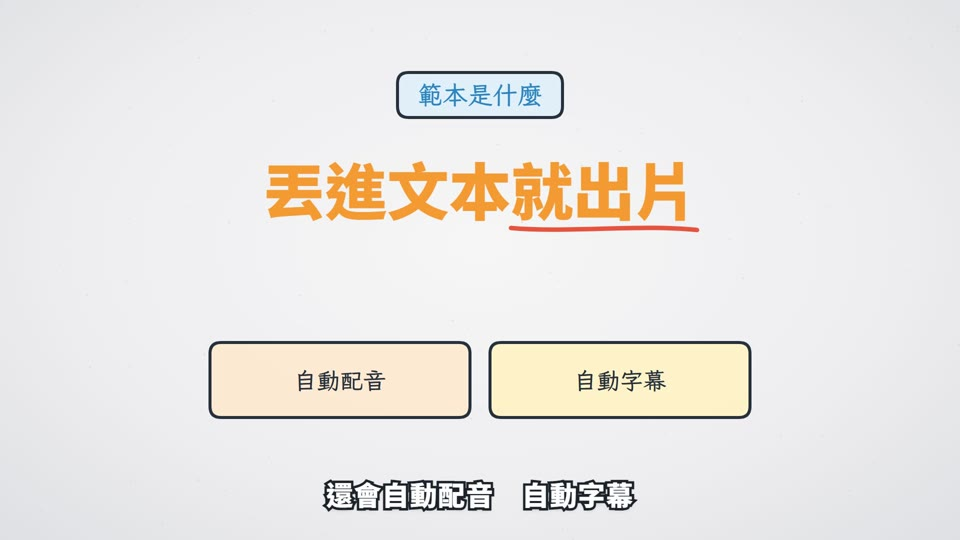

# 範本D_白板手繪：白板手繪 Whiteboard

> 來源：2026-10-02 教學影片 1-1「協定與封包」。做法是以原始提示詞（下方）定調，畫面參考兩支白板動畫教學影片的手繪風格。使用者看過試看片後，把手換成「只有一支馬克筆」。
> 觸發：使用者說「**範本D／白板手繪／手繪範本**」，或在選範本時選 D。（範本B 是「手稿範本」：方格筆記本加便利貼，兩個不要搞混）
> 用法：**丟任何文本 → 拆成共用場景語彙 → 選本範本 → 產出同一風格的影片**。

## 長什麼樣（30 秒示範片）

[](示範/示範.mp4)


示範片：[`示範/示範.mp4`](示範/示範.mp4)（主題「測試範本」、edge-tts 配音）；示範分鏡：[`示範/storyboard.json`](示範/storyboard.json)；沒有這個 skill 時用：[`提示詞_範本D完整版.md`](提示詞_範本D完整版.md)

## 適合
觀念教學、微課、比喻很多的內容（寄信、搬家、門牌……），也適合「一步一步畫給你看」的說明影片。最後會拉遠，讓觀眾看到整張白板的全貌。

## 原始提示詞（逐字保存）
```
I would like to see you create a 1 minute video programmatically. The video should be coded and rendered using whatever tools you need,
you are free to download anything needed. The theme of the video would be - an official flagship commercial introducing Apple's latest
iPhone 18. This should be a sleek, production-ready video suitable for Apple's official launch, featuring ultra-refined visuals,
seamless transitions, and a cinematic edge that highlights groundbreaking next-gen technology. The visuals should be detailed, polished,
and high-impact, and the audio should be seamlessly programmed in with precise, high-energy sound design however you see fit.
```
**這個範本怎麼解讀它**：拿提示詞的「質感要求」（精緻、轉場順、有電影感、音效緊湊而且每個動作都有聲音），套在白板動畫的畫風上：
- 淺灰紙面上，馬克筆先描黑框、再上扁平色（藍 #2b86bf、橘 #f39a33、黃 #f7c94a、紅 #e5543f）。
- 字幕是白字黑邊的粗體。
- 整片是一張大白板，鏡頭平移串起每個場景。

## 流程與品檢（2026-10-06，所有範本一致）
不改畫面風格，只是讓影片更順、少出錯：
1. **逐字審稿**：`final_qa/review_prep.py storyboard.json` → Claude 逐句審 → `final_qa/review_report.py` → 給使用者 ⛔
2. **分鏡預覽**：`make_video.py storyboard.json --template D --preview`（edge-tts 暫配、不花額度）→ `qa/分鏡預覽/分鏡預覽.html` ⛔
3. **正式出片**：`make_video.py storyboard.json --template D`，自動跑唸法標準題 → 建置（Gemini 過壞音檔關卡）→ AI 耳朵 → 兩個 AI 交叉聽 → 句內停頓 → 版面品檢
4. 概念忠實度（下表）→ 抽檢回報加進品檢規則 → 收工紀錄（`進度.md`）

配音：專案自己的 `.env.local` 有 `GEMINI_API_KEY` 才用 Gemini Flash TTS，否則 edge-tts。

## 概念忠實度檢查（交付前逐項打勾，用「連續格」看，不是只看單格）
| # | 招牌特徵 | 怎麼驗 | 通用版現況 |
|---|---|---|---|
| 1 | 一張大白板一鏡到底：場景之間平移（中途微拉遠）；片尾最後一句字幕結束後拉遠看全貌，全景放在字幕區上方 | 場景交界抽 5 格連續格；最後 15 格要看到整張白板 | ✅ |
| 2 | 只有一支馬克筆（**沒有手**）：筆尖永遠貼著正在畫的那一筆，一次只畫一樣；空檔短就滑到下一筆，空檔長就收到右下角 | 每場景抽 3 格（寫字中、畫圖中、空檔） | ✅ 同場景物件自動排隊、不重疊 |
| 3 | 先描黑框，再上色並輕彈一下 | 圖示畫完後抽 2 格，要看到從線稿變成彩色 | ✅ `lib/whiteboard` 的 `WB_ICONS`；沒有對應時退回 `lib/sketches` 線稿＋淡色圓底，**不准只放 emoji**（真的沒有才畫圓框＋emoji，並把新圖示補進 `WB_ICONS`） |
| 4 | 扁平藍／橘／黃／紅圖示，粗黑描邊，淺灰紙面 | 總覽圖 | ✅ |
| 5 | 白字黑邊的粗體字幕（思源黑體 900），手寫字用霞鶩文楷 | 總覽圖 | ✅ |
| 6 | 每個畫面動作都有聲音：描線沙沙、上色「啵」、答對「叮」、答錯「嗡」、換場「咻」 | 聽成片 | ✅ |

## 範本設定
| 項目 | 設定 |
|---|---|
| Composition | `TemplateD`（`engine/template/src/tpl/TemplateD.tsx`，繪製引擎與圖示庫在 `engine/template/src/lib/whiteboard.tsx`） |
| 配樂 | `"music": {"genre": "marimba", "bpm": 112, "key": "D"}`（輕快木琴，旁白時自動閃避） |
| 旁白 | 男聲雲哲 `zh-TW-YunJheNeural` +15%（1-1 試做時由使用者選定）；也可以用女聲曉臻 |
| 字幕 | 白字黑邊粗體、畫面底部；片尾拉遠時自動隱藏 |
| 音效 | `tpl_sfx.py D`：產生 `public/sfx_d/*.wav`（沙沙、啵、叮、嗡），由 TemplateD 對準每一筆播放；換場 whoosh 寫進 `tpl_sfx.wav` |
| 切點 | `"snapBars": true` |
| 片尾 | 最後一個場景（通常是 recap）設 `"minSec"`，比旁白長約 3 秒，留給拉遠全景（例：旁白 10 秒 → `"minSec": 13`）。**不要片尾全景**：storyboard 頂層 `"outro": false`（字幕一路到最後、鏡頭不拉遠；系列教學正式片用，2026-10-09），最後一場就不用加 minSec |
| 套件 | 需要 `@remotion/paths`（已寫進 `engine/template/package.json`；舊專案要補 `npm i @remotion/paths@4.0.300`） |

## 品牌素材與版面品檢（2026-10-05）
- 封面／片頭／LOGO：storyboard 加 `"brand"`（見 `../範本風格_場景語彙.md`「品牌素材」）。有 LOGO 時，標題寬度上限從 1500 縮成 1240，片尾全景放在 LOGO 下方。
- 卡片、標籤、選項框都標成「容器」（`data-qa-box`），框裡的字標 `data-qa-in`：版面探針檢查字有沒有超出框、或被框線（含圓孔、尖角）穿過，有就列必修。
  起因：quiz 的「小測驗」原本借用吊牌圖示，字壓到左框與圓孔；舊探針只量文字對文字，看不到。現在標籤一律依字寬畫框。

## 場景對應
| 場景 | 畫面 |
|---|---|
| title | 節次（藍）＋大標題（粗體，畫完「叮」）＋橘色手繪底線＋英文副標 |
| scenario | 藍色標題＋左邊大圖示，右邊逐項 ✓ 打勾；最後一項紅 ✗（「嗡」） |
| definition | 名詞標籤卡＋橘色粗體大字，重點段落畫紅色底線；sideNotes 變成粉彩小卡 |
| cards | 2–4 張粉彩卡片並排：先畫卡，再畫圖示（描線→上色）、標題、說明 |
| vs | 左右兩張卡（danger 淡紅＋紅 ✗、success 淡綠＋綠 ✓、primary 淡藍），中間大字 vs／≠／＋ |
| stat | 巨大橘色數字＋紅筆圈起來，右邊手寫標籤 |
| quiz | 橘色「小測驗」標籤＋題目＋選項框，揭曉時紅筆圈出答案（「叮」）。**四個選項 → 2×2 排（統測格式，2026-10-10）**，選項短排 2×2、長（原題常 20～30 字）排四行直列像考卷；歷屆題一律四個全放、照原題 A～D 順序（A2 會擋）；自編題也建議四個 |
| recap | 「今天帶走」逐項打勾，房子圖示＋「下一節：……」 |
| qaEnd | 2×2 選項框，時間到紅筆圈答案 |
| kmap、terms、readTable（數位邏輯設計專用） | 卡諾圖、布林式換成 0／1、逐個變數比對。畫面、props、教法與念法見 [`科目包/數位邏輯設計`](../../科目包/數位邏輯設計/README.md) |

圖示：`icon` 可以填 emoji（💻📱✉️📮📦🏷️🔁🔀👂……）或白板圖示名稱：computer、laptop、phone、bubble、question、book、handshake、envelope、stamp、mailbox、house、ear、gauge、file、sofa、package、packet、road、routes、retry、tag、bulb、lock、clock、trophy、person、globe、cloud、wifi、rocket、warning、gear、magnifier、checklist、network、server。也可以填 `lib/sketches` 的線稿名稱。

## 執行步驟
1. **拿到文本** → 依 [`../範本風格_場景語彙.md`](../範本風格_場景語彙.md) 拆成 9 種場景，寫出 `storyboard.json`（旁白一行一句；最後一個場景加 `minSec`）。
2. **給使用者審文本** ⛔（場景表：型別、畫面重點、旁白）。
3. 建專案並建置：
   ```bash
   python <skill>/engine/scripts/new_project.py <專案> --no-install   # 再 npm install 或 junction 共用 node_modules（要有 @remotion/paths）
   python <skill>/engine/scripts/build.py storyboard.json
   python <skill>/engine/scripts/tpl_sfx.py D
   python <skill>/engine/scripts/qa.py --comp TemplateD          # 版面＋旁白品檢
   npx remotion render src/index.ts TemplateD out/x.mp4 --concurrency=4 --crf=18 --audio-codec=aac
   ffmpeg -i out/x.mp4 -c:v copy -af loudnorm=I=-14:TP=-1:LRA=9 -c:a aac out/成片.mp4
   python <skill>/engine/scripts/qa.py --comp TemplateD --skip-layout --skip-asr --video out/成片.mp4
   ```
4. 看 `qa_report.md` 與總覽圖，有必修項目就修正重算；再照上面的忠實度表，用連續格逐項核對。

## 參考實作
- 通用渲染器（任何文本）：`engine/template/src/tpl/TemplateD.tsx`＋`engine/template/src/lib/whiteboard.tsx`
- 範例分鏡：`engine/examples/template_1-1_storyboard.json`（1-1 協定與封包，10 個場景、約 73 秒；A／B／C 也能直接吃這份）
