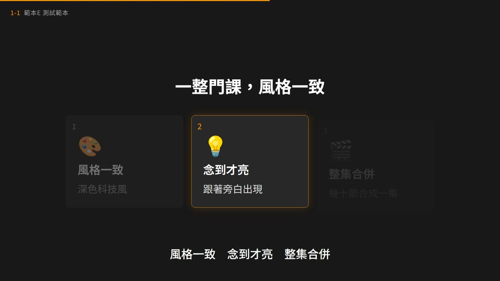
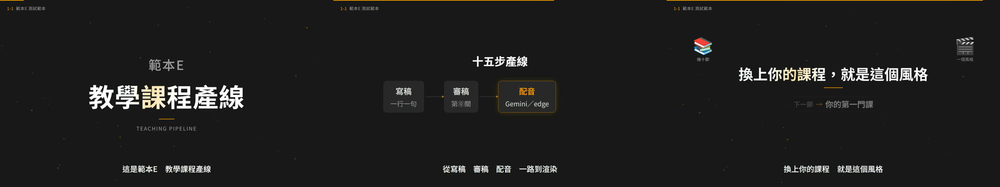

# 範本E：教學課程產線（garychen-dark）

> 來源：一門實際製作的遠距教學課程（8 集 56 節）產線，2026-10 匯出。範例課程（examples\）是中性示範內容。
> 跟範本 A～D 的差別：A～D 是「丟一段文本 → 一支風格化短片」；**範本E 是「一整門課 → 幾十節風格完全一致的教學影片，再合併成集」**。

> **完整流程（①～⑮，含文稿調教、聲音選擇、配音後聽檢、品檢）見 [`規範/完整工作流程.md`](規範/完整工作流程.md)。** 下面是精簡版。

## 長什麼樣（10 秒示範片）

[](示範/示範.mp4)



10 秒示範片：[`示範/示範.mp4`](示範/示範.mp4)（主題「測試範本」、edge-tts 配音；畫面就是正式產線的 garychen-dark＋特效設定）；示範分鏡：[`示範/示範分鏡_1-1.md`](示範/示範分鏡_1-1.md)＋[`示範/示範分鏡_1-1_plan.json`](示範/示範分鏡_1-1_plan.json)；沒有這個 skill 時用：[`提示詞_範本E完整版.md`](提示詞_範本E完整版.md)

## 什麼時候用

| 用範本E | 用十步流程或範本 A～D |
|---|---|
| 一門課、很多節，每節 3～5 分鐘，要合併成 30 分鐘左右的集 | 一支宣傳片、招生片、活動說明 |
| 風格已定、要穩定量產，重點是**內容正確、字幕與唸法零錯誤** | 要創意、要驚喜、每支概念不同 |
| 只有旁白＋極輕的提示音（卡片亮起「噠」、測驗揭曉「叮」），不需要配樂 | 需要配樂、對拍剪接 |

## 畫面風格：garychen-dark

深色科技風（底色 #181818、主色橘 #F89800、綠 #20C058、紫 #604098），字型 Noto Sans TC。
規格與拉片依據在 `規範\styles\garychen-dark\`。13 種場景型別：

```
title_card  scenario  definition  concept_cards  comparison  quiz
closing_card  qa_endcard  flow_arrows  layer_stack  network_diagram  ui_mock  terminal
```

**動態原則（2026-10-03 定案）**：畫面上的每個項目在**旁白唸到時才出現並亮起，全部唸完後固定**，
不做任何循環動畫（焦點輪播、光點循環、整塊沉降都已移除）。

**特效（2026-10-06 定案，`規範\特效設定.json`，build_data 寫進每節 data.fx）**：
② 數字滾動（卡片／footer 數字出現時 0.8 秒滾到目標值）、③ 終端機打字（`terminal` 場景，每行寫 `cue`＋`dt`，建置時換算時間，找不到 cue 就中止）、
④ 前後呼應（結語卡 `callback: [{icon,label}×2]`，帶回開頭比喻；開頭沒有比喻的節不加）、⑤ 輕音效（噠／叮，約 −20dB；**不要換場咻聲**，白噪音聽起來像雜音）、
⑥ 測驗小儀式（思考倒數圈＋揭曉光暈一次）。① 聚光燈／微推近 試作後不採用（`pushIn: false`）。

## 流程

```
① 雙軌稿 01_腳本\<id>_<標題>.md     一行一句旁白＋VISUAL 畫面說明
② 分鏡   01_腳本\<id>_plan.json      場景型別＋內容；項目可寫 cue（沒寫會自動拿項目文字去旁白裡找）
       ⛔ 文稿一次審完再出片
⓪ 文稿檢查 py qa\term_check.py       配音之前跑：網址／協定／產品名寫法、年份與百分比、大陸用語、唸法寫進稿子；
                                     規則在 00_規範\用詞規範.json；有「必改」exit 1，改完再配音（報告 HTML＋MD）
③ 配音   py tts_gemini.py <稿>.md     Gemini 3.8 Flash TTS（預設）；設定 00_規範\配音設定.json，金鑰 .env.local
                                     一節只送 3～4 次請求；配額用完會停，隔天重跑同一指令從斷點接續
                                     沒有 Gemini 金鑰：py tts.py <稿>.md（edge-tts zh-TW-YunJheNeural，輸出格式相同）
       ⓐ 多音詞  py qa\poly_ab.py 11_品檢\多音詞 <節...>   AI 判讀多音詞，只聽紅黃列（見下方「配音」）
④ 建置   py build_data.py <id>         ← 第一道品檢：字幕覆蓋、單頁字數、項目全部對上旁白，不過不產出
⑤ 渲染   render_v2.ps1 -Ver v2 -Ids 1-1,1-2   檢查 exit code 與輸出檔時間戳
⑥ 合併   py assemble.py EP1 1-1 … 1-7 --ver v2   封面＋片頭＋過渡＋各節，整集響度正規化到 −16 LUFS
⑦ 品檢   見下方（= storynow-aimovie-make 第⑪步）
```

## 配音（Gemini 3.8 Flash TTS）

- **配音選擇規則**：專案自己的 `.env.local` 有 `GEMINI_API_KEY` 才用 Gemini Flash TTS（自動最新正式版），沒有就用 edge-tts（`tts_gemini.py` 沒有金鑰會自動改跑 `tts.py`）。
- **金鑰**：課程根目錄 `.env.local` 一行 `GEMINI_API_KEY=…`（new_course.py 會建好空白檔與 .gitignore）。
- **聲音**：`00_規範\配音設定.json`。`voice_id` 空白時，第一次配音會依 `voice_description` 用 Gemini「聲音設計」做出聲音並寫回
  （聲音存在你的 Gemini 專案裡一年）。預設描述是「25 歲台灣年輕男老師、熱情開朗、溫暖中音」，`_其他候選` 另有明亮高音、低沉渾厚兩種。
  想先試聽：照描述各做一個聲音、同一段課文各唸一次再選。
- **時間戳**：Gemini 不回傳時間戳，`tts_gemini.py` 用 faster-whisper 逐字時間＋difflib 對齊已知文稿，算出每句起訖，
  再切成每場一個 mp3＋句級 srt（與 edge-tts 版格式相同，下游不用改）。
- **唸法**：數字、IP、英文縮寫照 `發音規範.json` 轉；edge-tts 專用的權宜寫法（多音詞同音字替換、ping→聘 這類）列在 `skip_rules`，送 Gemini 時略過。
- **配額**：免費層每天次數很少（實際上限看 Google AI Studio 的 Rate limits）；遇到每日上限會印出錯誤並停止，已完成的段落快取在 `02_語音\<id>\_gemini_cache\`。
- **資料政策**：免費層送出的文稿可能被 Google 用來改進產品；業主內容敏感就用付費層。

## 品檢（四關＋自我測試）

| 關卡 | 指令 | 內容 |
|---|---|---|
| ⓪ 文稿 | `qa\term_check.py` | 專業用詞與寫法（用詞規範.json）：必改 0 才配音 |
| ① 渲染前 | `build_data.py` | 字幕覆蓋 >85%、單頁 <40 字、有項目的場景 100% 對上旁白 |
| ② 單節 | `qa_layout.mjs`、`qa_asr.py`、`qa_run.py` | 字幕 C1～C6、同步 S1～S4、唸法 P1～P4、版面 L、聲音 A、畫面 V |
| ③ 整集 | `qa_run.py --ep` | 長度 28～33 分、整集響度、各節落差、接縫 |
| ④ 看圖 | `make_report.py`、`compare.py` | HTML 報告：截圖總覽、修改前後對照、試聽清單 |
| ⓪ 自我測試 | `selftest.py` | 規則有改就跑：故意做壞 13 種，每種都要被抓到 |
| 配音前 | `qa\pron_test.py` | 唸法標準題 30 題（數字、網址、IP、縮寫），沒全過就不配音 |
| 配音後 | `qa\listen_crosscheck.py` | 兩個 AI 交叉聽：AI 耳朵的疑點再用 whisper 聽一次，分確定／待聽／可接受／誤報（接受清單 `規範\唸法接受清單.json`），只有確定＋待聽要人聽 |
| 配音後 | `qa\pause_check.py` | 句內停頓 >1.2 秒提醒（測驗思考停頓除外） |
| 配音後 | `qa\ep_estimate.py` | 配完音就估整集長度（封面片頭＋各節＋片尾測驗），不用等合併 |
| 配音前 | `qa\storyboard_page.py`＋`remotion\storyboard_stills.mjs` | 分鏡預覽頁：每場景一張截圖＋旁白，給業主先看內容 |
| 探針 | `qa_layout.mjs` | 另加：渲染錯誤算問題；ui_mock 高亮框要完整框住目標列（含側欄） |
| 建置 | `build_data.py` | 另加：測驗缺揭曉時間、終端機 cue 找不到 → 中止 |

完整項目與門檻：`規範\品檢規範.md`。

## 開新課程

```powershell
py <本資料夾>\engine\new_course.py D:\課程\新課程
# 再把 cover.jpg（封面）、intro.mp4（片頭）、logo.png（LOGO）放進 03_素材\brand\
```

## 踩過的坑（別再犯）

| 現象 | 根因 | 現在的做法 |
|---|---|---|
| 字幕每 4 格抖一次 | Google Fonts 中文分片「用到才載」，4 個平行分頁有的沒載到就截圖 | `fonts.ts preloadGlyphs()` 算圖前一次載完整節用字 |
| 字幕換頁閃一下 | 起點、長度各自四捨五入，接縫空 1 格 | 起訖先取整數格再相減 |
| 物件跟旁白對不上 | 計時輪播、講完又循環 | 旁白驅動出場（`beats.ts narrate()`）、唸完固定 |
| PAN、MAN 唸成單字 | TTS 對未定義縮寫自己猜 | 用時長比對（`pron_check.py`）逐詞確認，寫進發音規範 |
| 交出舊檔 | 用程序數判斷渲染完成 | 比對輸出檔時間戳＋exit code |
| 黑畫面量不到 | Remotion 輸出全範圍色彩，黑＝亮度 16 | blackdetect pix_th 0.08（背景 #181818＝24，不會誤判） |
| 語音辨識判斷唸法 | whisper 對中文 TTS 的英文縮寫、數字分不出 | 只當試聽清單，判斷用時長比對 |
