# 範本F_開發者流程線：深色開發者風＋流程節點列

> 來源：2026-10-06 提示詞研究。01 號提示詞（Matt Pocock 的 skill 開發流程，30 秒）做出的影片，使用者評價「整體特效跟場景是我喜歡的」；再用同一套做法做了「研習行前通知＋資訊科介紹」（89.5 秒），效果也很好。
> 觸發：使用者說「**範本F／開發者流程線／01 風格**」，或在選範本時選 F。
> 用法：**丟任何「有步驟」的文本 → 寫成 `storyboard.json` → `engine/make.py` 一行出片**。畫面元件已寫死在引擎裡，換文本也是同一種風格與動態。

## 長什麼樣

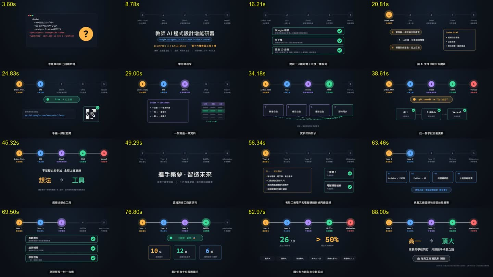

**一句話**：近黑底＋點陣＋頂部藍光，上方一排**流程節點**常駐，講到哪一步就點亮哪一個（灰→彩色＋外圈呼吸光暈），下方舞台依步驟性質換成不同的「會動的物件」（對話氣泡、文件卡、任務卡、狀態燈、檢查列），最後用雙色等寬大標語收尾。底部深色膠囊字幕一次一句，溫暖男聲＋輕柔電子配樂。

| 開場：終端機出錯＋問號圓章 | 總覽：大標題＋技術膠囊，節點列登場 |
|---|---|
| 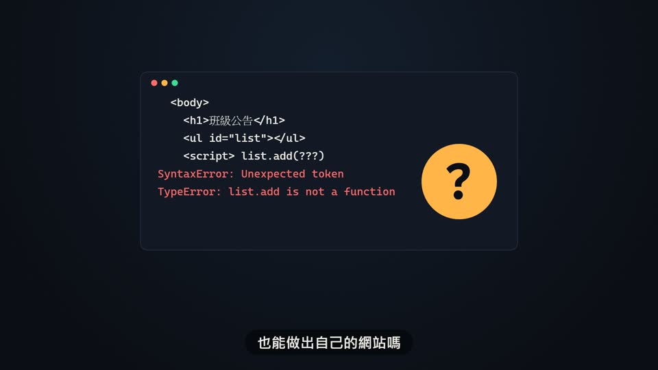 |  |
| **Q/A 氣泡＋文件卡**（節點 1 亮起） | **上線：deploying → live＋QR 打勾** |
| 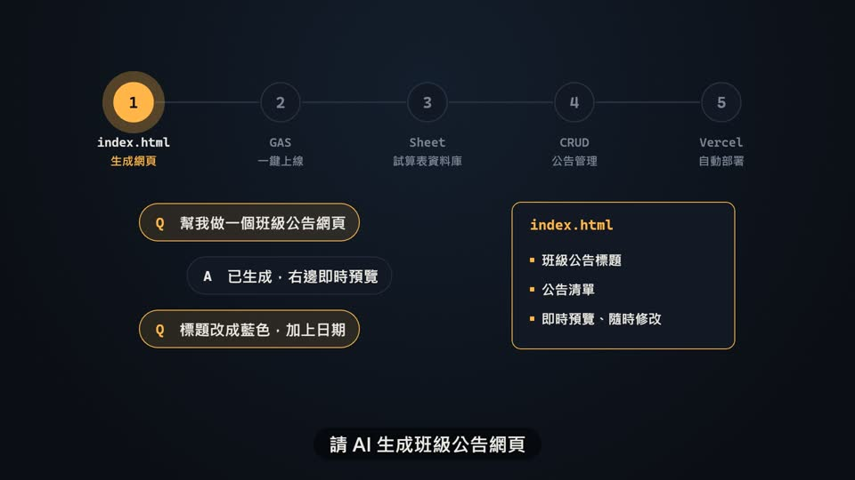 | 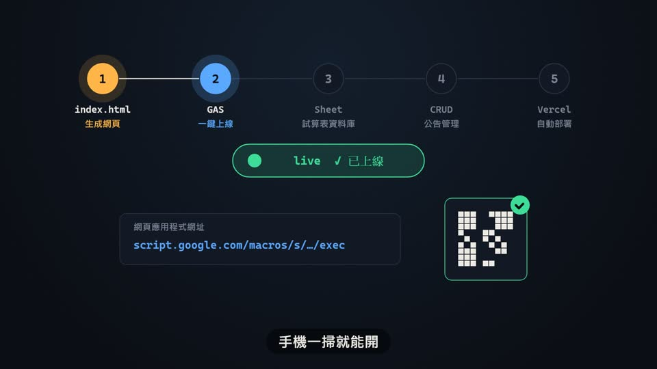 |
| **收攏成文件＋表格某一列亮起** | **一分為四＋虛線關係** |
| 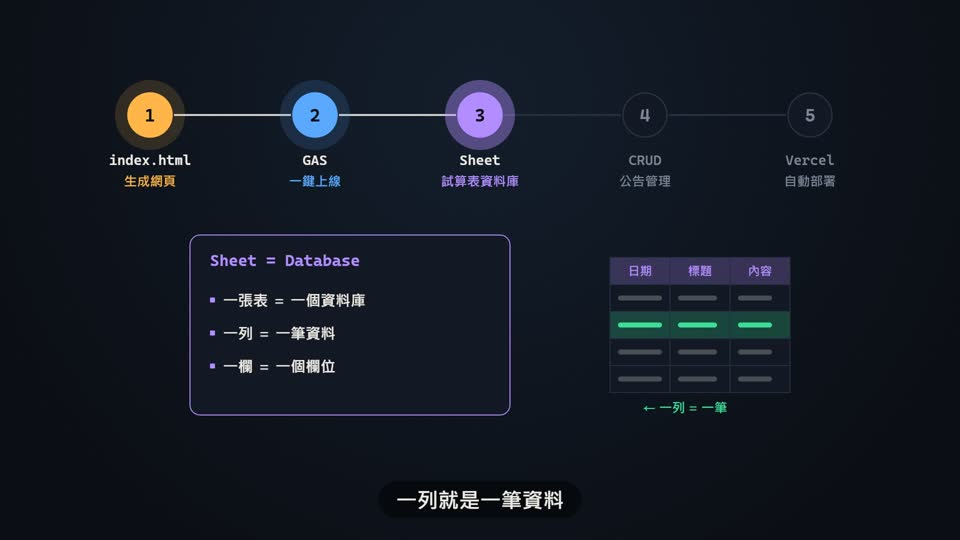 | 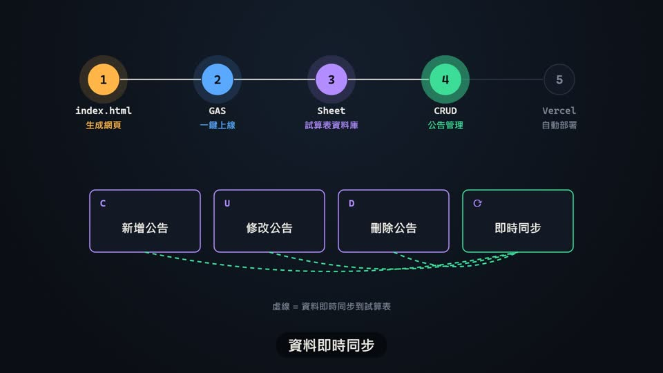 |
| **三段鏈 A → B → C 依序打勾** | **檢查列：念到哪項就打勾** |
| 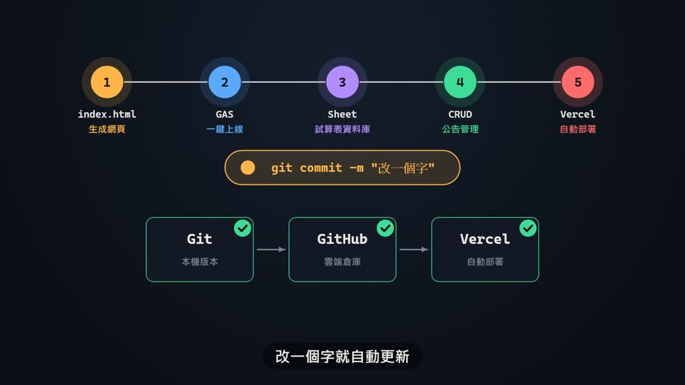 | 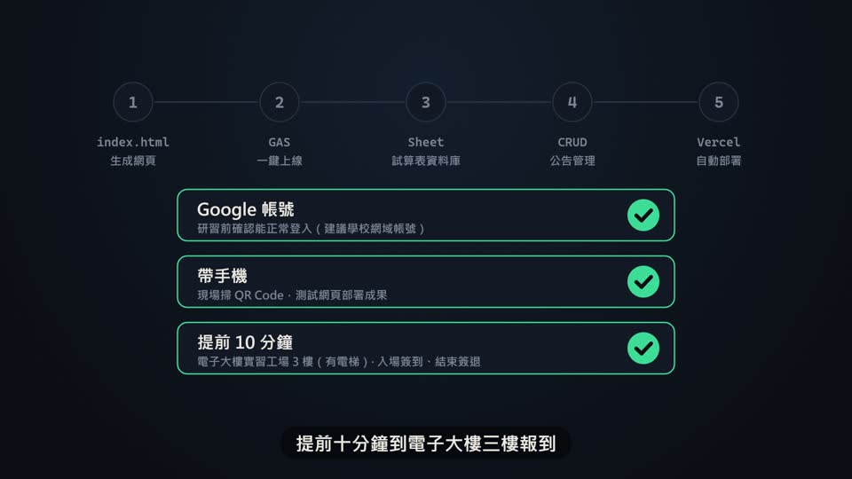 |
| **數據卡：狀態翻轉＋數字跑動** | **大數字（念到時剛好停住）＋名單膠囊** |
| 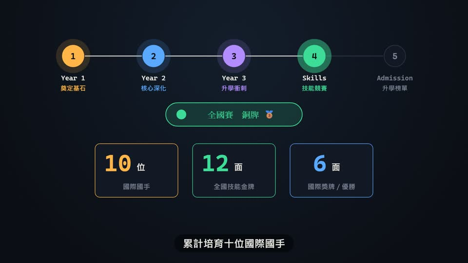 | 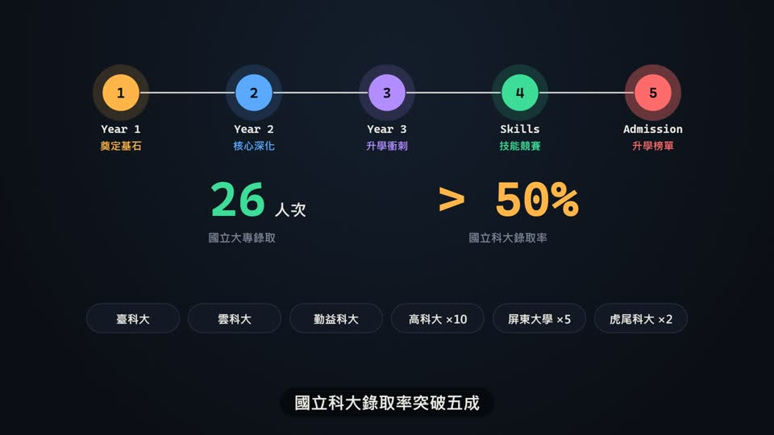 |
| **轉場：換一組節點列（兩段式）** | **收尾：雙色標語＋署名膠囊** |
| 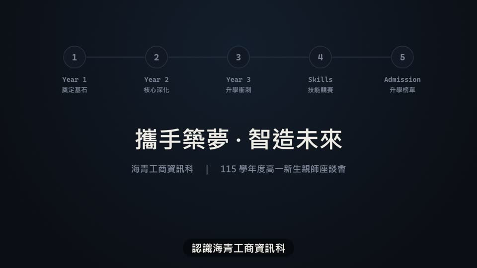 | 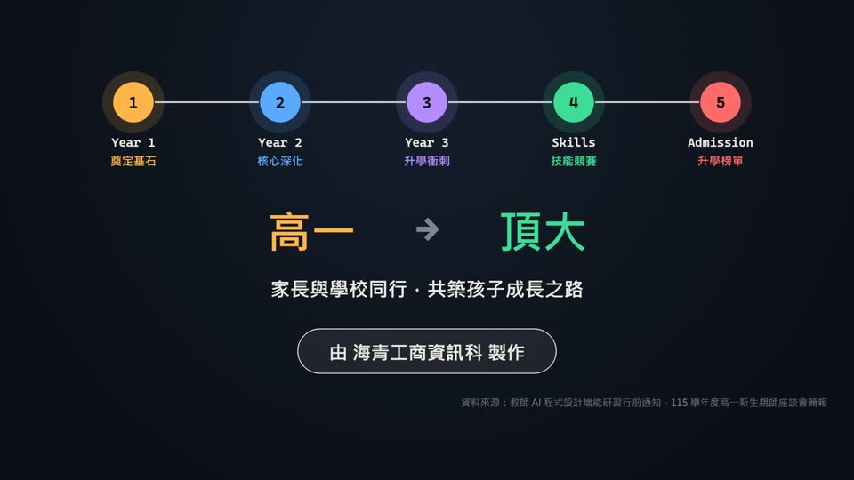 |

另一支範例（01 Matt Pocock）的總覽：

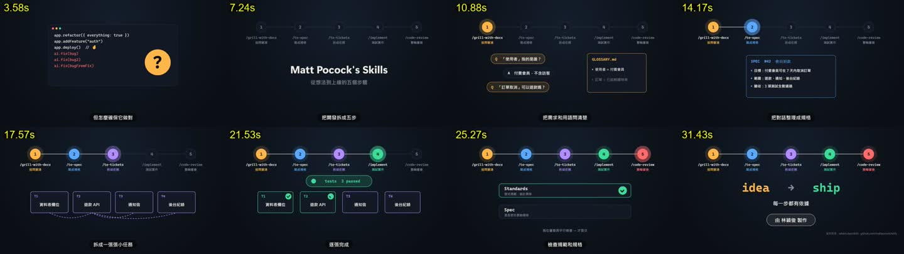

全部逐段截圖都在 [`截圖/`](截圖/)：`範例04_*`（16 段）、`範例01_*`（8 段）。

## 適合
- 有**先後步驟**的內容：流程、課程單元、研習議程、三年課程地圖、申請步驟、專案開發
- 介紹一個工具／方法／科系，每一步都有具體「產出物」可以畫
- 兩件事前後接（例：活動說明 → 單位介紹）：用 `transition` 換一組節點列
- 步驟 3～6 步最好；超過 6 步節點會擠，請拆成兩支或兩段

## 改文本就會一模一樣嗎？
| 會一樣的 | 會跟著內容變的 |
|---|---|
| 背景、配色、字型、節點列、字幕、配樂、音效、所有進場與轉場動態、每種畫面的版面（都寫死在 `engine/lib_F.js`） | 每段選哪一種畫面、畫面裡寫什麼字（寫在 `storyboard.json`，由 Claude 依內容填） |

所以**風格與動態一模一樣**；內容不同，畫面組合自然不同。內容裡如果有範本沒有的東西（例如地圖、照片），要先新增畫面型別。

## 重要提示詞在哪裡
| 檔案 | 內容 |
|---|---|
| [`原始提示詞_01.txt`](原始提示詞_01.txt) | 使用者最早貼的 01 提示詞（逐字）。只有主題、流程、聲音、署名、「上網研究」、「先給我看分鏡」，**沒有任何畫面規定** |
| [`提示詞_範本F完整版.md`](提示詞_範本F完整版.md) | 把當時「AI 自己決定」的部分全部改寫成規則：色碼、節點列、舞台畫面庫、動態秒數、配樂、品檢。**在沒有這個 skill 的地方，貼這份就能做出接近的影片** |
| `engine/lib_F.js` | 上面規則的實作（真正讓每次都一樣的是這份程式） |

**原始提示詞為什麼沒寫畫面也做得好看**（研究結論）：「請上網搜尋跟研究」讓 AI 追到 GitHub README，拿到每一步的具體產出物（GLOSSARY.md、相依任務、TDD、雙軸審查），畫面才有東西可以畫；主題詞（skill、開發流程、/指令）決定了深色開發者風格；動態規則則是沿用 06 號提示詞（範本G）的節奏寫法。

## 概念忠實度檢查（交付前用連續格逐項確認）
| # | 招牌特徵 | 怎麼驗 |
|---|---|---|
| 1 | 上方節點列常駐，講到哪一步才點亮；目前步驟外圈呼吸光暈；下一步前 0.4 秒白色連線延伸過去 | 每個步驟段開頭抽 2 格 |
| 2 | 每一步的舞台都是「會動的具體物件」，不是純文字方塊 | 總覽圖逐段看 |
| 3 | 狀態翻轉（紅→綠、deploying→live）與打勾都**對準旁白關鍵詞** | 關鍵詞前後各抽 1 格 |
| 4 | 舞台轉場：舊內容往上飄 80px 淡出、新內容同時進場，節點列不動 | 段落交界抽 3 格 |
| 5 | 收尾雙色等寬標語（左琥珀右綠）＋署名膠囊 | 最後一段 |
| 6 | 深色膠囊字幕一次一句、配樂在旁白時自動壓低、每次節點點亮有提示音 | 聽成片 |

## 範本設定
| 項目 | 設定 |
|---|---|
| 背景 | #0b0e14＋48px 點陣（白 5%）＋頂部中央藍光暈（#5AA9FF 10%） |
| 面板／框線／文字 | #131924／#263043／象牙白 #EDEAE3、灰 #7C8698 |
| 步驟色（依序循環） | 琥珀 #FFB547、藍 #5AA9FF、紫 #B38CFF、綠 #3DDC97、紅 #FF6B6B |
| 字型 | 微軟正黑體粗體；指令、檔名、數字、標語用 Cascadia Code／Consolas；英文大標題用 Segoe UI |
| 進場 | 主角 outBack（0.65→1 倍回彈 0.5 秒）；次要 outExpo（下方 40px 上滑 0.55 秒）；同組錯開 0.08 秒 |
| 同步 | 元素在旁白念到關鍵詞時出現（字元位置 ÷ 句長 × 該段秒數）；念到太晚就主體先出、細節跟關鍵詞 |
| 字幕 | 底部深色膠囊（y=962、高 74）、象牙白 42px、按標點切句一次一句 |
| 配音 | 專案自己的 `.env.local` 有 `GEMINI_API_KEY` 才用 Gemini Flash TTS（自動最新正式版），沒有就用 edge-tts（Gemini 聲音寫 `voice.voice_id`／`description`／`style`，過壞音檔關卡）；edge-tts 為 `zh-TW-YunJheNeural` +8%，段間 0.18 秒 |
| 配樂 | numpy 合成 96 BPM 輕柔電子（Fmaj7–Am7–Dm7–B♭maj7）；節點點亮提示音逐步升高；轉場／收尾兩聲高音；人聲閃避最多壓 70% |
| 響度 | loudnorm I=-14.5、TP=-2＋限幅（實測約 -16 LUFS、峰值 -1.9 dBFS） |
| 規格 | 1920×1080、30 fps、H.264 CRF 16、AAC 192k |

## 畫面型別（`storyboard.json` 每段的 `scene`）
共用欄位：`"step": 第幾步（0 起算，有寫才會點亮該節點並響提示音）`。所有 `*Word` 都要寫**該段旁白裡真的有的字**，元素會在念到那個字時出現；不寫就用預設時間。

| type | 截圖 | 用在 | 欄位 |
|---|---|---|---|
| `terminal` | 範例04_01 | 開場鉤子 | `code`（程式碼行）、`errorFrom`（第幾行起變紅）、`stampWord`、`stamp`（預設 ?） |
| `overview` | 範例04_02、範例01_02 | 總覽，節點列在這段登場 | `title`、`subtitle` 或 `chip`＋`info`＋`infoWord`＋`note` |
| `transition` | 範例04_10 | 兩段式的第二段開頭，換節點列 | `title`、`sub` |
| `checkRows` | 範例04_03、範例01_07 | 檢查、準備事項、審核 | `rows: [{title, desc, word}]`（2～3 條）、`mono`、`note` |
| `qa` | 範例04_04、範例01_03 | 提問、釐清、跟 AI 對話 | `qa: [["Q","…"],["A","…"]]`、`doc: {title, lines, word}` |
| `deploy` | 範例04_05 | 上線、發布 | `pill: [前,後]`、`pillWord`、`card: [標籤,網址]`、`qrWord` |
| `mergeDoc` | 範例04_06、範例01_04 | 整理、彙整成文件 | `doc: {title, lines}`、`table: {cols, rowWord, label}`（選用） |
| `split4` | 範例04_07、範例01_05 | 拆解、分類、四個面向 | `cards: [[編號,名稱]]`、`deps: [[a,b]]`＋`depWord`＋`depColor`＋`note`、`tag: {text, word}`、`color`、`hlLast` |
| `tdd` | 範例01_06 | 執行、實作、測試通過 | `pill`、`word`、`cards`、`doneWord`（卡片逐張打勾） |
| `chain3` | 範例04_08 | 三步串接 | `items: [[名稱,說明]]`、`doneWord`、`pill`、`pillWord` |
| `docCerts` | 範例04_11 | 課程內容＋證照／成果 | `doc: {title, lines}`、`certs: [{name, desc, word}]` |
| `stats` | 範例04_14 | 成果數據 | `pill`、`pillWord`、`stats: [[數字,單位,說明]]`、`word` |
| `bigNumbers` | 範例04_15 | 關鍵數字＋名單 | `nums: [{value, prefix, suffix, unit, label, word}]`、`pills` |
| `slogan` | 範例04_09、範例04_16 | 收尾（每一部分的最後一段） | `left`、`right`、`word`、`top`、`line`、`note`、`credit`、`source`、`allWord`（節點連線全亮的時機） |

storyboard 最外層：`name`（成片檔名）、`voice`、`pron`（只改配音稿的唸法，例 `"5.5": "五點五"`）、`parts: [{steps: [[英文或指令, 中文說明], ...]}]`（一部分一組節點列）、`segments: [{say, tts?, scene}]`。

## 執行步驟
1. **讀文本**，找出步驟（3～6 步）；兩件事就分兩個 `parts`。
2. **寫 rundown 給使用者確認** ⛔：每段的旁白、畫面型別、畫面裡的字（照 `原始提示詞_01.txt` 的精神：先給分鏡，確認後才動手）。
3. **寫 `storyboard.json`**（參考 [`examples/`](examples/)），放進新的專案資料夾。
4. **先抽格**：
   ```bash
   python <skill>/templates/範本F_開發者流程線/engine/make.py <專案資料夾> --stills
   ```
   看 `<專案>/抽格/_總覽.jpg`：每段 75% 處＋每個轉場前 0.1 秒。檢查文字超框、元素重疊、舞台空太久（關鍵詞太晚就改 `*Word` 或旁白）。
5. **出片**：
   ```bash
   python <skill>/templates/範本F_開發者流程線/engine/make.py <專案資料夾>
   ```
   會配音（有快取）→ 配樂 → 抽格 → 整支渲染 → 合成聲音＋響度，最後印出長度、響度、峰值。成片在 `<專案>/out/<name>.mp4`。
6. 照上面的忠實度表用連續格核對。

需要：Node.js、ffmpeg、Python（edge-tts、numpy、scipy；用 Gemini 時另需 faster-whisper 對齊）。第一次執行會在專案裡 `npm install playwright`；本機沒有 Playwright 的 Chromium 時會自動下載（同機已有專案可以用 junction 共用 `node_modules`）。

## 檔案
```
engine/   make.py（一行出片）、lib_F.js（渲染器＋畫面庫）、scene.html、render.mjs（逐格截圖→ffmpeg）、
          build_audio.py（配音＋字幕時間，範本F／G 共用）、make_music.py（配樂＋人聲閃避）
examples/ 04_研習與資訊科.storyboard.json（兩段式，16 段，89.5 秒）、01_MattPocock.storyboard.json（8 段，33 秒）
截圖/     逐段截圖與總覽
```

## 復刻用特效關鍵詞（寫進提示詞就是在指定這個效果）
| 特效 | 關鍵詞 |
|---|---|
| 點陣背景 | 背景近黑 #0b0e14，48px 間距的點陣，頂部中央一團淡藍光暈 |
| 流水線節點點亮 | 畫面上方常駐五個圓形節點，講到哪一步就點亮（灰→彩色），目前步驟外圈呼吸光暈，節點間連線在下一步前 0.4 秒延伸點亮 |
| 終端機捲動 | macOS 風格終端機視窗（左上紅黃綠三圓點），程式碼往上捲動，最後幾行變紅色表示出錯 |
| 問號圓章 | 黃色大圓章帶一個問號，outBack 彈出，蓋在畫面右側 |
| Q/A 對話氣泡 | 一問一答的對話氣泡依序滑入，問題用黃框、回答用灰框並往右縮排 |
| 文件卡條列 | 文件卡彈出，檔名標題用等寬字，條列項目每 0.1 秒滑入一條 |
| 收攏成一張 | 多個元素縮小並移向中央後淡出，接著一張新卡片從中央彈出 |
| 一分為四 | 一張大卡縮小淡出，同時拆成 4 張小卡，以 0.08 秒間隔彈出排成一列 |
| 虛線相依 | 卡片下方用紫色虛線弧線，依序（間隔 0.12 秒）描出彼此的相依關係 |
| 紅轉綠 | 狀態膠囊先顯示紅色「failed」，0.6 秒後翻成綠色「passed」 |
| 檢查列打勾 | 寬版檢查列（粗體標題＋灰色說明），逐條在右側打勾，外框同時變綠 |
| 數字跑動 | 數字從 0 跑到目標值，在旁白念到該數字時剛好停住 |
| 雙色標語 | 結尾大字標語用等寬字體，左詞黃色、右詞綠色，中間灰色箭頭，outBack 彈出 |
| 署名膠囊 | 片尾署名放在白色細框膠囊內，右下角加一行資料來源小字 |
