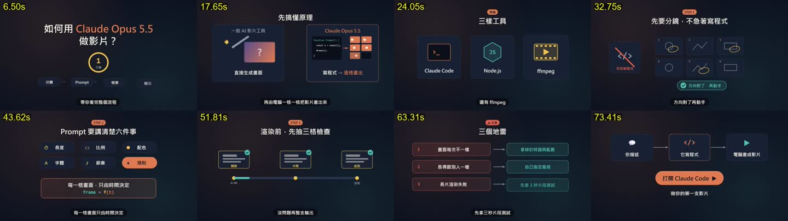
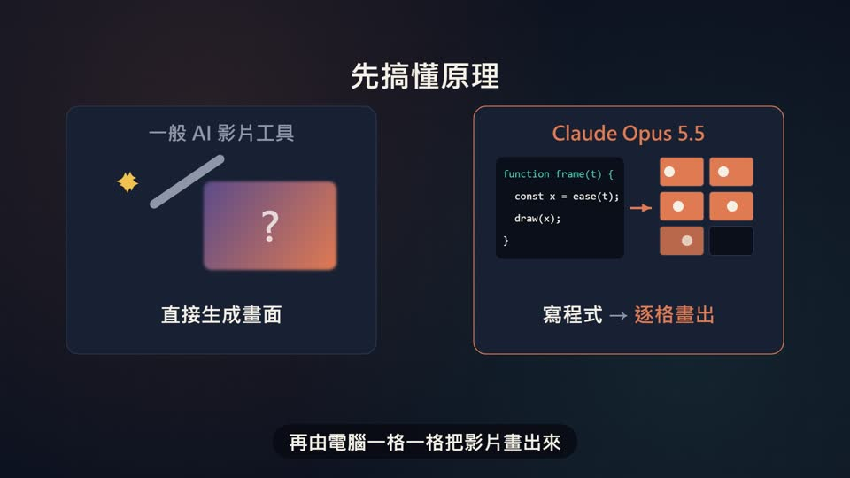
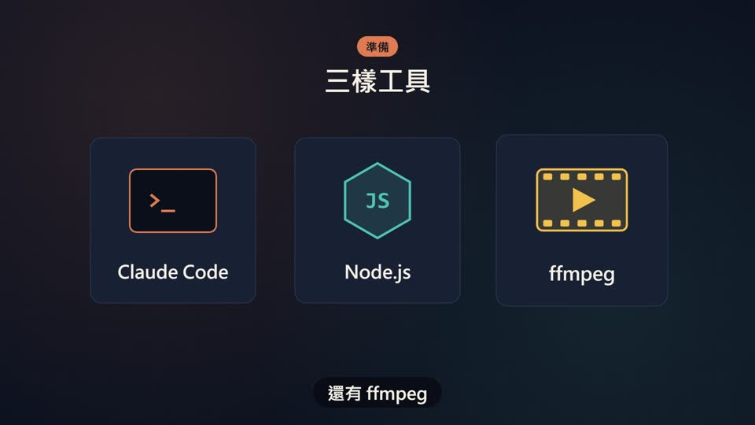
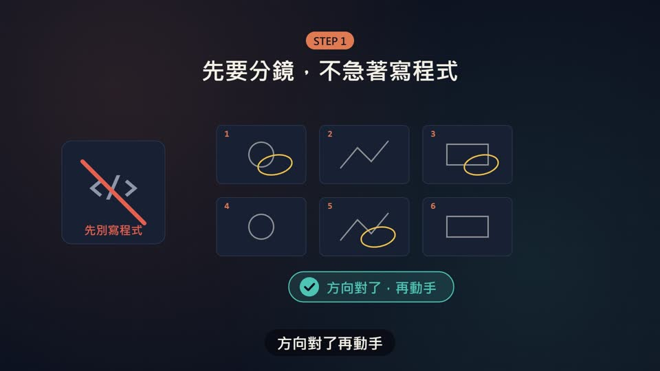
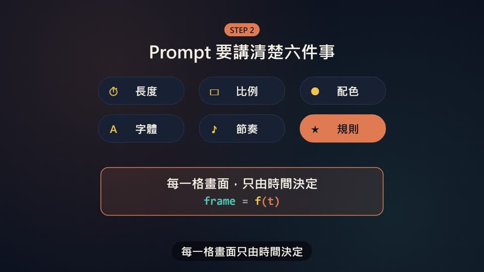
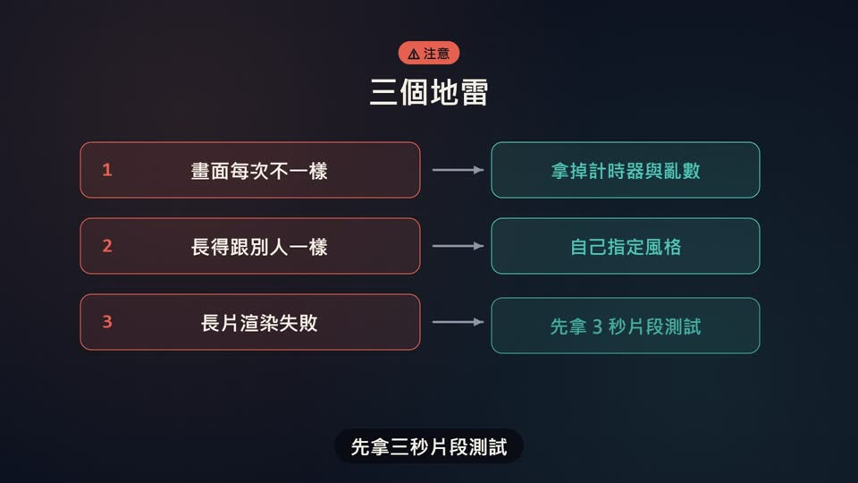
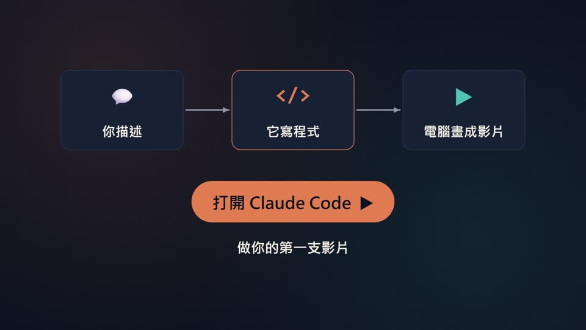

# 範本G_動態圖卡教學：深藍光暈＋圖卡跟著旁白跳出來

> 來源：2026-10-06 提示詞研究。06 號提示詞（「如何用 Claude Opus 5.5 做影片」教學動畫，約 70 秒）做出的影片。這份提示詞的特色是**節奏規則寫成數字**：元素在旁白念到的那一刻才出現、同組只差 0.05～0.1 秒、上一段往上飄時下一段已經進場。
> 觸發：使用者說「**範本G／動態圖卡教學／06 風格**」，或在選範本時選 G。
> 用法：**丟任何「教學、說明」文本 → 寫成 `storyboard.json` → `engine/make.py` 一行出片**。

## 30 秒示範片

[](示範/示範.mp4)

示範片：[`示範/示範.mp4`](示範/示範.mp4)（主題「測試範本」、edge-tts 配音）；示範分鏡：[`示範/storyboard.json`](示範/storyboard.json)

## 長什麼樣



**一句話**：深藍底＋左上珊瑚、右下青綠兩團緩慢漂移的光暈＋細格線；每段上方一個彩色膠囊標籤（STEP 1、⚠ 注意）＋大標題，下面的圖卡、膠囊、圓環**在旁白念到的那一刻彈出**；段落之間舊畫面往上飄、新畫面同時進場，沒有空白。只有旁白、沒有配樂，底部深色膠囊字幕一次一句。

| 開場：大標題＋計時圓環＋流程膠囊 | 對照：魔杖模糊圖 vs 程式逐字打出＋底片點亮 |
|---|---|
|  |  |
| **圖示卡：念到名稱才彈出** | **分鏡格：紅線劃掉、黃筆圈註、確認膠囊** |
|  |  |
| **要點膠囊＋重點框（多色公式）** | **時間軸：三張縮圖打勾＋進度條填滿** |
|  |  |
| **問題 → 解法逐列出現** | **收尾：三節點串線＋呼吸按鈕** |
|  |  |

## 適合
- 教學、微課、操作說明、「三個步驟／三個地雷」這類有清楚結構的解說
- 想要節奏俐落、畫面跟著旁白一個詞一個詞出來的影片
- 不適合：需要配樂撐氣氛的宣傳片（請用範本F 或 A～D）

## 範本F 和範本G 怎麼選
| | 範本F（01 風格） | 範本G（06 風格） |
|---|---|---|
| 結構 | 上方流程節點列常駐，強調「第幾步」 | 每段獨立的標題＋圖卡，強調「這段講什麼」 |
| 底色 | 近黑＋點陣 | 深藍＋珊瑚／青綠光暈＋格線 |
| 聲音 | 旁白＋輕柔配樂＋提示音 | 只有旁白 |
| 適合 | 流程、步驟、課程地圖、兩段式介紹 | 觀念教學、比較、清單、注意事項 |

## 改文本就會一模一樣嗎？
| 會一樣的 | 會跟著內容變的 |
|---|---|
| 背景、配色、字型、段落標題、字幕、所有進場與轉場動態、每種畫面的版面（寫死在 `engine/lib_G.js`） | 每段選哪一種畫面、畫面裡的字、元素對準旁白的哪個詞（寫在 `storyboard.json`） |

## 原始提示詞
逐字保存在 [`原始提示詞_06.txt`](原始提示詞_06.txt)（06 號提示詞）；它寫了什麼、沒寫什麼、為什麼還是做得好，見下一段。

## 重要提示詞在哪裡
| 檔案 | 內容 |
|---|---|
| [`原始提示詞_06.txt`](原始提示詞_06.txt) | 06 號提示詞（逐字）。寫了技術、規格、旁白稿、配音、**動畫節奏**、品檢、交付；**沒有寫畫面長什麼樣** |
| [`提示詞_範本G完整版.md`](提示詞_範本G完整版.md) | 原始提示詞＋把當時「AI 自己決定」的畫面（配色、標題膠囊、圓環、打字機、分鏡格、要點膠囊、時間軸、問題→解法、收尾按鈕）全部寫成規則 |
| `engine/lib_G.js` | 上面規則的實作 |

**06 提示詞真正產生效果的關鍵句**（研究結論，逐字出自原始提示詞）：
- 「用『關鍵詞在該句中的字元位置 ÷ 句長 × 該句秒數』推算念到某詞的時間，元素在那個時間點出現」→ 圖卡念到才彈出
- 「同一組元素一起進場，彼此只差 0.05–0.1 秒，不要一個等一個」→ 骨牌式分批進場
- 「下一段開始進場時，上一段還在退場（往上飄＋淡出），不留空白」→ 段落重疊轉場
- 「主角用 outBack 彈出或 outExpo 快進慢停」→ 回彈與快進慢停
- 「字幕按標點切成小句，同一時間只顯示一句」、「深色膠囊底、象牙白字」→ 字幕樣式
- 「每一格畫面只由時間決定」→ 可重現、可抽格檢查

## 概念忠實度檢查（交付前用連續格逐項確認）
| # | 招牌特徵 | 怎麼驗 |
|---|---|---|
| 1 | 元素在旁白念到的那一刻出現，不是整段一開始就全部出來 | 每段抽 3 格（開頭、關鍵詞前、關鍵詞後） |
| 2 | 同組元素分批錯開 0.07 秒左右（骨牌感） | 分鏡格、要點膠囊進場時抽連續格 |
| 3 | 段落交界：舊段往上飄淡出、新標題同時進場，沒有空白格 | 交界前後 0.3 秒抽 4 格 |
| 4 | 主角 outBack 回彈、次要 outExpo 上滑 | 看標題與卡片進場 |
| 5 | 深藍底、珊瑚／青綠光暈漂移、細格線；段落標題膠囊 | 總覽圖 |
| 6 | 字幕深色膠囊一次一句；只有旁白沒有配樂 | 聽成片 |

## 範本設定
| 項目 | 設定 |
|---|---|
| 背景 | #0d1220；左上珊瑚光暈 rgba(224,122,82,.13)、右下青綠光暈 rgba(79,195,181,.10)，緩慢漂移；80px 細格線（白 3.5%） |
| 卡片／框線／文字 | #182033／#2A3550／象牙白 #F5F0E6、灰 #8E96A8 |
| 強調色 | 珊瑚 #E07A52（主角）、青綠 #4FC3B5（完成、解法）、黃 #F2C14E（數字、時間點）、紅 #E5604F（問題） |
| 字型 | 微軟正黑體粗體；程式碼與公式用 Consolas |
| 進場 | 主角 outBack（0.6→1 倍回彈 0.55 秒）；次要 outExpo（下方 46px 上滑 0.6 秒）；同組錯開 0.07～0.08 秒 |
| 轉場 | 下一段開始前 0.3 秒，舊段往上飄 110px、0.45 秒淡出；新段標題提前 0.1 秒進場 |
| 字幕 | 底部深色膠囊（y=958、高 78）、象牙白 44px、按標點（含破折號）切句 |
| 配音 | 專案自己的 `.env.local` 有 `GEMINI_API_KEY` 才用 Gemini Flash TTS（自動最新正式版），沒有就用 edge-tts（Gemini 可用設計過的聲音或克隆聲音 `voice.voice_id`，過壞音檔關卡）；edge-tts 為 `zh-TW-YunJheNeural` +4%，段間 0.45 秒（原提示詞提到 F5-TTS 克隆聲音） |
| 聲音 | 不加配樂；loudnorm I=-16、TP=-2＋限幅 |
| 規格 | 1920×1080、30 fps、H.264 CRF 16、AAC 192k |

## 畫面型別（`storyboard.json` 每段的 `scene`）
共用欄位：`header: {label?, title, color?}`（段落標題；`color` 可填 coral／teal／yellow／red）。所有 `word` 都要寫**該段旁白裡真的有的字**。顏色名可用 ivory、dim、coral、teal、yellow、red。

| type | 截圖 | 用在 | 欄位 |
|---|---|---|---|
| `hook` | 範例06_01 | 開場 | `title: [[ [文字,顏色], ... ], ...]`（每行一個陣列）、`ring: {big, small, word}`、`chips: {items, word}` |
| `compare` | 範例06_02 | 兩種做法對照 | `left: {title, word, caption, captionWord}`、`right: {title, word, code, codeWord, filmWord, caption: [[文字,顏色]]}` |
| `iconCards` | 範例06_03 | 介紹 2～4 個工具或物件 | `cards: [{name, icon, iconText?, word}]`；`icon` 可填 term、hex、film，或一個字／符號 |
| `storyboard` | 範例06_04 | 先後順序、先做什麼 | `no: {icon, text, word}`、`gridWord`、`frames?`（6 格各寫一個字，不寫就畫簡筆）、`editWord`、`ok: {text, word}` |
| `chips` | 範例06_05 | 3～6 個要點 | `items: [{name, icon, word}]`（最後一顆珊瑚色強調）、`panel: {title, word, formula?}` |
| `timeline` | 範例06_06 | 檢查點、三個階段 | `points: [{name, word}]`、`checkWord`、`done: {word, button}`、`startLabel`、`endLabel` |
| `problemFix` | 範例06_07 | 地雷、常見錯誤 | `rows: [{problem, fix, pword, fword}]`（2～3 列） |
| `finale` | 範例06_08 | 收尾 | `nodes: [{name, icon, word}]`（3 個）、`cta: {text, word}`、`line: {text, word}` |

storyboard 最外層：`name`、`voice`、`pron`、`segments: [{say, tts?, scene}]`。

## 執行步驟
1. **讀文本**，切成 4～10 段，每段選一種畫面型別。
2. **寫分鏡給使用者確認** ⛔：每段旁白、畫面型別、畫面裡的字。
3. **寫 `storyboard.json`**（參考 [`examples/`](examples/)），放進新的專案資料夾。
4. **先抽格**：
   ```bash
   python <skill>/templates/範本G_動態圖卡教學/engine/make.py <專案資料夾> --stills
   ```
   看 `<專案>/抽格/_總覽.jpg`：文字落單斷行、字幕疊字、元素重疊、裝飾壓到文字、轉場空白。
5. **出片**：
   ```bash
   python <skill>/templates/範本G_動態圖卡教學/engine/make.py <專案資料夾>
   ```
   成片在 `<專案>/out/<name>.mp4`。
6. 照上面的忠實度表用連續格核對。

需要：Node.js、ffmpeg、Python（edge-tts；用 Gemini 時另需 numpy、faster-whisper）。第一次執行會在專案裡 `npm install playwright`。

## 檔案
```
engine/   make.py（一行出片）、lib_G.js（渲染器＋畫面庫）、scene.html、render.mjs、build_audio.py（與範本F 共用同一版）
examples/ 06_如何用ClaudeOpus做影片.storyboard.json（8 段，74.7 秒）
截圖/     逐段截圖與總覽
```

## 復刻用特效關鍵詞（寫進提示詞就是在指定這個效果）
| 特效 | 關鍵詞 |
|---|---|
| 背景 | 背景深藍 #0d1220，左上珊瑚色、右下青綠色兩團大光暈緩慢漂移，疊 80px 細格線（白色 3.5% 透明） |
| 念到才出現 | 元素在旁白念到該詞時出現，時間＝關鍵詞在句中的字元位置 ÷ 句長 × 該句秒數 |
| 主角回彈 | 主角元素用 outBack 彈出：從 0.6 倍放大到 1 倍，略超過再回彈，0.5 秒 |
| 次要上滑 | 次要元素用 outExpo 快進慢停：從下方 46px 上滑並淡入，0.6 秒 |
| 分批錯開 | 同一組元素一起進場，彼此只差 0.07 秒，不要一個等一個 |
| 上飄轉場 | 下一段進場時，上一段往上飄 110px 並在 0.45 秒內淡出，兩段重疊不留空白 |
| 字幕 | 字幕在畫面下方，深色膠囊底、象牙白字；按標點切成小句，同一時間只顯示一句 |
| 計時圓環 | 一個黃色圓環從 12 點鐘方向順時針描一圈（1.8 秒，慢入慢出），中間放大字 |
| 流程膠囊 | 流程用橫排膠囊表示，依序出現，膠囊之間的箭頭由左往右長出來 |
| 打字機 | 深色程式碼框，程式碼一個字一個字打出來（約 1.6 秒打完），第一行用青綠色 |
| 底片點亮 | 六個底片格排成 3×2，每 0.18 秒依序點亮一格（由暗變珊瑚色） |
| 魔杖星星 | 一根斜放的魔杖，旁邊 4 顆黃色 ✦ 星星繞圈閃爍 |
| 模糊圖塊 | 紫到珊瑚色的漸層圖塊，加 3px 模糊，中央一個白色問號 |
| 紅線劃掉 | 在圖示上用紅色粗斜線從左上劃到右下（0.4 秒），表示「先不要」 |
| 手繪圈註 | 用黃色橢圓像紅筆批改一樣描一圈，把重點圈起來（0.35 秒畫完） |
| 打勾 | 完成時，在綠色圓點中把勾勾分兩筆畫出來（0.4 秒） |
| 進度條 | 進度條從左到右填滿（1.2 秒，慢入慢出），填滿後彈出完成按鈕 |
| 重點框公式 | 重點用珊瑚色外框的強調框 outBack 彈出，裡面一行大字，下面一行多色公式 |
| 問題→解法 | 每列左邊紅框寫問題、中間箭頭延伸、右邊青綠框寫解法，由上往下逐列出現 |
| 呼吸按鈕 | 結尾珊瑚色大按鈕彈出後，以 ±3% 大小持續呼吸脈動 |

## 流程與品檢（2026-10-06，跟外層工作流一致）
不改畫面風格，只是讓影片更順、少出錯：
1. **逐字審稿**：`python <skill>/final_qa/review_prep.py storyboard.json` → Claude 逐句審 → `final_qa/review_report.py` → 給使用者 ⛔
2. **分鏡預覽**：`python engine/make.py <專案> --preview`（edge-tts 暫配、不花額度，每段 75% 處截圖）→ `抽格/分鏡預覽.html` ⛔
3. **正式出片**：`python engine/make.py <專案>`，配音後自動跑 AI 耳朵（有 Gemini 金鑰才跑）→ 兩個 AI 交叉聽 → 句內停頓（都只提醒）
4. 概念忠實度（上表）→ 抽檢回報加進品檢規則 → 收工紀錄（`進度.md`）

配音：專案自己的 `.env.local` 有 `GEMINI_API_KEY` 才用 Gemini Flash TTS（批次合成＋壞音檔關卡），否則 edge-tts。
