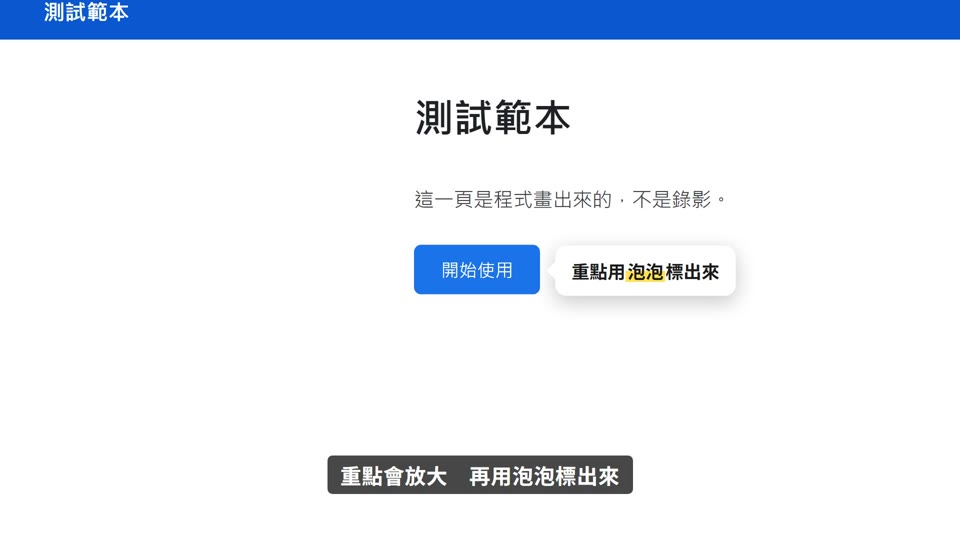
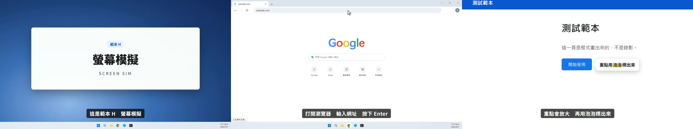

# 範本H_螢幕模擬：給文本就產生「像螢幕錄影」的操作畫面

> 來源：2026-10-07。使用者拿 PAPAYA 電腦教室〈找不到適合自己的 App〉當參考（46 秒後的螢幕操作段落），要求「**我給你一個文本，你能產生像螢幕錄影的畫面**」，不錄真實螢幕。
> 上一次（2026-10-01）模仿 PAPAYA 失敗的原因：做成「空的模擬視窗＋亂飄的游標」。這一版的差別：**視窗裡有真實內容、每一個操作都由旁白驅動**。
> 觸發：使用者說「**範本H／螢幕模擬／模擬螢幕錄影／不錄螢幕的操作教學**」，或在選範本時選 H。
> 用法：丟文本 → 寫 `storyboard.json`（screen／phone 場景＋操作動作）→ `make_video.py --template H` 一行出片。

## 長什麼樣（10 秒示範片）

[](示範/示範.mp4)



示範片：[`示範/示範.mp4`](示範/示範.mp4)（主題「測試範本」、edge-tts 配音）；示範分鏡：[`示範/storyboard.json`](示範/storyboard.json)；
完整範例（1-3 DNS，約 1 分鐘，四種場景都用到；最終品檢全部通過）：[`示範/範例_1-3_DNS.json`](示範/範例_1-3_DNS.json)；沒有這個 skill 時用：[`提示詞_範本H完整版.md`](提示詞_範本H完整版.md)

## 適合
軟體操作、網路／雲端／指令教學、App 使用說明——**要讓學生看到「在電腦上實際怎麼做」，但不想（或不能）錄真實螢幕**：
沒有帳號、畫面有個資、介面常改版、要跟旁白逐字對齊、要量產很多節。
不適合：需要真實網站「一模一樣」的畫面（例如教某個政府網站的實際欄位）→ 錄真實螢幕；純觀念課 → 範本E／G。

## 原始提示詞（2026-10-07，逐字保存使用者的要求＋設計）
```
使用者：papaya 的部份……我想要是你能產生模擬的畫面……就是我給你一個文本……你能產生像螢幕錄影的畫面……你能做到嗎
使用者：要，做成範本H。系統外觀 Windows 11；第一版元件：瀏覽器＋終端機、手機（iPhone 外框）。

Design: Generate a screen-recording-style tutorial from a script, without recording a real screen.
The whole frame IS a Windows 11 desktop (wallpaper, centered taskbar, clock) with real-looking apps:
Chrome (tab strip, omnibox, status bubble "正在解析主機...", built-in pages: new tab, Google home, ERR_NAME_NOT_RESOLVED),
Windows Terminal (PowerShell header, zh-TW nslookup output), and an iPhone chat app.
Every action happens exactly when the narrator says it: the cursor glides to the address bar and clicks,
text is typed character by character with keyboard clicks, Enter shows a loading spinner and status text,
terminal output prints line by line. Key moments get a smooth Screen-Studio-style camera push-in,
then a white rounded callout card with a tail points at the exact UI element, with a yellow highlighter
sweeping across the key words. Native Windows fonts (Segoe UI Variable, Microsoft JhengHei UI, Cascadia Mono).
```

## 流程與品檢（所有範本一致；完整十二步見 SKILL.md）
1. **逐字審稿**：`final_qa/review_prep.py storyboard.json` → Claude 逐句審 → `final_qa/review_report.py` → 給使用者 ⛔
2. **分鏡預覽**：`make_video.py storyboard.json --template H --preview`（edge-tts 暫配、不花額度）→ `qa/分鏡預覽/分鏡預覽.html` ⛔
   **範本H 每個動作（按 Enter、載入、放大、標示、泡泡、訊息）各截一張**，看得到每一步操作
3. **正式出片**：`make_video.py storyboard.json --template H`，自動跑文稿檢查 → 唸法標準題 → 建置（Gemini 過壞音檔關卡）→ 範本音效 → AI 耳朵 → 兩個 AI 交叉聽 → 句內停頓 → 版面 → 算圖 → 響度 → 成片品檢
4. 最終品檢 `final_qa/final_qa.py`（HTML＋MD）→ 概念忠實度（下表）→ 抽檢回報加進品檢規則 → 收工紀錄（`進度.md`）

配音：專案自己的 `.env.local` 有 `GEMINI_API_KEY` 才用 Gemini Flash TTS，否則 edge-tts。

**範本H 專屬的關卡**（build.py，2026-10-07）：
- 每個動作的 `cue`（旁白原文片段）**找不到就中止建置**（依旁白順序往後找；排錯順序會提示）
- 放大／標示／泡泡會**自動等前面的打字或指令輸出做完**（順延超過 0.3 秒會印 ⚠）——不會指到還沒出現的東西
- **泡泡文字要用旁白的說法**（文不對題會擋）；App 訊息、打的字、終端機輸出是畫面內容，不檢查
- 介面本身標 `data-qa="ignore"`：真實介面的字本來就小（16px），不量字級；泡泡、標題、字幕照常量
- 文稿檢查不看動作代號與真實介面文字（`do／app／to／page／typed／output／url／status…`）

## 概念忠實度檢查（交付前逐項打勾，用「連續格」看，不是只看單格）
| # | 招牌特徵 | 怎麼驗 | 通用版現況 |
|---|---|---|---|
| 1 | 看起來像**真的螢幕錄影**：真的介面（分頁、網址列、工作列、終端機）、真的字型、真的輸出格式；不是空殼視窗 | 總覽圖 | ✅ |
| 2 | **每個操作都跟著旁白發生**：唸到網址才打字、唸到「按下去」才 Enter、輸出逐行出現 | 連續格＋聽 | ✅ cue 換算秒數 |
| 3 | 重點用**鏡頭平滑推近**＋**白色泡泡（尖角指著目標）**＋**黃色螢光筆**指出來 | 連續格 | ✅ |
| 4 | 游標**滑過去才點**（有按壓與漣漪），打字**有按鍵聲**、點擊有滑鼠聲 | 連續格＋聽 | ✅ `tpl_sfx.py H` |
| 5 | 沒有亂飄的假游標、沒有為了「有動態」硬加的動作 | 看整段 | ✅（2026-10-01 失敗的教訓） |

## 範本設定
| 項目 | 設定 |
|---|---|
| Composition | `TemplateH`（`engine/template/src/tpl/TemplateH.tsx`；元件庫 `engine/template/src/lib/screen.tsx`） |
| 配樂 | `"music": {"genre": "lofi", "bpm": 80, "key": "C"}`，音量 0.25（旁白為主） |
| 系統外觀 | Windows 11（使用者選定：學生用的是 Windows）；**在 Windows 上算圖**字型最像（Segoe UI Variable、微軟正黑體 UI、Cascadia Mono） |
| 字幕 | 底部黑底白字（Netflix 繁中規範：每頁 ≤16 字、≤9 字/秒） |
| 音效 | 鍵盤（每個字一聲）、滑鼠、Enter、泡泡「啵」（`tpl_sfx.py H`，時間＝build.py 排好的同一份） |
| 切點 | `"snapBars": false`（跟著操作，不對拍） |

## 場景型別
| 型別 | 畫面 | props |
|---|---|---|
| `title` | Windows 桌面上的白卡片：章節小標＋大標題＋英文 | `eyebrow`、`title`、`en` |
| `screen` | 電腦螢幕：Chrome（＋Windows 終端機），游標、鏡頭、泡泡 | `browser`、`terminal`、`cursor`、`actions` |
| `phone` | iPhone 訊息 App（淺色背景），手指點擊 | `phone`、`actions` |
| `recap` | 白卡片清單，跟著旁白逐條打勾 | `heading`、`points`、`cueMap` |

**`screen` 的初始狀態**
- `browser`：`{"tab": "新分頁", "url": "", "page": "newtab"}`；`page` 可用 `newtab`、`google`、`dns_error`（無法連上這個網站）、`blank`，或自訂網頁 `{"site": "LINE Developers", "brand": "#06C755", "blocks": [...]}`
- 自訂網頁區塊（由上往下排，位置算得出來）：`h1`、`p`、`button`、`input`（`label`、`value`）、`card`（`title`、`text`）、`list`（`items`）、`code`（`lines`）、`image`（`label`）；要指到它就給 `id`，目標寫 `page:<id>`
- `terminal`：`{"shell": "powershell"|"cmd", "open": false, "user": "student"}`（`open: true`＝一開場就開著）
- `phone`：`{"app": "AI 小幫手", "color": "#06C755", "messages": [{"from": "other", "text": "…"}]}`

**動作 `actions`**（每個動作用 `cue`＝旁白原文片段對時；沒寫 cue 就用 `after`＝接在上一個動作後幾秒；`dt` 微調）
| do | 欄位 | 效果 |
|---|---|---|
| `click` | `to` | 游標滑過去點（有聲音）；`to: "omnibox"` 讓網址列進入編輯 |
| `move` | `to` | 游標移開（不點） |
| `type` | `app`（`browser`／`terminal`／`page`）、`typed`、`speed` | 逐字打字＋按鍵聲 |
| `enter` | `app`；browser：`status`（狀態列文字輪播）；terminal：`output`（輸出行） | 瀏覽器開始載入／終端機執行並逐行印出 |
| `load` | `page`、`title`、`url` | 載入完成、換頁 |
| `focus` | `app: "terminal"` | 游標到工作列點圖示，視窗彈出 |
| `zoom` | `to`、`z`（倍率）、`dur`；`reset: true` 拉回全畫面 | 鏡頭平滑推近 |
| `highlight` | `to` | 黃框（終端機是螢光筆）標出來 |
| `callout` | `to`、`text`（`[[字]]`＝螢光筆、`\n` 換行）、`side`（below／above／right／left） | 白色泡泡；顯示到下一個泡泡／hide／換鏡頭 |
| `hide` | — | 收掉泡泡 |
| `tap`（手機） | `to`：`mic`／`send`／`input` | 手指點擊；點 mic 會進入聆聽 |
| `message`（手機） | `from`：`me`／`other`、`text` | 訊息泡泡出現 |
| `notify`（手機） | `title`、`text`、`hold` | 上方通知橫幅 |

**目標 `to`**：`omnibox`、`tab`、`status`、`terminal`、`page`、`page:<id>`（自訂網頁）、`page:title／desc／tips／code／reload`（dns_error）、
`term:<文字>`（終端機裡那段文字的位置）、`icon:browser／terminal`、`phone:mic／send／input／header／last／screen`，或直接給座標 `{"x":..,"y":..,"w":..,"h":..}`（1920×1080）。

## 執行步驟
1. **拿到文本** → 找出「要在螢幕上做的操作」（打網址、跑指令、按按鈕、手機對話），其餘是開場／重點整理；寫 `storyboard.json`（旁白一行一句、每個動作寫 cue）
2. **逐字審稿＋給使用者審文本** ⛔
3. 建專案並一行做完：
   ```bash
   python <skill>/engine/scripts/new_project.py <專案> --no-install   # 再 npm install 或 junction 共用 node_modules
   cd <專案> && cp <你的分鏡>.json storyboard.json
   python <skill>/engine/scripts/make_video.py storyboard.json --template H --preview   # 先給使用者看分鏡預覽 ⛔
   python <skill>/engine/scripts/make_video.py storyboard.json --template H --name <片名>
   ```
4. 看 `qa/pre_H.md`、`qa/post_H.md` 與總覽圖 → 最終品檢 → **用連續格逐項核對上面的「概念忠實度檢查」**

## 參考實作
- 渲染器：`engine/template/src/tpl/TemplateH.tsx`；元件庫：`engine/template/src/lib/screen.tsx`
- 動作換算（cue → 格數、打字時間表、等待規則）：`engine/scripts/build.py` 的 `resolve_screen()`
- 範例分鏡：[`示範/範例_1-3_DNS.json`](示範/範例_1-3_DNS.json)（Chrome 打網址→解析主機、DNS 錯誤頁、終端機 nslookup、手機 App）

## 之後可以加的元件
Claude／AI 對話 App（打字送出、回覆串流）、檔案總管、VS Code、說明卡（米色紙＋勾選清單＋螢光筆）、macOS 外觀。
