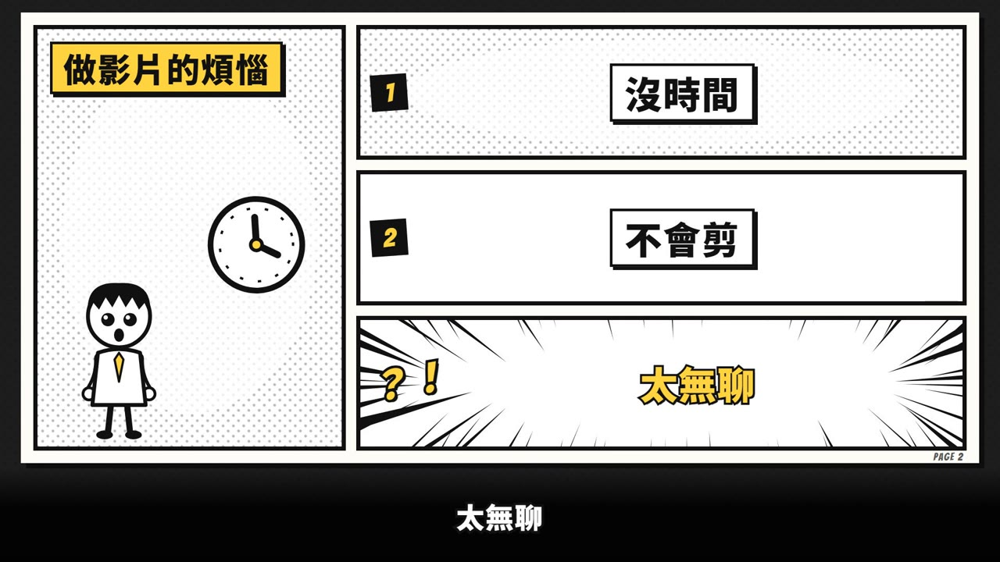
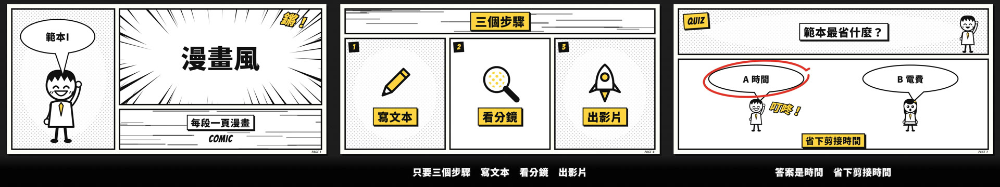

# 範本I_漫畫風：漫畫風 Comic

> 來源：2026-10-07 屏榮高中招生宣導片「新風格 1 漫畫風」。使用者授權「內容和過程全部由你決定」做出來，看完說「漫畫風跟動漫風整個風格是不錯的」，要求收進 skill 範本；風格不改，只微調到最終品檢全部通過。
> 觸發：使用者說「**範本I／漫畫風／漫畫範本**」，或在選範本時選 I。（範本B 是「創客手稿」筆記本風，兩個不要搞混）
> 用法：**丟任何文本 → 拆成共用場景語彙 → 選本範本 → 產出同一風格的影片**。

## 長什麼樣（30 秒示範片）

[](示範/示範.mp4)



示範片：[`示範/示範.mp4`](示範/示範.mp4)（edge-tts 配音，旁白介紹本範本、演出各種場景型別與招牌特效）；示範分鏡：[`示範/storyboard.json`](示範/storyboard.json)；沒有這個 skill 時用：[`提示詞_範本I完整版.md`](提示詞_範本I完整版.md)

## 適合
招生宣導、活動介紹、生活情境教學、輕鬆的觀念說明：每段內容是一頁漫畫，重點用分格、對話框、擬聲字「砰！」表現，節奏明快、有幽默感。
不適合：需要真實照片或操作畫面的內容（改用範本H）、很嚴肅的主題（災難、醫療決策等）。

## 原始提示詞（逐字保存）
```
如果全部完成就再多渲染4種風格 內容和過程全部由你決定 風格如下 1.漫畫風 2.地圖風 3.音樂風 4.動漫風 能理解我說的並直接完成嗎 都完成後做成一個展示網頁讓我一次觀看
```
收進範本時的要求：
```
我覺得漫畫風跟動漫風整個風格是不錯的。我想要你幫我更新到我的 skill 範本上
```
**這個範本怎麼解讀它**：白紙頁面＋粗黑框分格、網點、集中線、速度線、對話框、旁白框、黑邊黃字擬聲字、簡筆漫畫小人；黑白為主、黃色 #ffd23f 強調；每個場景翻一頁。

## 流程與品檢（共用引擎，和範本 A～D 一致）
1. **逐字審稿**：`final_qa/review_prep.py storyboard.json` → Claude 逐句審 → `final_qa/review_report.py` → 給使用者 ⛔
2. **分鏡預覽**：`make_video.py storyboard.json --template I --preview`（edge-tts 暫配）→ `qa/分鏡預覽/分鏡預覽.html` ⛔
3. **正式出片**：`make_video.py storyboard.json --template I`：圖示檢查（含漫畫圖示庫）→ 名詞檢查 → 唸法標準題 → 建置 → 範本音效 → AI 耳朵 → 交叉聽 → 句內停頓 → 版面品檢 → 算圖 → 響度 → 成片檢查
4. **最終品檢**：`final_qa/final_qa.py <成片> --spec src/data/spec.json --layout qa_layout.json` 全部通過；再照下表用連續格核對概念忠實度

配音：專案自己的 `.env.local` 有 `GEMINI_API_KEY` 才用 Gemini Flash TTS，否則 edge-tts。

## 概念忠實度檢查（交付前逐項打勾，用「連續格」看，不是只看單格）
| # | 招牌特徵 | 怎麼驗 | 現況 |
|---|---|---|---|
| 1 | 每個場景是一頁白紙漫畫，換場時舊頁往左滑走並微旋轉（約 0.6 秒，平滑、沒有黑白反轉） | 場景交界抽 5 格連續格 | ✅ |
| 2 | 粗黑框分格依旁白 cue 一格一格出現（淡入＋輕微縮放，沒有白閃） | 每場景抽 3 格 | ✅ |
| 3 | 集中線、網點、速度線：**集中線靜止**（只由 seed 決定形狀），速度線慢速平移 | 連續 10 格看集中線不抖動 | ✅（屏榮版每秒換形 2.5 次，被判畫面突跳，收進範本時改成靜止） |
| 4 | 黑邊黃字擬聲字（鏘！砰！？！叮咚！正解！）＋簡筆漫畫小人（揮手、驚訝、歡呼） | 總覽圖 | ✅ |
| 5 | 數字砸進來並**往上數**：每位數換數字時舊的往上滑出淡出、新的從下滑入淡入，前快後慢，停在正確值（`lib/rollnum.tsx`） | stat 場景連續格 | ✅（不用逐格硬換字：大字逐格換字會被判畫面突跳；好特效保留、換做法） |
| 6 | 字幕白字黑邊粗體，下方固定深色漸層底；畫面內容一律 y<900 | 總覽圖＋版面品檢 | ✅ |
| 7 | 音效：翻頁咻、每格出現「啵」、stat／quiz／recap 重音 | 聽成片 | ✅ |

## 範本設定
| 項目 | 設定 |
|---|---|
| Composition | `TemplateI`（`engine/template/src/tpl/TemplateI.tsx`，漫畫元件在 `engine/template/src/lib/comic/kit.tsx`、圖示庫 `lib/comic/icons.tsx`） |
| 配樂 | `"music": {"genre": "comedy", "bpm": 120, "key": "C"}`（make_video 預設，旁白時自動閃避） |
| 旁白 | 男聲雲哲 `zh-TW-YunJheNeural` +0%（測試片由使用者選定） |
| 字幕 | 白字黑邊粗體（Noto Sans TC 900）、y≈952；下方 y 900→1080 深色漸層底 |
| 字型 | 中文 Noto Sans TC；英數大字與擬聲字 Bangers |
| 音效 | `tpl_sfx.py I`：換場 whoosh、每個 cue「啵」、stat／quiz／recap 加 impact，寫進 `tpl_sfx.wav` |
| 切點 | `"snapBars": false`（示範）；長片可用 `true` |
| 品牌 | 有 LOGO 時整頁縮到 0.88、避開右上角 |

## 場景對應
| 場景 | 畫面 |
|---|---|
| title | 左格網點底＋小人揮手＋對話框（eyebrow）；右上集中線大標題＋「鏘！」；右下速度線副標旁白框＋英文 |
| scenario | 左格標題黃框＋情境圖示＋思考小人（出問題時變驚訝）；右邊 pills 逐格出現（1～3 個一欄、4 個 2×2）；最後一格集中線黃字＋「？！」 |
| definition | 上格集中線大字，highlight 段落在 cueMap[1] 畫黃色底線＋「重點！」；下排小人格＋sideNotes 補充格 |
| cards | 速度線標題格；2～4 格並排（編號、圖示、黃框標題、說明）；footer 變黃色網點格 |
| vs | 左右兩格對打（danger 網點底＋NG!、success 集中線底＋OK!）；中間大字 VS（或 ＋、≠）；下方結論黃框 |
| stat | 左格集中線巨大數字（砸進來後滾輪式往上數）＋單位＋驚訝小人＋「砰！」；右側 label／sub |
| quiz | 上格 QUIZ 標籤＋題目＋思考小人；下格每個選項是一個小人的對話框；揭曉時紅圈＋「叮咚！」＋答對的小人歡呼，再出現 afterNote |
| recap | 左格「重點回顧」逐項打勾（黃勾）；右上清單＋歡呼小人；右下速度線 NEXT＋下一節預告 |
| qaEnd | 上格集中線題目＋FINAL QUIZ；下方 A～D 四格；answerSec 時答案格變黃＋紅圈＋「正解！」 |

圖示：`icon` 可以填 emoji 或漫畫圖示名稱：trophy、plane、cert、paw、dog、cart、laptop、cup、hotel、bowl、camera、printer、laser、tablet、clapper、baby、coin、bag、chip、circuit、phone、bolt、bus、bed、ac、lamp、book、cap、cross、suitcase、star、heart、square、cube、school、monitor、bulb、clock、pencil、mic、target、warning、chart、magnifier、people、calendar、chat、gear、check、rocket。找不到時退回 `lib/sketches` 線稿（畫成粗黑線），再沒有才畫圓框＋emoji，不會出現空白或「?」。

## 執行步驟
1. **拿到文本** → 依 [`../範本風格_場景語彙.md`](../範本風格_場景語彙.md) 拆成 9 種場景，寫出 `storyboard.json`（旁白一行一句）。
2. **給使用者審文本** ⛔
3. 建專案並出片：
   ```bash
   python <skill>/engine/scripts/new_project.py <專案> --no-install   # 再 npm install 或 junction 共用 node_modules
   python <skill>/engine/scripts/make_video.py storyboard.json --template I --preview   # 分鏡預覽 ⛔
   python <skill>/engine/scripts/make_video.py storyboard.json --template I             # 正式出片
   python <skill>/final_qa/final_qa.py out/<成片>.mp4 --spec src/data/spec.json --layout qa_layout.json
   ```
4. 最終品檢全部通過後，照上面的忠實度表用連續格逐項核對。

## 參考實作
- 通用渲染器：`engine/template/src/tpl/TemplateI.tsx`＋`engine/template/src/lib/comic/`
- 完整測試（9 種場景、約 90 秒，最終品檢全部通過）：主題「如何準備一場上台報告」：[`示範/範例_完整測試_storyboard.json`](示範/範例_完整測試_storyboard.json)（9 種場景都有，可當寫分鏡的範例）
