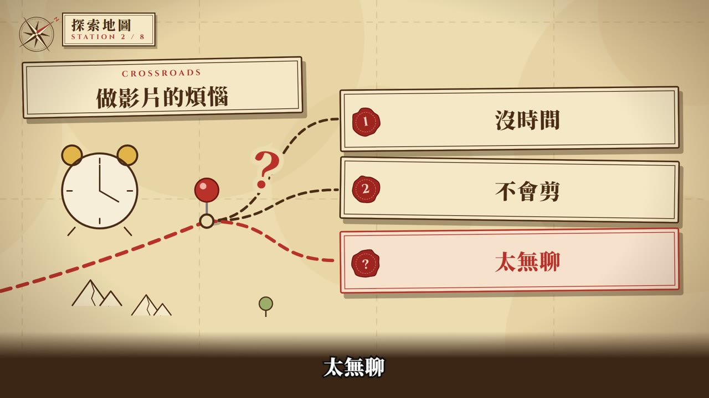
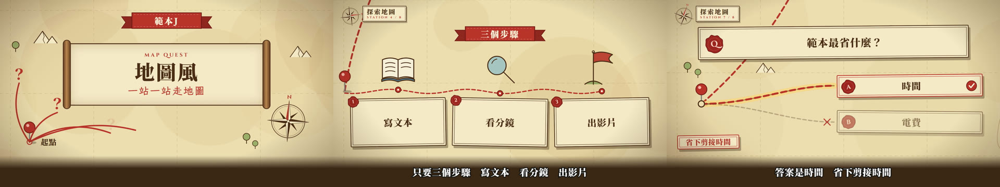

# 範本J_地圖風：地圖風 Map Quest

> 來源：2026-10-07 屏榮高中招生宣導片「新風格 2 地圖風」（使用者授權「內容和過程全部由你決定」做出來，最終品檢全過）。2026-10-08 使用者說「這幾個風格都不錯」，指定收進範本庫。
> 觸發：使用者說「**範本J／地圖風／地圖範本**」，或在選範本時選 J。
> 用法：**丟任何文本 → 拆成共用場景語彙 → 選本範本 → 產出同一風格的影片**。

## 長什麼樣（30 秒示範片）

[](示範/示範.mp4)



示範片：[`示範/示範.mp4`](示範/示範.mp4)（edge-tts 配音，旁白介紹本範本、演出所有場景型別）；示範分鏡：[`示範/storyboard.json`](示範/storyboard.json)；9 場景完整測試分鏡：[`示範/範例_完整測試_storyboard.json`](示範/範例_完整測試_storyboard.json)；沒有這個 skill 時用：[`提示詞_範本J完整版.md`](提示詞_範本J完整版.md)

## 適合
有「一步一步走」感覺的內容：學習路徑、闖關式課程、招生介紹（每個科別一站）、活動流程、旅程與歷史沿革。整支是一張探索地圖，觀眾跟著紅色路線一站站前進，最後回頭看走過的路。
不適合：需要真實照片或操作畫面的內容（改用範本H）、節奏要很快很炫的短片（改用範本C）。

## 原始提示詞（逐字保存）
```
如果全部完成就再多渲染4種風格 內容和過程全部由你決定 風格如下 1.漫畫風 2.地圖風 3.音樂風 4.動漫風 能理解我說的並直接完成嗎 都完成後做成一個展示網頁讓我一次觀看
```
收進範本時的要求：
```
我覺得有幾個風格滿不錯的，可以上傳到我的範本庫當範本。…這幾個風格都不錯，讀完我的 skill 後依照規則變成範本：漫畫風、地圖風、宇宙風、黏土玩具風
```
**這個範本怎麼解讀它**：一張羊皮紙「探索地圖」——紅色虛線路線、圖釘、指南針、手繪地標（墨線＋水彩）、註記卡、紅緞帶、蠟封章；鏡頭在大地圖上從一站移到下一站。

## 流程與品檢（共用引擎，和範本 A～D 一致）
1. **逐字審稿**：`final_qa/review_prep.py storyboard.json` → Claude 逐句審 → `final_qa/review_report.py` → 給使用者 ⛔
2. **分鏡預覽**：`make_video.py storyboard.json --template J --preview`（edge-tts 暫配）→ `qa/分鏡預覽/分鏡預覽.html` ⛔
3. **正式出片**：`make_video.py storyboard.json --template J`：圖示檢查（含地圖圖示庫）→ 名詞檢查 → 唸法標準題 → 建置 → 範本音效 → AI 耳朵 → 交叉聽 → 句內停頓 → 版面品檢 → 算圖 → 響度 → 成片檢查
4. **最終品檢**：`final_qa/final_qa.py <成片> --spec src/data/spec.json --layout qa_layout.json` 全部通過；再照下表用連續格核對概念忠實度

配音：專案自己的 `.env.local` 有 `GEMINI_API_KEY` 才用 Gemini Flash TTS，否則 edge-tts。

## 概念忠實度檢查（交付前逐項打勾，用「連續格」看，不是只看單格）
| # | 招牌特徵 | 怎麼驗 | 現況 |
|---|---|---|---|
| 1 | 整支是一張大羊皮紙地圖，每個場景是一站（蛇行排列）；換場時鏡頭連續平移（中途微拉遠，看得到站與站之間的山、樹、湖） | 場景交界抽 5 格連續格 | ✅ |
| 2 | 紅色虛線路線跟鏡頭同步畫到下一站，到站時圖釘落下並留在地圖上 | 換站連續格 | ✅ |
| 3 | 地標先描墨線、再上水彩、最後描細節；註記卡、紅緞帶、蠟封章 | 每場景抽 3 格 | ✅ |
| 4 | 數字刻在石碑上**往上數**（`lib/rollnum.tsx`：舊數字往上滑出淡出、新的從下滑入淡入） | stat 連續格 | ✅ |
| 5 | 回顧時重畫走過的路線、逐站打勾；結尾測驗是四個寶箱，答案寶箱翻開 | recap／qaEnd 連續格 | ✅ |
| 6 | 字幕下方固定木桌色漸層底（y 900→1080），地圖移動時字幕後面穩定；畫面內容 y<900 | 版面品檢＋F2 字幕抖動 | ✅（屏榮版曾因地圖在字幕後移動被判字幕抖動，加漸層底後通過） |
| 7 | 音效：換站捲紙咻、每個註記「啵」、數字與測驗「叮」 | 聽成片 | ✅ |

## 範本設定
| 項目 | 設定 |
|---|---|
| Composition | `TemplateJ`（`engine/template/src/tpl/TemplateJ.tsx`；元件 `engine/template/src/lib/map/`：`kit.tsx` 路線／圖釘／註記卡、`world.tsx` 站點與地形、`icons.tsx` 手繪地標；數字 `lib/rollnum.tsx`） |
| 配樂 | `"music": {"genre": "acoustic", "bpm": 120, "key": "G"}`（make_video 預設，旁白時自動閃避） |
| 旁白 | 男聲雲哲 `zh-TW-YunJheNeural`（使用者選定的測試聲音） |
| 字幕 | 深墨色粗體（Noto Serif TC 900）、y≈954；下方木桌色漸層底；緊接上一句時直接換字不淡入 |
| 字型 | 標題與內文 Noto Serif TC；手寫註記 LXGW WenKai TC；英文小標 Cinzel |
| 色彩 | 羊皮紙 #ecdcb0、墨 #4a2c17、路線紅 #b8322a、海 #a9c8c6、金 #e0b13f、葉綠 #9aae6a |
| 音效 | `tpl_sfx.py J`：換站 whoosh、每個 cue「啵」、stat／quiz「叮」，寫進 `tpl_sfx.wav` |

## 場景對應
| 場景 | 畫面 |
|---|---|
| title | 紅緞帶 eyebrow＋卷軸展開（英文、標題、副標）；左下「起點」與紅色岔路加問號；右下大指南針轉入 |
| scenario | 標題註記卡＋情境地標；路口分出小路連到右側註記卡逐張出現；最後一張是問題：紅框、紅路、蠟封章打「？」 |
| definition | 大型地標被手繪紅圈圈起、頂端升起紅旗寫 label；右側大卡寫 bigText，highlight 刷金色並變紅；sideNotes 是釘紅圖釘的便條 |
| cards | 紅緞帶標題；2～4 個小地標沿小路排開，旁白念到哪張路就畫到哪；下方註記卡帶編號蠟封；footer 印章條 |
| vs | 同一路口分兩條路：危險的墨色虛線＋紅叉蓋「此路不通」，正確的紅色路線＋金光蓋「正確路線」；中間蠟封章寫 VS |
| stat | 石碑從地面升起帶揚塵，數字刻在碑上往上數；右側說明卡與補充便條 |
| quiz | 題目卡；路口分 2～3 條路到選項卡；揭曉時正確的路亮紅＋金光暈＋打勾，其他變淡打叉；afterNote 左下 |
| recap | 左邊小地圖重畫走過的站並逐站打勾；右邊回顧清單逐條打勾；木製路標寫「NEXT＋下一節」 |
| qaEnd | 題目卡＋四個寶箱選項；揭曉時答案寶箱翻開冒金光、被紅圈圈起，其他變淡 |

圖示：`icon` 可以填 emoji 或地圖圖示名稱：booktower、lighthouse、market、harbor、cottage、cinema、garden、tower、chest、gate、camp、castle、stele、target、scroll、quill、mic、clock、hourglass、book、bulb、flag、mountain、magnifier、people、chat、warning、star、trophy、compass、heart、chart、check、calendar、house、tree、eye、map、board、key、rocket、gear、coin。找不到時退回 `lib/sketches` 線稿（畫成手繪墨線），再沒有才畫圓框＋emoji，不會出現空白或「?」。

## 執行步驟
1. **拿到文本** → 依 [`../範本風格_場景語彙.md`](../範本風格_場景語彙.md) 拆成 9 種場景，寫出 `storyboard.json`（旁白一行一句）。
2. **給使用者審文本** ⛔
3. 建專案並出片：
   ```bash
   python <skill>/engine/scripts/new_project.py <專案> --no-install   # 再 npm install 或 junction 共用 node_modules
   python <skill>/engine/scripts/make_video.py storyboard.json --template J --preview   # 分鏡預覽 ⛔
   python <skill>/engine/scripts/make_video.py storyboard.json --template J             # 正式出片
   python <skill>/final_qa/final_qa.py out/<成片>.mp4 --spec src/data/spec.json --layout qa_layout.json
   ```
4. 最終品檢全部通過後，照上面的忠實度表用連續格逐項核對。

## 參考實作
- 通用渲染器：`engine/template/src/tpl/TemplateJ.tsx`＋`engine/template/src/lib/map/`
- 9 場景完整測試（約 90 秒）：[`示範/範例_完整測試_storyboard.json`](示範/範例_完整測試_storyboard.json)
