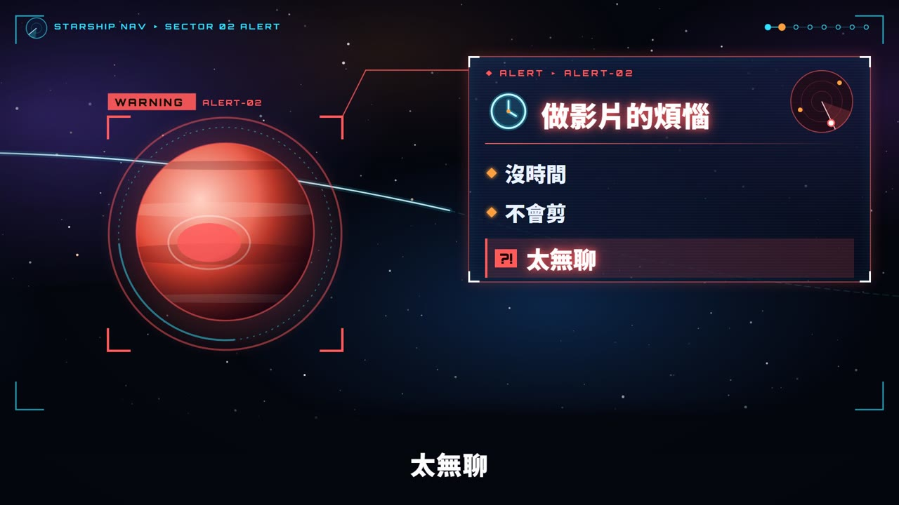
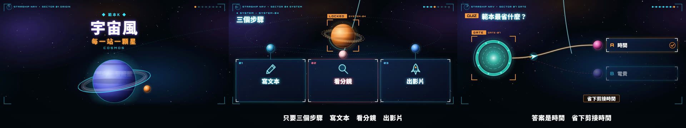

# 範本K_宇宙風：宇宙風 Cosmos

> 來源：2026-10-07 屏榮高中招生宣導片第二批「宇宙風」（使用者指定風格，最終品檢全過）。2026-10-08 使用者說「這幾個風格都不錯」，指定收進範本庫。
> 觸發：使用者說「**範本K／宇宙風／宇宙範本**」，或在選範本時選 K。
> 用法：**丟任何文本 → 拆成共用場景語彙 → 選本範本 → 產出同一風格的影片**。

## 長什麼樣（30 秒示範片）

[](示範/示範.mp4)



示範片：[`示範/示範.mp4`](示範/示範.mp4)（edge-tts 配音，旁白介紹本範本、演出所有場景型別）；示範分鏡：[`示範/storyboard.json`](示範/storyboard.json)；9 場景完整測試分鏡：[`示範/範例_完整測試_storyboard.json`](示範/範例_完整測試_storyboard.json)；沒有這個 skill 時用：[`提示詞_範本K完整版.md`](提示詞_範本K完整版.md)

## 適合
科技、科學、資訊類主題，或想要「探索、啟航、未來感」的招生與課程介紹：每個重點是一顆星體，太空船一站站飛過去，HUD 鎖定、資料面板逐行出現，最後拉遠看整張星圖。
不適合：溫馨生活題材（改用範本L 黏土玩具風或範本D 白板手繪）、需要真實照片的內容。

## 原始提示詞（逐字保存）
```
1.依你建議 2.這2個範本不改 3.在產生四個不同的風格（藍球風格.傳說對決風格.修仙風格.宇宙風格）
```
收進範本時的要求：
```
我覺得有幾個風格滿不錯的，可以上傳到我的範本庫當範本。…這幾個風格都不錯，讀完我的 skill 後依照規則變成範本：漫畫風、地圖風、宇宙風、黏土玩具風
```
**這個範本怎麼解讀它**：太空船星際航行——深空星點分層視差、星雲漸層、每個重點一顆行星（各有配色與特徵環）、航行時星點拉成光線、抵達時 HUD 鎖定框「LOCKED」、全像資料面板、掃描圈、片尾星圖。

## 流程與品檢（共用引擎，和範本 A～D 一致）
1. **逐字審稿**：`final_qa/review_prep.py storyboard.json` → Claude 逐句審 → `final_qa/review_report.py` → 給使用者 ⛔
2. **分鏡預覽**：`make_video.py storyboard.json --template K --preview`（edge-tts 暫配）→ `qa/分鏡預覽/分鏡預覽.html` ⛔
3. **正式出片**：`make_video.py storyboard.json --template K`：圖示檢查（含宇宙圖示庫）→ 名詞檢查 → 唸法標準題 → 建置 → 範本音效 → AI 耳朵 → 交叉聽 → 句內停頓 → 版面品檢 → 算圖 → 響度 → 成片檢查
4. **最終品檢**：`final_qa/final_qa.py <成片> --spec src/data/spec.json --layout qa_layout.json` 全部通過；再照下表用連續格核對概念忠實度

配音：專案自己的 `.env.local` 有 `GEMINI_API_KEY` 才用 Gemini Flash TTS，否則 edge-tts。

## 概念忠實度檢查（交付前逐項打勾，用「連續格」看，不是只看單格）
| # | 招牌特徵 | 怎麼驗 | 現況 |
|---|---|---|---|
| 1 | 每個場景是一顆星體（蛇形排列）；換場時太空船沿曲線航線飛過去，途中拉遠、星點拉成光線 | 場景交界抽 5 格連續格 | ✅ |
| 2 | 抵達時鎖定框由大縮小鎖住星體並轉橘，「LOCKED」只在標籤範圍柔和脈動 | 抵達連續格 | ✅ |
| 3 | 全像資料面板先橫向、再縱向展開，內容依旁白逐行出現；場景結束前收起 | 每場景抽 3 格 | ✅ |
| 4 | 數字在掃描圈裡發光**往上數**（`lib/rollnum.tsx`：舊數字往上滑出淡出、新的從下滑入淡入） | stat 連續格 | ✅ |
| 5 | 測驗是三條航道，揭曉時正確航道亮起、太空船飛過去；回顧時拉遠成整張星圖逐顆打勾 | quiz／recap 連續格 | ✅ |
| 6 | 星空 svg 只到 y 900，下緣固定深色漸層（900→1080），星點不在字幕區移動或閃爍；星點各自閃爍、不全畫面同步 | F1／F2 字幕閃爍抖動 | ✅（星空移動最容易被判字幕抖動） |
| 7 | 音效：航行上升音、資料面板嗶聲、title／stat／qaEnd 鎖定重音 | 聽成片 | ✅ |

## 範本設定
| 項目 | 設定 |
|---|---|
| Composition | `TemplateK`（`engine/template/src/tpl/TemplateK.tsx`；元件 `engine/template/src/lib/cosmos/`：`kit.tsx` 星體／星空／鎖定框／全像面板／太空船、`icons.tsx` 青色發光圖示；數字 `lib/rollnum.tsx`） |
| 配樂 | `"music": {"genre": "minimal", "bpm": 120, "key": "Am"}`（make_video 預設，旁白時自動閃避） |
| 旁白 | 男聲雲哲 `zh-TW-YunJheNeural`（使用者選定的測試聲音） |
| 字幕 | 白字深色描邊粗體（Noto Sans TC 900）、y≈952；下方深色漸層底；緊接上一句時直接換字不淡入 |
| 字型 | 中文 Noto Sans TC；英數 HUD 與大數字 Orbitron |
| 色彩 | 深空 #05070f、星雲紫 #6b4bd8、青 #36e2ff、橘 #ffa040、危險紅 #ff5a5a、宜居綠 #6cf0a0 |
| 音效 | `tpl_sfx.py K`：換場前 riser、每個 cue 嗶聲、title／stat／qaEnd impact，寫進 `tpl_sfx.wav` |

## 場景對應
| 場景 | 畫面 |
|---|---|
| title | 母星特寫（帶環、繞行小衛星），開場鏡頭推近；eyebrow、發光大標題、橘色副標由中間往兩側展開、英文 |
| scenario | 紅色警戒星＋擴散警示環（WARNING）；右側 ALERT 面板（圖示、標題、雷達），每個 pill 出現時雷達多一個光點；最後一條「問題」紅底＋「?!」 |
| definition | 行星鎖定後連線到全像框；大字定義，重點字轉青色並長出發光底線；sideNotes 在框下方依序出現 |
| cards | 中央行星＋2～4 顆衛星在橢圓軌道上，念到時亮起並垂下連線到資料卡（編號、圖示、標題、說明）；footer 橘框標籤 |
| vs | 雙星：紅色危險星（DANGER）對綠色宜居星（SAFE）各自鎖定；中間 VS＋流動虛線；下方 NG／OK 面板 |
| stat | 恆星鎖定，右側大掃描圈旋轉、掃描線掃過一次；發光大數字往上數；上方 label、下方 sub |
| quiz | 星門＋三條流動虛線航道通往 A/B/C；揭曉時正確航道亮起、太空船飛過去，錯的轉紅變暗；afterNote 底部 |
| recap | 鏡頭拉遠成整張星圖，走過的星依序點亮打勾、航線全亮；右側任務日誌逐條打勾＋「NEXT DESTINATION」 |
| qaEnd | 四顆目的地行星＋A～D；到 answerSec 時正確那顆被鎖定（LOCKED ANSWER）加光環，其他變暗 |

圖示：`icon` 可以填 emoji 或宇宙圖示名稱：rocket、planet、star、satellite、telescope、warning、clock、hourglass、target、bulb、mic、pencil、book、chart、people、person、chat、document、slides、check、cross、trophy、heart、gear、globe、eye、compass、flag、bolt、laptop、phone、calendar、search、key、lock、question、smile、nervous、music、home、camera、coin、radar。找不到時退回 `lib/sketches` 線稿（畫成青色發光線），再沒有才畫圓框＋emoji，不會出現空白或「?」。

## 執行步驟
1. **拿到文本** → 依 [`../範本風格_場景語彙.md`](../範本風格_場景語彙.md) 拆成 9 種場景，寫出 `storyboard.json`（旁白一行一句）。
2. **給使用者審文本** ⛔
3. 建專案並出片：
   ```bash
   python <skill>/engine/scripts/new_project.py <專案> --no-install   # 再 npm install 或 junction 共用 node_modules
   python <skill>/engine/scripts/make_video.py storyboard.json --template K --preview   # 分鏡預覽 ⛔
   python <skill>/engine/scripts/make_video.py storyboard.json --template K             # 正式出片
   python <skill>/final_qa/final_qa.py out/<成片>.mp4 --spec src/data/spec.json --layout qa_layout.json
   ```
4. 最終品檢全部通過後，照上面的忠實度表用連續格逐項核對。

## 參考實作
- 通用渲染器：`engine/template/src/tpl/TemplateK.tsx`＋`engine/template/src/lib/cosmos/`
- 9 場景完整測試（約 90 秒）：[`示範/範例_完整測試_storyboard.json`](示範/範例_完整測試_storyboard.json)
