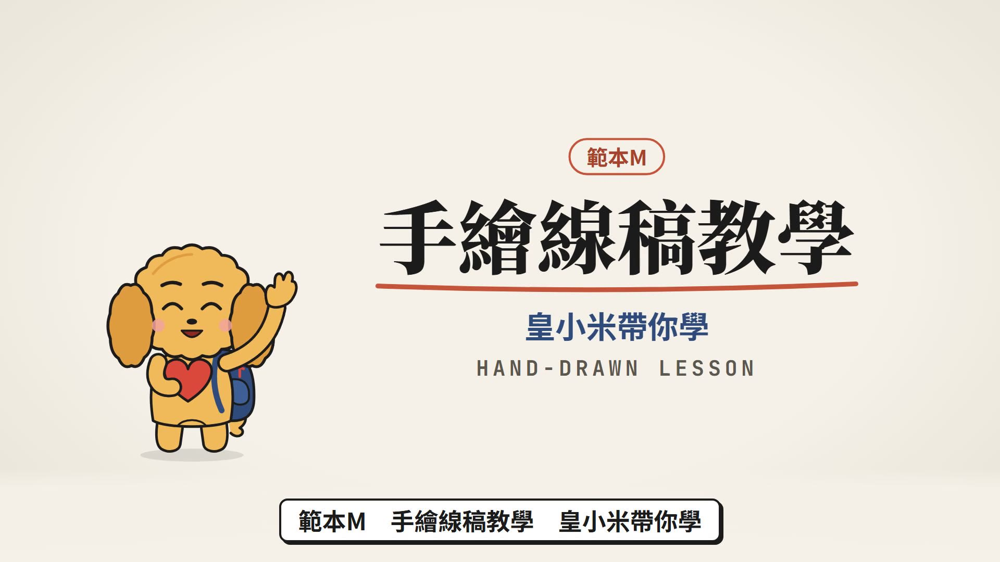
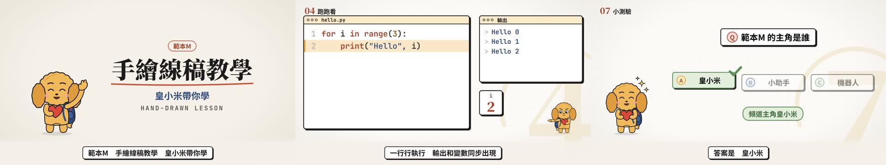

# 範本M_手繪線稿教學：皇小米帶你學 Hand-drawn Lesson

> 來源：2026-10-10 使用者下載一支喜歡的動畫教學影片（「別再手動整理5T素材」，看前 55 秒），問「你能模仿得出來嗎」。拆解它的手法（米白紙、黑色粗線稿、磚紅點綴、字模糊淡入、章節大數字卡、游標演戲、震動線、時鐘狂跑進度 0% 的反差）做了迴圈、研習行前通知、選擇結構、資訊科介紹四支試做；使用者說「做起來的感覺不錯」「這個拿來當廣告跟拿來當教學影片都不錯」，指定把頻道 logo 的主角**皇小米**融入、加一點專業配色，並要求收進範本庫；同一套線稿元件另外做成行前通知專用的範本N。
> 觸發：使用者說「**範本M／手繪線稿／線稿教學／皇小米範本**」，或在選範本時選 M。
> 用法：**丟任何文本 → 拆成共用場景語彙（另有範本M 專用的 `code` 程式執行場景）→ 選本範本 → 產出同一風格的影片**。

## 長什麼樣（30 秒示範片）

[](示範/示範.mp4)



示範片：[`示範/示範.mp4`](示範/示範.mp4)（edge-tts 配音，皇小米介紹本範本、演出 9 種場景）；示範分鏡：[`示範/storyboard.json`](示範/storyboard.json)；完整測試（選擇結構一課）：[`示範/範例_完整測試_storyboard.json`](示範/範例_完整測試_storyboard.json)；沒有這個 skill 時用：[`提示詞_範本M完整版.md`](提示詞_範本M完整版.md)

## 適合
程式設計與資訊類教學（`code` 場景會真的打字、高亮執行到哪一行、輸出與變數同步出現）、觀念說明、活動說明、科系介紹：乾淨的米白紙線稿，一次只講一件事，頻道主角皇小米每一場都在陪看、會思考、冒星星、驚訝、開心。
不適合：需要真實照片或真實操作畫面的內容（改用範本H）、要熱鬧綜藝感的宣傳（改用範本A／C）。

## 原始提示詞（逐字保存）
```
你看一下"我下載不錯的範本"中我下載了."別再手動整理5T素材",從一開始到 55 秒處，我覺得這個製作的動畫教學影片很好，你能模仿得出來嗎？
```
試做與定調：
```
那你幫我用這個先做個一分鐘的範本，那兩個主題是：1. 程式設計迴圈的教學（要跑程式碼的畫面） 2. 素材的研習行前通知
```
```
不過為何會有雜音.. 再來就是畫出來的人物太醜了，有辦法改變嗎？還有，我覺得這個拿來當廣告跟拿來當教學影片都不錯。
```
```
一.這是我 YouTube 教學頻道的 logo，那你可以用我這個 logo融入到這一個手繪的人物嗎？這個就是裡面互動的主要主角名字是皇小米
三.這個風格用的顏色有點少，能加一點點顏色進去嗎？但是你不要硬加，還是要配合美工的專業色調。
```
```
"頭上的燈泡天線",這個不用啦..
```
```
我覺得做起來的感覺不錯.. 你讀的到要上傳到我github當範本的規範嗎.. 我覺得這個能在"廣告"和"範本"都各放一個
```
**這個範本怎麼解讀它**：米白紙上的一張張線稿板；黑色粗線稿＋磚紅主點綴，金黃（皇小米毛色）／藏青（書包）／鼠尾草綠（成立）只在重點出現；標題粗明體逐字模糊淡入；線稿圖示一筆筆畫出；每場右下淡金色巨大章節數字＋弧線（學原片的章節卡）；重點打勾打叉、震動線；程式執行場景照旁白逐步執行。配樂不用 lofi（黑膠劈啪聲會被聽成雜音）。

## 流程與品檢（共用引擎，和範本 A～L 一致）
1. **逐字審稿**：`final_qa/review_prep.py storyboard.json` → Claude 逐句審 → `final_qa/review_report.py` → 給使用者 ⛔
2. **分鏡預覽**：`make_video.py storyboard.json --template M --preview`（edge-tts 暫配）→ `qa/分鏡預覽/分鏡預覽.html` ⛔
3. **正式出片**：`make_video.py storyboard.json --template M`：文稿檢查 → **A1 程式碼執行**（`code` 場景請加 `verify`，程式真的跑一次比對輸出）→ 圖示檢查 → 唸法 → 建置 → 範本音效 → 聽檢 → 版面品檢 → 算圖 → 響度 → 最終品檢
4. **最終品檢**：`final_qa/final_qa.py <成片> --spec src/data/spec.json --layout qa_layout.json` 全部通過；再照下表用連續格核對概念忠實度

配音：專案自己的 `.env.local` 有 `GEMINI_API_KEY` 才用 Gemini Flash TTS，否則 edge-tts。

## 概念忠實度檢查（交付前逐項打勾，用「連續格」看，不是只看單格）
| # | 招牌特徵 | 怎麼驗 | 現況 |
|---|---|---|---|
| 1 | 米白紙底（程式／卡片／測驗加淡格線）＋黑色粗線稿＋磚紅主點綴，金黃／藏青／鼠尾草綠只在重點出現 | 總覽圖 | ✅ |
| 2 | 標題粗明體逐字模糊淡入；重點詞變磚紅＋金黃螢光筆刷過 | title／definition 連續格 | ✅ |
| 3 | 每場右下淡金色巨大章節數字＋弧線畫出、左上「01 標題」 | 總覽圖 | ✅ |
| 4 | 主角皇小米每場都在（沒有燈泡天線），表情跟內容走：思考、冒星星、驚訝、開心、揮手、指向 | 每場景抽 2 格 | ✅ |
| 5 | 線稿圖示一筆一筆畫出（`lib/sketches.ts`） | cards／vs 連續格 | ✅ |
| 6 | `code`：打字（有按鍵聲）→ 高亮條 4 格滑到執行的那一行 → 輸出一行行出現、變數盒跳動 → 成立打勾／不成立打叉 | code 連續格 | ✅ |
| 7 | 換場 8 格快速疊化＋咻（不硬切：硬切會被 F11 判成畫面突跳）；白底黑框字幕 | F1、F11 | ✅ |

## 範本設定
| 項目 | 設定 |
|---|---|
| Composition | `TemplateM`（`engine/template/src/tpl/TemplateM.tsx`；元件 `engine/template/src/lib/hand/`：`kit.tsx` 配色／字模糊淡入／線條畫出／視窗／打勾打叉／震動線／印章／線稿圖示、`mascot.tsx` 皇小米） |
| 主角 | 皇小米（使用者 YouTube 頻道 logo 的金色捲毛小狗：垂耳、皺眉認真臉、大圓眼、粉紅腮紅、藏青書包、抱紅心、小尾巴；**不畫燈泡天線**——使用者 2026-10-10 指定）；七種表情 idle／think／idea（冒星星）／happy／wave／point／oops |
| 配樂 | `"music": {"genre": "pianopulse", "bpm": 96, "key": "F"}`（make_video 預設，旁白時自動閃避；不用 lofi） |
| 旁白 | edge-tts 雲哲 `zh-TW-YunJheNeural`（示範片 +15%）；有 Gemini 金鑰時用使用者的聲音 |
| 字幕 | 白底、4px 黑框、黑字、右下實心影；下方紙色漸層底；緊接上一句時直接換字不淡入 |
| 字型 | 標題 Noto Serif TC 900、說明 Noto Sans TC 700、程式 JetBrains Mono |
| 色彩 | 紙 #F5F1E8、墨 #1B1B1B、磚紅 #C4553A（小字 #A8432B）、金黃 #E9A93C、藏青 #2F4B7C、鼠尾草綠 #5E8F5A；淡彩底 #FBEBC8／#DFE6F1／#E3EEDC |
| 音效 | `tpl_sfx.py M`：每個 cue「啵」寫進 `tpl_sfx.wav`；咻、打字、執行一步滴答、成立叮、不成立嗡、測驗揭曉叮由 TemplateM 在事件那一格播（`public/sfx_m/`） |

## 場景對應
| 場景 | 畫面 |
|---|---|
| title | 皇小米揮手；紅框小標、大標題逐字模糊淡入（兩行時黑紅交替）、紅色手畫底線、藏青副標、英文小字 |
| scenario | 左上線稿圖示畫出、皇小米歪頭想；右邊編號情境卡依旁白彈出；最後一張紅框＋大紅問號＋震動線，皇小米驚訝 |
| definition | 大字逐字淡入；念到重點時變磚紅、金黃螢光筆刷過，皇小米冒星星；補充卡打綠勾 |
| cards | 2～4 欄：淡彩圓裡的線稿圖示一筆筆畫出、編號標題、灰色說明；footer 藏青膠囊；皇小米指著 |
| vs | 左右線稿卡：danger 變淡＋紅叉、success 綠框＋綠勾；中間紅 VS；皇小米先想再指 |
| stat | 巨大紅色數字往上數、落地震動線、藏青說明膠囊、灰色補充；皇小米驚訝→開心 |
| quiz | Q 題目卡＋選項按鈕；揭曉時正確的變綠浮起＋打勾、其他變淡；皇小米想→開心 |
| recap | 線稿清單板逐項畫勾；右邊 NEXT 預告；皇小米開心、揮手 |
| qaEnd | 題目卡＋2×2 選項；answerSec 揭曉 |
| **code** | 左：程式編輯器（打字、行號、關鍵字磚紅、字串藏青、數字金色）；右上：輸出視窗；右下：變數盒；皇小米跟著每一步反應 |

`code` 欄位：`file`（檔名）、`code[]`（每行程式）、`steps[]`（`line` 高亮第幾行（0 起算）、`out` 這步印出的字、`vars` `{變數: 值}`、`ok` true 打勾／false 打叉、`cue` 第幾句旁白開始）、`typeCue`、`outTitle`。沒寫 `cue` 的步驟平均分配；同一句 `cue` 的多個步驟平均分在那一句裡。**請加 `verify`**（`{"type": "code", "lang": "python", "src": "…", "stdout": "…"}`），A1 會實際執行比對。詳見 [`../範本風格_場景語彙.md`](../範本風格_場景語彙.md)。

圖示：`icon`／`sketch` 填 `lib/sketches.ts` 的線稿名（computer、laptop、phone、book、bulb、clock、rocket、document、gear、magnifier、trophy、medal、person、code、checklist…共 44 個）或對應的 emoji；沒有對應時畫圓框＋emoji。

## 執行步驟
1. **拿到文本** → 依 [`../範本風格_場景語彙.md`](../範本風格_場景語彙.md) 拆成場景（程式教學用 `code`），寫出 `storyboard.json`（旁白一行一句）。
2. **給使用者審文本** ⛔
3. 建專案並出片：
   ```bash
   python <skill>/engine/scripts/new_project.py <專案> --share-modules <共用的 node_modules>
   python <skill>/engine/scripts/make_video.py storyboard.json --template M --preview   # 分鏡預覽 ⛔
   python <skill>/engine/scripts/make_video.py storyboard.json --template M             # 正式出片＋最終品檢
   ```
4. 最終品檢全部通過後，照上面的忠實度表用連續格逐項核對。

## 品檢說明
- **F11 畫面突跳**：換場改成 8 格疊化、程式高亮條 4 格滑動後，示範片 F11 為 0（第一版硬切換場被擋 16 處，2026-10-10 改做法，不加 `--jumps-by-design`）。
- **對比與字級**：編號圓用淡彩底＋深色字（彩色底白字對比不足，品檢會擋）；畫面字一律 ≥32px。

## 參考實作
- 通用渲染器：`engine/template/src/tpl/TemplateM.tsx`＋`engine/template/src/lib/hand/`
- 試做原型（Remotion 手刻、build.py 配音）：本機 `02_試做/手繪線稿教學/`（迴圈、行前通知、選擇結構、資訊科介紹四支）
