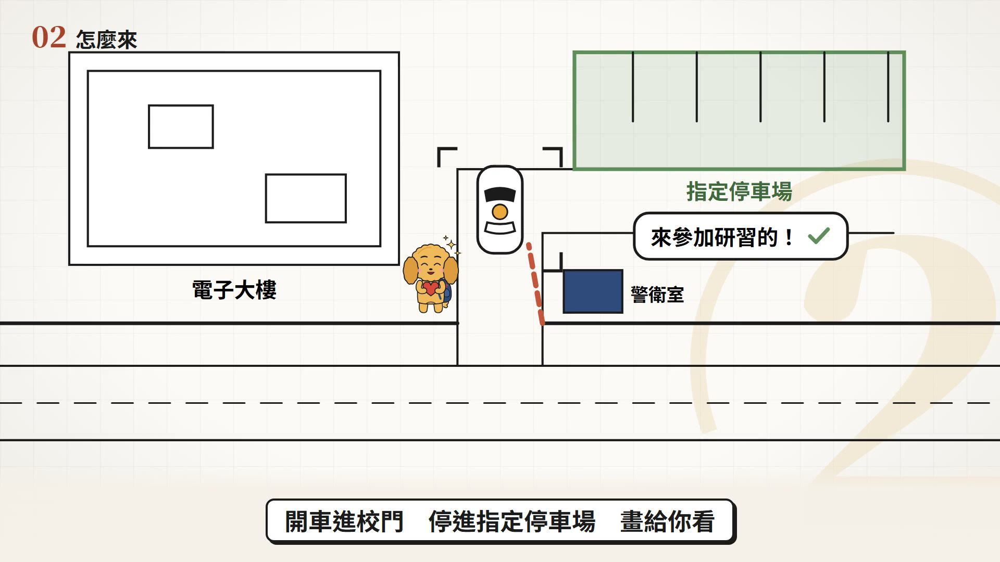
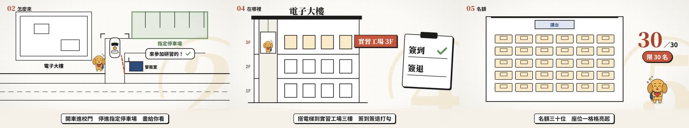

# 範本N_行前通知：皇小米幫你提醒 Before You Go

> 來源：2026-10-10 使用者模仿「別再手動整理5T素材」的動畫教學手法試做了「教師 AI 程式設計增能研習 行前通知」，看完說「這個停車的場景我很喜歡，範本內要多點這些場景」，要做成像那支行前通知（60 秒）的範本，並選定加入大樓電梯＋簽到退、桌曆翻頁＋時鐘進度、流程節點＋方格進度，再新增校園步行路線圖、教室座位圖、注意事項蓋章；要有旁白＋字幕、放範本區。和 [範本M 手繪線稿教學](../範本M_手繪線稿教學/README.md) 同一套線稿與主角皇小米。
> 觸發：使用者說「**範本N／行前通知／活動通知影片／研習通知影片**」，或在選範本時選 N。
> 用法：**丟一份行前通知、活動通知、研習或營隊說明 → 拆成場景（行前通知專用 7 種＋範本M 的 10 種）→ 選本範本 → 產出同一風格的影片**。

## 長什麼樣（30 秒示範片）

[](示範/示範.mp4)



示範片：[`示範/示範.mp4`](示範/示範.mp4)（edge-tts 配音，皇小米介紹本範本、演出 7 種行前通知場景）；示範分鏡：[`示範/storyboard.json`](示範/storyboard.json)；60 秒完整版（教師 AI 程式設計增能研習 9/30 行前通知，10 個場景）：[`示範/範例_完整版_storyboard.json`](示範/範例_完整版_storyboard.json)；沒有這個 skill 時用：[`提示詞_範本N完整版.md`](提示詞_範本N完整版.md)

## 適合
研習、營隊、親師座談、考試、校外教學、活動報到的行前通知：日期時間、交通停車、怎麼走、在幾樓、名額、當日流程、要帶什麼、注意事項——每一件事都變成一張會動的線稿圖（俯視地圖開車停車、皇小米沿路線走、搭電梯上樓、座位一格格亮起、流程節點亮起、文件蓋章），頻道主角皇小米每一場都在。
不適合：沒有時間地點流程的一般知識內容（改用範本M）、需要真實照片或真實地圖的內容。

## 原始提示詞（逐字保存）
```
那你幫我用這個先做個一分鐘的範本，那兩個主題是：1. 程式設計迴圈的教學（要跑程式碼的畫面） 2. 素材的研習行前通知
```
```
範本M能推上去.
廣Q的部份我想要改為像圖1這個的行前通知（60 秒）影片.要符合我上傳範本的規則.但是我覺得這個停車的場景我很喜歡.範本內要多點這些場景
```
```
所以這次就沒有廣告了..就2個範本
```
選定的場景（使用者在選項中勾選）：大樓電梯＋簽到退、桌曆翻頁＋時鐘進度、流程節點＋方格進度、校園步行路線圖、教室座位圖、注意事項蓋章（停車場景一定要有）；旁白＋字幕、放範本區。
**這個範本怎麼解讀它**：行前通知最重要的是「讓人知道怎麼到、什麼時候、做什麼、注意什麼」——每一項都畫成一張線稿俯視圖或立面圖，用動作演出來（車子開進校門停好、皇小米走路線、搭電梯、座位亮起），而不是條列文字。

## 流程與品檢（共用引擎，和範本 A～M 一致）
1. **逐字審稿**：`final_qa/review_prep.py storyboard.json` → Claude 逐句審 → `final_qa/review_report.py` → 給使用者 ⛔
2. **分鏡預覽**：`make_video.py storyboard.json --template N --preview`（edge-tts 暫配）→ `qa/分鏡預覽/分鏡預覽.html` ⛔
3. **正式出片**：`make_video.py storyboard.json --template N`：文稿檢查 → 內容正確 → 圖示檢查 → 唸法 → 建置 → 範本音效 → 聽檢 → 版面品檢 → 算圖 → 響度 → 最終品檢
4. **最終品檢**全部通過後，照下表用連續格核對概念忠實度

配音：專案自己的 `.env.local` 有 `GEMINI_API_KEY` 才用 Gemini Flash TTS，否則 edge-tts。

## 概念忠實度檢查（交付前逐項打勾，用「連續格」看）
| # | 招牌特徵 | 怎麼驗 | 現況 |
|---|---|---|---|
| 1 | 和範本M 同一套：米白紙、黑色粗線稿、磚紅點綴、字模糊淡入、右下淡金色章節大數字、白底黑框字幕、換場疊化 | 總覽圖 | ✅ |
| 2 | when：桌曆翻頁到那一天、時鐘從開始時間跑到結束時間、進度條填滿、蓋時數章 | when 連續格 | ✅ |
| 3 | drive：俯視地圖，車子從大路開進校門（追蹤框跟著車）、警衛對話打勾、柵欄升起、停進指定停車場（變綠） | drive 連續格 | ✅ |
| 4 | walk：俯視校園，紅色虛線路線一路畫出、皇小米沿路走、經過的地標彈出名字、終點建築插旗亮起 | walk 連續格 | ✅ |
| 5 | building：大樓立面，皇小米搭電梯到目的樓層、樓層字變紅、目的樓層窗戶亮、房間牌彈出；簽到簽退打勾 | building 連續格 | ✅ |
| 6 | seats：俯視教室，座位一格格亮起到名額上限，右邊大數字跟著數 | seats 連續格 | ✅ |
| 7 | steps：流程節點一個個亮起（線稿圖示、彩色圓環），方格進度條跟著填 | steps 連續格 | ✅ |
| 8 | stamp：文件蓋紅章、震動線、注意事項大字（重點紅色）、皇小米驚訝 | stamp 連續格 | ✅ |

## 範本設定
| 項目 | 設定 |
|---|---|
| Composition | `TemplateN`（`engine/template/src/tpl/TemplateN.tsx`：7 種行前通知場景；頁面外框與範本M 的 10 種場景來自 `tpl/TemplateM.tsx` 的 `makeHandTemplate`；元件 `engine/template/src/lib/hand/`） |
| 主角 | 皇小米（同範本M；沒有燈泡天線）：開場揮手、走路線、搭電梯、看座位、驚訝 |
| 配樂 | `"music": {"genre": "pianopulse", "bpm": 96, "key": "F"}`（不用 lofi） |
| 旁白 | edge-tts 曉臻 `zh-TW-HsiaoChenNeural`（示範片 +14%）；有 Gemini 金鑰時用使用者的聲音 |
| 字幕、字型、色彩 | 同範本M |
| 音效 | `tpl_sfx.py N`：每個 cue「啵」；咻、時鐘滴答、叮、蓋章、座位滴答由 TemplateN 在事件那一格播（`public/sfx_m/`） |

## 場景（行前通知專用 7 種；另外可用範本M 的 title、scenario、definition、cards、vs、stat、quiz、recap、qaEnd、code）
| 型別 | 欄位 | 時間 |
|---|---|---|
| `when` | `month`（例 115 年 9 月）、`day`、`weekday`、`start`／`end`（HH:MM，時鐘從開始跑到結束）、`range`（預設「start － end」）、`stamp` 時數章（可省，`\n` 換行） | `cueMap[0]` 時鐘開始、`cueMap[1]` 蓋章 |
| `drive` | `building`、`lot`（停車場名）、`guard`（警衛室）、`say` 對話泡泡（約 10 字）、`badge` 右上提醒（可省） | `cueMap[0]` 車子開進、`cueMap[1]` 停車 |
| `walk` | `from` 起點、`stops[]` 沿途地標 0～3 個（沒有就走兩個轉角的步道）、`to` 終點 | `cueMap[0]` 開始走、`cueMap[1]` 到達 |
| `building` | `name`、`floors` 樓層數 2～6、`floor` 目的樓層、`room` 房間牌、`checks[]` 簽到表 0～3 項 | `cueMap[0]` 搭電梯、`cueMap[1]` 簽到表出現、`checkCues[i]` 打勾 |
| `seats` | `limit` 名額 1～48、`label`（例 限 30 名）、`podium`（講台）、`note` | `cueMap[0]` 座位開始亮、`cueMap[1]` 亮滿 |
| `steps` | `title` 標題、`items[]` 2～5 個：`icon` 線稿名、`title`、`tag`（例 實作一） | `cueMap[i]` 第 i 個節點亮 |
| `stamp` | `doc` 文件名、`stamp` 章字（`\n` 換行）、`warn` 注意事項、`em` 紅色重點 | `cueMap[0]` 蓋章、`cueMap[1]` 注意事項 |

所有場景都可加 `heading`（左上章節標籤）。畫面上的字全部來自 storyboard；地圖、大樓、教室是示意圖，**不代表真實位置與樓層數**，沿途地標只寫通知上有的地名。不要編造事實。詳見 [`../範本風格_場景語彙.md`](../範本風格_場景語彙.md)。

## 執行步驟
1. **拿到通知** → 依上表拆成場景（時間 when、交通 drive、路線 walk、地點 building、名額 seats、流程 steps、注意 stamp，再搭配 title／cards／recap），寫出 `storyboard.json`（旁白一行一句）。
2. **給使用者審文本** ⛔
3. 建專案並出片：
   ```bash
   python <skill>/engine/scripts/new_project.py <專案> --share-modules <共用的 node_modules>
   python <skill>/engine/scripts/make_video.py storyboard.json --template N --preview   # 分鏡預覽 ⛔
   python <skill>/engine/scripts/make_video.py storyboard.json --template N             # 正式出片＋最終品檢
   ```
4. 最終品檢全部通過後，照上面的忠實度表用連續格逐項核對。

## 參考實作
- 渲染器：`engine/template/src/tpl/TemplateN.tsx`（＋`TemplateM.tsx` 的 `makeHandTemplate`、`lib/hand/`）
- 試做原型：本機 `02_試做/手繪線稿教學/`（皇小米行前通知、資訊科介紹）
