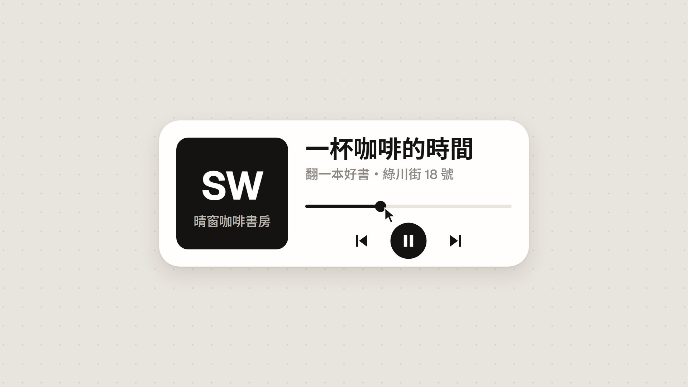
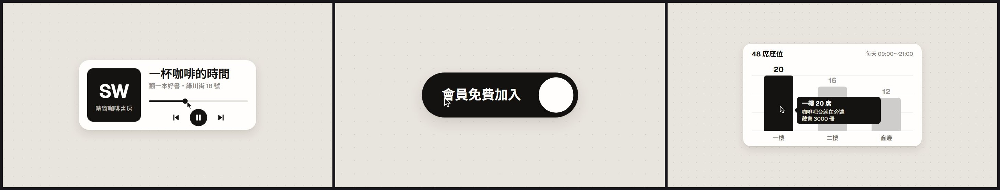

# 範本廣A_一個形狀不剪接：一個形狀不剪接 One Shape, Never Cut（UI 動態廣告）

> 來源：2026-10-09 研究 skillry.dev 的 Opus 5.5 熱門影片，照人氣第 3 名的提示詞（@twoclipping，1.2 萬讚）試做「H2 一個形狀不剪接」（屏榮版 14 秒），使用者挑進純廣告收藏；同日決定改成通用範本、收進 skill（廣告範本第一號）。原作保留在本機 `02_試做/廣告30風格`（不在 skill 裡）。
> 觸發：使用者說「**廣A／一個形狀不剪接／UI 動態廣告**」，或在選廣告範本時選廣A。
> 用法：**丟任何文本 → 照下方「內容欄位」寫成 `storyboard.json` → `engine/ad/make_ad.py 廣A <專案>` 一行出片**。沒有旁白；片長由內容多寡決定。

## 30 秒示範片

[](示範/示範.mp4)



示範片：[`示範/示範.mp4`](示範/示範.mp4)（範本直接用示範分鏡出的完整片，不是剪輯）；示範分鏡：[`示範/storyboard.json`](示範/storyboard.json)（虛構的「晴窗咖啡書房」開幕，文本見 [`../../engine/ad/範例文本_小店開幕.md`](../../engine/ad/範例文本_小店開幕.md)）；沒有這個 skill 時用：[`提示詞_範本廣A完整版.md`](提示詞_範本廣A完整版.md)

## 長什麼樣
暖灰點陣畫布上**只有一個圓角形狀**，從頭到尾不剪接：它一路變形成按鈕、讀取圈、動態島、音樂播放器、音量滑桿、開關、分頁、長條圖、⌘K 搜尋框、通知——尺寸、圓角、明暗都是彈簧，內容換掉時帶一下短模糊。一個游標真的去點、去拖：拖進度條、把滑桿拖過頭讓整個形狀被拉長、按開關、開關鈕變成會伸縮的液態分頁指示器。鏡頭跟著縮放讓每個狀態都填滿畫面；最後一格接回第一格，可以無限循環。黑白灰配色、Geist＋思源黑體，配 120 BPM 極簡電子節拍，每次點擊、拖曳、切換都有細小的 UI 音效。

## 適合
UI 感、俐落、現代的氣質：一個名稱加幾個「可以點、可以切、可以搜尋」的重點——開幕、上線、報名、方案、課程、活動、產品都行；內容是「幾個短詞＋一兩個數字＋一句行動呼籲」最好看。
不適合：需要大段文字說明、照片或真實場景的內容（每個狀態只放得下一兩行短字）。

## 內容欄位（storyboard.json）
最外層：`name`（成片檔名）、`states`（3～16 個，依序演出，可任意排列、重複、省略）、`pace`（選填，每拍讀幾個字，預設 4＝每秒 8 字；字多想快一點就調大）。
建議第一個放 `button`（片尾會變回第一個狀態，循環才自然）；`toggle` 後面緊接 `tabs` 時，開關鈕會直接變成分頁指示器（招牌動作）。

| type | 畫面 | 欄位（中文字數上限約略，程式用字寬精算） | 可省略 |
|---|---|---|---|
| `button` | 黑色膠囊按鈕，游標移上去變灰、按下 | `label` 按鈕字（約 10 字） | — |
| `loading` | 縮成圓形讀取圈，轉一圈後打勾 | （沒有字） | 整個狀態可省 |
| `island` | 動態島：呼吸小圓點＋字＋跳動音量條，被點一下 | `tag` 英文小標（選填，約 5 個英數）、`text`（約 14 字；有 tag 時少 2～4 字） | `tag` |
| `player` | 音樂播放器：封面方塊＋標題＋副標＋進度條，按播放（三角形變暫停）、拖進度條 | `cover` 封面大字（2～3 個英數或 2 個中文）、`coverSub` 封面小字（約 7 字）、`title`（約 8 字）、`subtitle`（約 16 字） | `coverSub`、`subtitle` |
| `slider` | 音量滑桿，拖過最大值形狀會被拉長再彈回 | `label` 右側小字（約 4 字） | 整個狀態可省 |
| `toggle` | 開關：游標移上去鈕變大、按下翻到 ON（形狀變黑、字變白） | `label`（約 10 字） | — |
| `tabs` | 分頁列，液態指示器依序滑到每一頁（前緣快、後緣慢） | `tabs`：2～4 個 `{a, b}`（a＝粗體短詞或數字，b＝說明；a＋b 合計約 5 字） | — |
| `chart` | 長條圖自己長出來，游標停在某根，其他變淡、跳出提示框 | `title`（約 10 字）、`note` 右上小字（約 13 字）、`bars`：2～5 根 `{v 數值, l 標籤, show 顯示的數字（選填）}`、`highlight`（第幾根，0 起算）、`tip`：`{head 約 11 字, lines 0～2 行各約 13 字}` | `note`、`tip`、`show` |
| `search` | ⌘K 搜尋框：一個字一個字打、跳出結果、按 Enter | `placeholder`（約 16 字）、`query` 打的字（1～6 字）、`result`＋`resultSub`（合計約 19 字） | `resultSub` |
| `toast` | 通知：打勾＋一句話 | `text`（約 15 字） | — |

**長條圖數值要是同一種單位**（都是席數、都是人數…），高度照數值比例畫；不同單位的數字改放 `tabs`、`island` 或 `tip`。
欄位太長或數量不對時，`make_ad.py` 會停下來並說出哪個欄位、最多約幾字（取捨與改寫規則見 [`../../references/廣告範本工作流.md`](../../references/廣告範本工作流.md)）。

片長＝每個狀態的基本動作（按鈕 1 秒、讀取 1.5 秒、播放器 3 秒、分頁每頁 0.5 秒……照原作節奏）＋依字數加的停留拍數（每 4 個字加一拍＝0.5 秒），再加片尾 0.5 秒變回第一個狀態。示範分鏡 10 個狀態＝29 秒。

## 原始提示詞
逐字保存在 [`原始提示詞_H2.txt`](原始提示詞_H2.txt)（skillry.dev 熱門提示詞第 3 名，公開原文在第 5 點中途截斷）。
**這個範本怎麼解讀它**：照原文的狀態順序與規則（同一個元素變形、內容換掉帶短模糊、游標真的點和拖、封閉解彈簧、指示器兩邊不同彈簧、拖曳時值由游標位置算、鏡頭縮放填滿、最後一格接回第一格）；改成 1920×1080；配樂不用現成歌曲，改用 numpy 合成 120 BPM 電子節拍，並把「每個事件第幾格」寫進時間表讓音效對準畫面。通用化時把「固定 7 小節」改成「狀態清單依內容伸縮」，畫面上的字全部改讀 storyboard。

## 流程與品檢（自帶產線，見 [`../../references/廣告範本工作流.md`](../../references/廣告範本工作流.md)）
1. 讀文本 → 照上表寫 `storyboard.json` → `python engine/timeline.py storyboard.json` 看預估片長與每個狀態的時間
2. **rundown 給使用者確認** ⛔（每個狀態放什麼字）
3. `python <skill>/engine/ad/make_ad.py 廣A <專案> --stills` → 看 `抽格/_總覽.jpg`（每個狀態一格＋片尾）
4. `python <skill>/engine/ad/make_ad.py 廣A <專案>`：時間表 → 配樂與音效 → 抽格 → 整支算圖 → 兩段式響度（I −14、TP −2、限幅 0.75）→ **最終品檢**（`final_qa.py`，無旁白模式：`--jumps-by-design`，片長 ±5%）
5. 照下表用連續格核對概念忠實度

## 概念忠實度檢查
| # | 招牌特徵 | 怎麼驗 | 現況 |
|---|---|---|---|
| 1 | 從頭到尾只有一個形狀、不剪接；每次換狀態都是同一個元素在變尺寸／圓角／明暗，內容換掉時帶短模糊 | 每個交界前後各抽 3 格 | ✅ |
| 2 | 游標真的驅動每個變化：點按鈕、點動態島、按播放、拖進度、拖滑桿、按開關、點分頁、按 Enter；按下時游標與形狀都縮一下 | 每個事件格前後 | ✅ |
| 3 | 滑桿拖過最大值時整個形狀被拉長，放開從當下長度彈回 | slider 段連續格 | ✅ |
| 4 | 開關鈕變成液態分頁指示器；指示器左右兩邊不同彈簧（前緣先到、後緣拉長跟上） | toggle→tabs 交界、每次換頁 | ✅ |
| 5 | 長條圖自己長出來、提示框淡入；搜尋框逐字打字、結果出現、Enter 變成通知 | chart、search 段 | ✅ |
| 6 | 鏡頭縮放讓每個狀態填滿畫面；最後一格接回第一格（循環） | 第 0 格與最後一格比較 | ✅ |
| 7 | 120 BPM 電子節拍；每次點擊、拖曳刻度、切換、打字、Enter 都有對準畫面的細小音效 | 聽成片 | ✅ |

## 範本設定
| 項目 | 設定 |
|---|---|
| 引擎 | 自帶產線：`engine/timeline.py`（欄位檢查＋依內容排時間表＋音效清單）、`engine/music.py`（配樂＋UI 音效）、`engine/remotion/src/Ad.tsx`（畫面，Composition `Ad`）；共用出片程式 `engine/ad/make_ad.py` |
| 畫面 | 1920×1080、30 fps；背景 #E8E4DE＋44px 點陣（隨鏡頭縮放）；形狀黑 #141312／灰／白，柔和雙層陰影 |
| 字型 | Geist（英數）＋Noto Sans TC 500／700（只載入文本用到的字所在子集） |
| 動態 | 全部是封閉解彈簧（`spring.ts`，任一格都算得出來）；內容視窗進退場 6 格短模糊；鏡頭彈簧比形狀慢一點 |
| 配樂 | numpy 合成 120 BPM：kick＋clap＋hat＋shaker、反拍 sub bass、Fm9→D♭maj7→A♭→E♭ pad＋撥弦琶音，最後一小節回主和弦，結尾 1 秒淡出 |
| 音效 | click／grab／scrub／release／swoosh／tick／key／enter／ding／chime，格數來自時間表 |
| 旁白／字幕 | 無 |
| 響度 | 兩段式 loudnorm I −14、TP −2＋alimiter 0.75 |

## 檔案
```
engine/timeline.py      storyboard → 時間表（make_ad.py 呼叫 build(sb)；直接執行可印出預估片長）
engine/music.py         時間表 → public/music.wav
engine/remotion/src/    Ad.tsx（全部畫面）、spring.ts（循環彈簧）、ui.tsx（字型、字寬、元件）、Root.tsx、index.ts
示範/                   示範.mp4、poster.jpg、總覽.jpg、storyboard.json
原始提示詞_H2.txt       逐字原文
```
