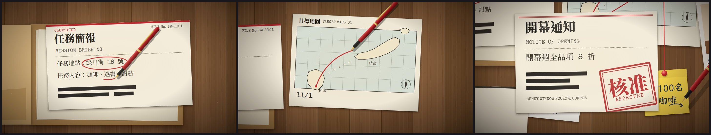

# 範本廣C_機密檔案：機密檔案 Top Secret Dossier（偵探牆廣告）

> 來源：2026-10-09「廣告 30 風格」第 2 批第 12 支「機密檔案：赴日任務」（故事裝置：桌上牛皮紙機密檔案被打開，照片、地圖、紅線、蓋章「核准」），使用者挑進純廣告收藏；同日決定改成通用範本收進 skill（廣告範本第三號）。原作保留在本機 `02_試做/廣告30風格`（不在 skill 裡）。
> 觸發：使用者說「**廣C／機密檔案／偵探牆／任務檔案**」，或在選廣告範本時選廣C。
> 用法：**丟任何文本 → 照下方「內容欄位」寫成 `storyboard.json` → `engine/ad/make_ad.py 廣C <專案>` 一行出片**。沒有旁白；片長由內容多寡決定。

## 30 秒示範片

[](示範/示範.mp4)



示範片：[`示範/示範.mp4`](示範/示範.mp4)（範本直接用示範分鏡出的完整片，34 秒）；示範分鏡：[`示範/storyboard.json`](示範/storyboard.json)（虛構的「晴窗咖啡書房」開幕，文本見 [`../../engine/ad/範例文本_小店開幕.md`](../../engine/ad/範例文本_小店開幕.md)）；沒有這個 skill 時用：[`提示詞_範本廣C完整版.md`](提示詞_範本廣C完整版.md)

## 長什麼樣
俯拍檯燈下的深色木桌：燈一亮，牛皮紙機密檔案被推進來，「極機密」木柄印章落下蓋章、紅色封條被撕開、封面 3D 翻開 → 文件一張張被抽出來攤在桌上（快速移動有紙片殘影）：任務簡報（打字機逐字打出、紅筆把重點圈起來、畫底線）→ 目標地圖（紅色航線一路畫過去、圖釘按下）→ 線索：兩張拍立得（手寫說明）＋一張便利貼，偵探牆紅線從地圖目的地拉到每張線索 → 鏡頭拉遠看整面牆 → 裝備清單逐條打勾 → 最後一份通知被抽出來，音樂抽空只剩低音與越來越快的時鐘滴答，木柄大印章從空中落下蓋「核准」、鏡頭重擊震動、全樂團爆發 → 所有文件收回檔案夾、闔上 → 封面蓋上名稱章、打出標語與網址。主角是一支**紅桿鋼筆**：畫圈、畫航線、手寫、打勾都是它，抬筆時影子拉開，最後躺在封面上。

## 適合
「揭曉一個任務／計畫／機會」的內容：活動報名、課程或研習、新服務、招生、徵選、開幕、專案啟動——有一個地點或目標、幾個線索（亮點）、一兩項準備事項、最後一個「核准／錄取／通過」的結論。神祕、解謎、偵探的氣質。
不適合：純數據或排行（改用廣B）、需要真實照片的內容（拍立得是固定的幾何插圖）。

## 內容欄位（storyboard.json）
最外層：`name`（成片檔名）、`pace`（選填，每幾個字多停半拍，預設 6）。中文 1 字＝1 字級寬、英數 0.6；超過上限 `make_ad.py` 會停下來說哪個欄位、最多約幾字。

| 區塊 | 欄位（中文字數上限約略） | 可省略 |
|---|---|---|
| `folder` 檔案夾 | `label` 標籤頁（打字，約 9 字）、`title` 封面名稱（約 12 字）、`en` 封面英文（選填）、`secret` 封面小印章（預設「極機密」，約 3 字）、`file` 簡報右上檔號（選填，約 15 個英數） | `en`、`secret`、`file` |
| `brief` 任務簡報 | `head`（預設「任務簡報」）、`en`（預設 MISSION BRIEFING）、`a` 第一行（打字，約 21 字）、`circle` 要被紅筆圈起來的字（**必須是 a 裡的一段**）、`b` 第二行（約 21 字）、`underline` 要畫底線的字（**必須是 b 裡的一段**） | `circle`、`underline` |
| `map` 目標地圖 | `title`（預設「目標地圖」）、`from` 出發點（約 6 字）、`to` 目的地（約 7 字）、`caption`（打字，約 16 字）。地圖是抽象陸塊，不是真實國家 | **整塊可省** |
| `clues` 線索 | `photos` 0～2 張 `{pic, text}`（pic：building／mountain／cup／book／star；text 手寫約 8 字）、`note` 便利貼 0～2 行（每行約 3 字） | **整塊可省**（每張也可省） |
| `check` 裝備清單 | `title`（打字，約 14 字）、`items` **剛好 2 項**（各約 12 字，逐條打勾）、`en`（選填，預設 EQUIPMENT CHECKLIST） | **整塊可省** |
| `letter` 最後的通知 | `title`（打字，約 7 字）、`en`（選填）、`line`（打字，約 12 字）、`stamp` 大印章字（預設「核准」，約 2 字）、`stampEn`（預設 APPROVED）、`foot` 頁尾英文（選填） | `en`、`foot` |
| `end` 封面收尾 | `name` 名稱章（約 4 字）、`slogan` 標語（打字，約 14 字）、`url` 網址（選填，約 36 個英數） | `url` |

省略的段落鏡頭與鋼筆自動跳過；沒有地圖時偵探牆只有圖釘、沒有紅線。取捨與改寫規則見 [`../../references/廣告範本工作流.md`](../../references/廣告範本工作流.md)。

片長＝固定動作（開場檔案夾 4 秒、每份文件進場與打字 2～4 秒、蓋章前抽空約 3 秒、收回闔上與封面 4 秒）＋依字數加的停留。示範分鏡（全部段落、`pace` 7）＝34 秒；省略地圖與清單約 26 秒。

## 原始提示詞
逐字保存在 [`原始提示詞_12.txt`](原始提示詞_12.txt)：「廣告 30 風格」第 2 批清單裡第 12 支那一列，加上第 2 批製作規範的「這批的要求」與「加分技法」。
**這個範本怎麼解讀它**：故事、鏡頭、鋼筆、印章、配樂照原作；通用化時把屏榮與「赴日」的字全部改讀 storyboard，台灣→日本的地圖改成抽象陸塊（出發點與目的地讀文本），櫻花與鳥居插圖改成五種不帶國家符號的插圖，印章字型從日文 Zen Antique 改成 Noto Serif TC 900（換文本時不會缺繁體字；木柄落下、斑駁印泥、震動都保留），地圖／線索／清單改成可省略，紅筆圈與底線依字寬算位置，時間表改成依內容排（原作固定 60 秒）。

## 流程與品檢（自帶產線，見 [`../../references/廣告範本工作流.md`](../../references/廣告範本工作流.md)）
1. 讀文本 → 照上表寫 `storyboard.json` → `python engine/timeline.py storyboard.json` 看預估片長
2. **rundown 給使用者確認** ⛔
3. `python <skill>/engine/ad/make_ad.py 廣C <專案> --stills` → 看 `抽格/_總覽.jpg`
4. `python <skill>/engine/ad/make_ad.py 廣C <專案>`：時間表 → 配樂與音效 → 抽格 → 整支算圖 → 兩段式響度 → **最終品檢**（無旁白模式）
5. 照下表用連續格核對概念忠實度

**品檢說明**：最終品檢的「F1 字幕閃爍」會抓到最後那份通知從畫面下方滑進來（示範片 22.1 秒）；「F2 字幕抖動」會抓到「核准」章蓋下時的鏡頭重擊＋震動（示範片 26.2～26.4 秒）——兩者都是設計（本片沒有字幕），逐格確認過。響度、峰值、片長、靜止、亮度全部通過。

## 概念忠實度檢查
| # | 招牌特徵 | 怎麼驗 | 現況 |
|---|---|---|---|
| 1 | 檯燈亮起；檔案夾滑入落地；「極機密」木柄印章落下蓋章；紅色封條上下撕開；封面 3D 翻開 | 前 4 秒連續格 | ✅ |
| 2 | 文件被抽出時有紙片殘影、落桌時陰影變小；打字機逐字（剛打下的字略重、每字深淺不同）＋行尾叮與回車聲 | 每份文件進場 | ✅ |
| 3 | 紅桿鋼筆是主角：圈重點、畫底線、畫航線、手寫拍立得與便利貼、打勾；抬筆時影子拉開、筆身略大；最後躺在封面上 | 各段 | ✅ |
| 4 | 偵探牆：圖釘按下（大→小）、紅線從目的地拉到每張線索；鏡頭拉遠框住整面牆 | 線索段 | ✅ |
| 5 | 通知出現後音樂抽空、時鐘滴答越來越快、刷鼓滾奏上升；木柄大印章從空中落下蓋「核准」，鏡頭重擊＋震動，全樂團爆發 | 高潮前後 | ✅ |
| 6 | 文件全部收回檔案夾、封面闔上；名稱章蓋下、標語與網址打出；ba-DUM 收尾 | 最後 5 秒 | ✅ |

## 範本設定
| 項目 | 設定 |
|---|---|
| 引擎 | 自帶產線：`engine/timeline.py`（欄位檢查＋依內容排時間表）、`engine/music.py`（配樂＋音效）、`engine/remotion/src/`（`Ad.tsx` 桌面／檔案夾／殘影／偵探牆／鋼筆、`scene.ts` 文件位置＋鏡頭＋鋼筆路線、`docs.tsx` 文件內容、`parts.tsx` 打字機／手寫／紅筆／印章／圖釘、`fonts.ts`、`kit.ts`）；共用出片程式 `engine/ad/make_ad.py` |
| 畫面 | 1920×1080、30 fps；木桌 #7a5536 系、牛皮紙 #c9a46c、紙 #f3ecdb、紅 #c1272d、便利貼 #f4d34c；檯燈暈影＋浮塵 |
| 字型 | Special Elite（英文打字機；中文退回 Noto Serif TC）、LXGW WenKai TC（手寫）、Noto Serif TC 900（印章、標題）——中文只載入文本用到的字所在子集 |
| 配樂 | numpy 合成 100 BPM 冷爵士：低音提琴 walking bass、刷鼓＋ride、電鋼琴、鐵琴、弱音小號主題（線索段）、銅管漸強與齊奏 |
| 音效 | 檯燈、紙張滑動、落桌、蓋章、撕封條、打字機逐字＋叮＋回車、筆刷、圖釘、迴紋針、時鐘滴答、上升音 |
| 旁白／字幕 | 無 |
| 響度 | 兩段式 loudnorm I −14、TP −2＋alimiter 0.75 |

## 檔案
```
engine/timeline.py      storyboard → 時間表（直接執行可印出預估片長）
engine/music.py         時間表 → public/music.wav
engine/remotion/src/    Ad.tsx、scene.ts、docs.tsx、parts.tsx、fonts.ts、kit.ts、Root.tsx、index.ts
示範/                   示範.mp4、poster.jpg、總覽.jpg、storyboard.json
原始提示詞_12.txt       逐字原文
```
