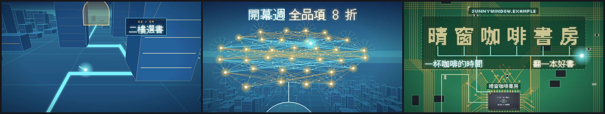

# 範本廣H_晶片之旅：一顆電子光點帶路，一鏡推進晶片裡的發光電路城市，靜音一拍後神經網路連鎖點亮

> 來源：2026-10-09「廣告 30 風格」第 2 批第 17 支「晶片之旅」（故事裝置：鏡頭從一顆晶片表面鑽進去，裡面是發光的電路城市；原作講屏榮電機與電子群），使用者挑進純廣告收藏；2026-10-10 改成通用範本收進 skill（廣告範本第八號）。原作保留在本機 `02_試做/廣告30風格`（不在 skill 裡）。
> 觸發：使用者說「**範本廣H／廣H／晶片之旅／電路城市廣告**」，或在選廣告範本時選廣H。
> 用法：**丟任何文本 → 照下方「內容欄位」寫成 `storyboard.json` → `engine/ad/make_ad.py 廣H <專案>` 一行出片**。沒有旁白；片長由內容多寡決定。

## 30 秒示範片

[](示範/示範.mp4)



示範片：[`示範/示範.mp4`](示範/示範.mp4)（範本直接用示範分鏡出的完整片，34.3 秒，4 座地標、名稱 6 字）；示範分鏡：[`示範/storyboard.json`](示範/storyboard.json)（虛構的「晴窗咖啡書房」開幕，文本見 [`../../engine/ad/範例文本_小店開幕.md`](../../engine/ad/範例文本_小店開幕.md)）；沒有這個 skill 時用：[`提示詞_範本廣H完整版.md`](提示詞_範本廣H完整版.md)

## 長什麼樣
**整支一個不中斷的鏡頭，主角是一顆電子光點**（白核＋青色光暈、5 層殘影＋拖尾，跟著拍子脈動）。
**電路板**：綠色 PCB（銅走線、導通孔、表面黏著元件、點陣底紋），光點從左邊沿走線一路轉彎（每個轉角「嗶」）跑進中央晶片，晶片上下的絲印像印表機一樣一格格印出 `board` 的字 →
**無限推進**（每一層是上一層中央的 1/5，背景微塵比前景早一步動、越過鏡頭拉出殘影；每拍鏡頭重擊）：灰色**封裝蓋**（雷射刻字 `chip`、觀察窗發光）→ **導線架與金線** → **彩虹干涉色晶粒**（標準元件列、金屬層，色相隨推進旋轉）→ 晶粒中央是一座**發光電路城市**，鏡頭從正上方壓低成追車視角（2.5D 自算透視投影，不是真 3D）。
**城市**：電晶體＝大樓（琥珀窗燈、遠處起霧）、導線＝道路、車流光點帶拖尾；光點沿發光主幹道跑，**每經過一座地標塔（3～6 座，左右交替）塔頂點亮「叮」**，虛線拉到看板寫「01 / 04」和 `towers` 的字 → 加速衝向一座巨大的 **AND 邏輯閘**（riser、鏡頭往後拉）→
**完全靜音一拍**：所有動態停住、畫面暗一階、聲音完全切掉 → **drop**：白光一閃、畫面震動，閘門上方 6 層**神經網路像煙火一層一層連鎖點亮**，光點往上竄、在頂端繞圈，上方用像素字掃出 `drop` 大標 →
**一路拉遠**穿回晶粒、金線、封裝蓋，回到電路板，整塊板往下移 → **走線把名稱排成方塊點陣**：光點沿匯流排跑、每到一個字往上接到字底，那個字由下往上一格格亮起（每字一聲鐘）→ 標語由左往右掃出、最上方掃出網址。

## 適合
任何能說成「**走進去一路看到幾個重點，最後是我們的名字**」的內容：科技、資訊、電子、AI、程式課程與研習、科系招生、新產品或新服務、活動開幕（地標＝幾個重點或數字）。熱鬧、未來感、節奏強的氣質。
不適合：溫柔慢節奏的內容（改用廣E、廣G）、要比較一堆數字（改用廣B）、重點超過 6 個、名稱沒有 8 字以內的簡稱。

## 內容欄位（storyboard.json）
最外層：`name`（成片檔名）、`pace`（選填，看板超過幾個字就多停半小節，預設 6）。中文 1 字＝1 字級寬、英數 0.6（Silkscreen 欄位 0.9）、空白 0.3；字級在範圍內自動縮，縮到下限還放不下 `make_ad.py` 會停下來說哪個欄位、最多約幾字。

| 區塊 | 欄位（中文字數上限約略） | 可省略 |
|---|---|---|
| `board` 電路板絲印 | `top` 晶片上方（約 13 字，字級 60～46）、`bottom` 晶片下方（約 17 字，字級 46～36） | 都可省 |
| `chip` 封裝蓋雷射刻字 | `lines` 1～2 行（第 1 行在觀察窗上方、第 2 行在下方；每行約 19 字，字級 86～58）、`code` 右下英數小字（Silkscreen，約 27 個英數） | 都可省 |
| `towers` 城市地標 | **3～6 座**（必備），每座一塊看板（約 9 字，字級 84～60 自動配；超過 `pace` 字多停半小節） | — |
| `drop` drop 大標 | 1～2 段（兩段合計約 14 字，字級 120～76 自動縮、縮到底約 22 字；第 2 段晚一小節掃出） | 可省（只剩煙火） |
| `end` 收尾 | `name` 名稱（**必備，2～8 字**，走線排成點陣；英數字佔 0.6 格寬）、`slogan` 標語（一整句約 21 字，或寫成兩段 `["左半","右半"]` 各約 11 字）、`url` 網址或電話（Silkscreen 大寫像素字，約 37 個英數） | `slogan`、`url` |

**畫面上的字全部來自 storyboard**；範本自己只有地標編號「01 / 04」、絲印「U1」。電路板、晶片、城市、邏輯閘、神經網路只是故事裝置，不代表文本跟電子或 AI 有關。
**不要編造事實**：看板、刻字、大標都要是文本裡有的。名稱點陣用 Pillow＋Noto Sans TC 在 `timeline.py` 即時產生（取代原作寫死的 glyphs.json），字型依序找：環境變數 `AD_CJK_FONT` → `engine/fonts/`、skill 的 `engine/ad/fonts/` → 往上層的 `node_modules`（含 `_共用/node_modules`）→ 系統字型（Windows NotoSansTC／微軟正黑體、macOS PingFang、Linux Noto Sans CJK）；都找不到時錯誤訊息會列出找過哪裡、怎麼補。取捨與改寫規則見 [`../../references/廣告範本工作流.md`](../../references/廣告範本工作流.md)。

片長＝電路板 1.5 小節＋三層推進各 1 小節＋城市（第一座地標前 1 小節＋每座 1 小節、字多的 1.5 小節）＋衝向邏輯閘 2 小節（含靜音一拍）＋drop 2 小節＋拉遠 1.75 小節＋名稱（每字 1 拍，5 字以上每字半拍）＋標語網址約 3 小節（125 BPM，一小節 1.92 秒）。示範分鏡（4 座地標、名稱 6 字）＝34.3 秒；換文本實測（5 座地標、其中一座 7 字、名稱 7 字）＝37.5 秒；3 座地標約短 2 秒、每多一座約長 2 秒。

## 原始提示詞
逐字保存在 [`原始提示詞_17.txt`](原始提示詞_17.txt)：「廣告 30 風格」第 2 批清單裡第 17 支那一列，加上第 2 批製作規範的「這批的要求」與「加分技法」。
**這個範本怎麼解讀它**：一鏡到底的無限推進（電路板→封裝→金線→彩虹晶粒→城市）、電子光點主角與殘影、2.5D 自算投影的電路城市（大樓、車流、霧、主幹道）、地標逐一點亮、邏輯閘前**完全靜音一拍**（畫面停住變暗、聲音連殘響一起切）、drop 神經網路煙火連鎖點亮、拉遠穿回各層、走線排出像素名稱、125 BPM techno 全部照原作；通用化時把屏榮的字（絲印「電機與電子群／資訊科・電子科」、封裝蓋「AI 程式設計 × 半導體／PRHS-EE」、六個學習項目、drop「AI 程式設計 × 半導體」、校名「屏榮高中」、標語「遇見屏榮　預見未來」、網址）全部改讀 storyboard，**地標 6 座固定改成 3～6 座**（城市道路、轉彎嗶聲、塔的位置、看板編號都依座數排），**名稱點陣從寫死的 glyphs.json 改成 timeline.py 依名稱即時產生**（2～8 字自動縮放排成一列，英數字窄一點，走線依字的位置接上去），標語可一整句或左右兩半；原作 60 秒收緊到約 30～37 秒（電路板 3→1.5 小節、每層推進 2→1 小節、每座地標 1.5→1 小節、riser 1.75→1.5 小節、drop 4→2 小節、拉遠 3→1.75 小節、名稱字多時每字半拍），**和弦改以 drop 為小節起點**，所以地標數不同時 drop 仍落在 Am 第一拍；字型仍是原作的 DotGothic16＋Silkscreen，改成依 `allText` 只載入用到的子集並串接 Noto Sans TC 補缺字；原作 `../kit` 的 AdShell、緩動、隨機搬進範本自己的 `kit.ts`。

## 流程與品檢（自帶產線，見 [`../../references/廣告範本工作流.md`](../../references/廣告範本工作流.md)）
1. 讀文本 → 照上表寫 `storyboard.json` → `python engine/timeline.py storyboard.json` 看預估片長、各層與地標、靜音、drop 的格，並印出名稱前兩個字的點陣
2. **rundown 給使用者確認** ⛔（絲印、刻字、每座地標的看板、drop 大標、名稱、標語、網址）
3. `python <skill>/engine/ad/make_ad.py 廣H <專案> --stills` → 看 `抽格/_總覽.jpg`
4. `python <skill>/engine/ad/make_ad.py 廣H <專案>`：時間表 → 配樂與音效 → 抽格 → 整支算圖 → 兩段式響度 → **最終品檢**（無旁白模式）
5. 照下表用連續格核對概念忠實度

**品檢說明**：示範片最終品檢只有「F1 字幕閃爍」5 處（響度 −13.8 LUFS、峰值 −5.1 dBTP，預設參數；片長、靜止、突跳、光敏都通過）。F1／F2 看的是畫面最下面那條（本片沒有字幕）：示範片 8.3 秒是鏡頭從晶圓推進城市、晶粒邊框與走線衝出畫面下緣；12.1、12.3 秒是追車鏡頭貼著第一座地標塔飛過、塔的側牆掃過下緣；25.5、26.2 秒是拉遠穿回晶粒與封裝蓋、各層邊框滑過下緣——逐格確認都是一鏡到底的推進／拉遠，不是錯，效果保留、門檻不放寬。換文本實測另有 F2 兩處（5.2、6.2 秒，推進晶粒層時金線從畫面下緣往外擴）與 F1 30.1 秒（回到電路板後整塊板往下移），同樣是設計。
**靜音一拍**：配樂在母帶之後把 `silence`～`drop` 整拍歸零（殘響也切），畫面同一格變暗、所有動態停住；成片逐 50 毫秒量測，示範片 19.70～20.15 秒完全無聲（−180 dB）。
**峰值**：drop 衝擊、kick、超鋸齒的瞬間峰值較尖，`music.py` 最後用前瞻峰值限幅只壓最尖的幾毫秒（`PEAK_CUT` 2.5 dB），用預設參數出片峰值就會過且留 2.5 dB 以上餘裕（示範 −5.1、換文本 −4.6 dBTP）。
**字型測試**：DotGothic16 是日文點陣字型，換文本可能缺繁體字；`fonts.ts` 串接 DotGothic16 → Noto Sans TC（Silkscreen → DotGothic16 → Noto Sans TC），中文字型只載入 `allText` 用到的子集。示範與換文本兩支用到的 148 個字（含「綠、號、週、轉、變、訊、資、礎、參、樓、實」）排成測試圖，全部是 DotGothic16 點陣字形、沒有豆腐方塊，也沒有退回 Noto Sans TC；換文本後仍要看抽格：若某些字明顯不是點陣（退回 Noto Sans TC），就換掉那個字或改寫。Silkscreen 只有大寫字形，網址會顯示成大寫像素字（原作同樣）。

**換文本實測**（2026-10-10）：用真實的研習行前通知（教師 AI 程式設計增能研習：9/30 週三 12:10－15:10、電子大樓實習工場 3 樓、限 30 名、研習 3 小時、完全沒有程式基礎亦可參加、全程上機演練、實作一～四的課程名稱、海青工商資訊科電話），只換 storyboard、不改程式：**地標 5 座**（全程上機演練、生成第一個網頁、GAS 上線、班級公告管理、Vercel 部署；其中 7 字那座自動多停半小節）、**名稱 7 字**「海青工商資訊科」自動縮成每格 8.3 像素排一列、標語一整句不拆兩半、網址欄放電話 → 37.5 秒成片，字都在框內；最終品檢只有上面說明的 F1 四處、F2 兩處（逐格確認是設計），響度 −13.8 LUFS、峰值 −4.6 dBTP（預設參數）。

## 概念忠實度檢查
| # | 招牌特徵 | 怎麼驗 | 現況 |
|---|---|---|---|
| 1 | 一個不中斷的鏡頭：電路板 → 封裝蓋 → 金線 → 彩虹晶粒 → 城市，每層是上一層中央的 1/5、背景微塵先動並拉出殘影 | 前 9 秒連續格 | ✅ |
| 2 | 電子光點主角：殘影＋拖尾、跟拍子脈動、轉角嗶、全程帶路（電路板、金線、晶粒、城市、神經網路、名稱走線） | 任意連續格 | ✅ |
| 3 | 2.5D 發光電路城市：大樓、窗燈、霧、車流光點、發光主幹道；鏡頭從俯視壓低成追車 | 城市段 | ✅ |
| 4 | 地標逐一點亮（3～6 座）：塔頂亮、窗戶全亮、虛線拉到看板「01 / 0N」 | 每座地標前後 1 秒 | ✅（示範 4 座、實測 5 座） |
| 5 | **完全靜音一拍**：動態停住、畫面暗一階、聲音整拍歸零（殘響也切），與畫面同一格 | 成片逐 50 毫秒量音量＋連續格 | ✅ |
| 6 | drop：白光一閃＋震動，神經網路 6 層每半拍一層煙火連鎖點亮，像素大標掃出 | drop 後 4 秒 | ✅ |
| 7 | 拉遠穿回各層（反向咻）→ 整塊板下移 → 走線排出像素名稱、逐字由下往上亮起 → 標語、網址 | 最後 8 秒 | ✅（6 字、7 字都自動排版） |
| 8 | 125 BPM techno 逐層漸強（嗡嗡滴答 → kick → hat → 琶音 → clap 貝斯 → riser → 靜音 → drop → pad），音效對準事件 | 聽成片 | ✅ |
| 9 | 畫面上的字全部來自 storyboard，地標座數與名稱字數可變 | 換文本實測 | ✅ |

## 範本設定
| 項目 | 設定 |
|---|---|
| 引擎 | 自帶產線：`engine/timeline.py`（欄位檢查＋依地標座數、字數排推進、地標、靜音、drop、拉遠、名稱各事件＋**名稱點陣即時產生**）、`engine/music.py`（配樂＋音效）、`engine/remotion/src/`（`Ad.tsx` 疊層、光點、微塵、看板、drop 大標、鏡頭重擊、`core.ts` 讀時間表＋推進深度＋城市路徑＋2.5D 攝影機＋光點路徑、`Plates.tsx` 電路板／封裝蓋／金線／晶粒四層、`City.tsx` 電路城市＋邏輯閘＋神經網路、`Finale.tsx` 名稱點陣與收尾、`kit.ts`、`fonts.ts`）；共用出片程式 `engine/ad/make_ad.py` |
| 畫面 | 1920×1080、30 fps；電路板 #1f6545、銅 #d9a24a、封裝蓋 #4f5662、金線 #ffd35e、晶粒彩虹漸層、城市 #1f5684、霓虹青 #7ff6ff、琥珀 #ffc860；2.5D 自算投影（不是真 3D，不用 three.js） |
| 字型 | 像素字 DotGothic16 → Noto Sans TC 串接（兩套中文字型都只載入文本用到的字所在子集）、英數 Silkscreen；名稱點陣用本機 Noto Sans TC（22×22 取樣） |
| 配樂 | numpy 合成 125 BPM techno（Am F C G，以 drop 為小節起點）：嗡嗡＋滴答 → kick → 反拍 hat → 16 分琶音（濾波漸開）＋長音 sub → clap＋反拍貝斯 → riser＋上升 blip＋16 分 kick → **完全靜音一拍** → 衝擊＋超鋸齒＋reese 貝斯 → 寬闊 pad＋弦樂 |
| 音效 | 轉角嗶、穿層咻（拉遠時反向咻）、地標叮、神經網路每層一串 blip＋高音叮、回到電路板低沉衝擊、名稱每字一聲鐘、標語長鐘、網址 blip |
| 旁白／字幕 | 無 |
| 響度 | 配樂先做前瞻峰值限幅（瞬間峰值壓 2.5 dB）→ 出片兩段式 loudnorm I −14、TP −2＋alimiter 0.75（預設參數） |

## 檔案
```
engine/timeline.py      storyboard → 時間表（直接執行可印出預估片長、各層、地標、靜音、drop、名稱點陣）
engine/music.py         時間表 → public/music.wav
engine/remotion/src/    Ad.tsx、core.ts、Plates.tsx、City.tsx、Finale.tsx、kit.ts、fonts.ts、Root.tsx、index.ts
示範/                   示範.mp4、poster.jpg、總覽.jpg、storyboard.json
原始提示詞_17.txt       逐字原文
提示詞_範本廣H完整版.md  沒有 skill 時貼給 AI 的完整提示詞
```
