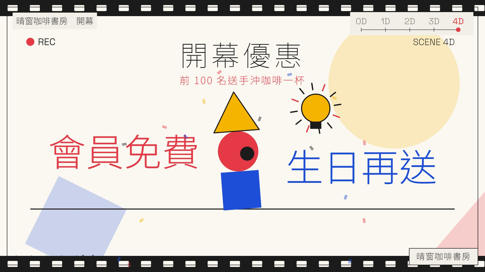
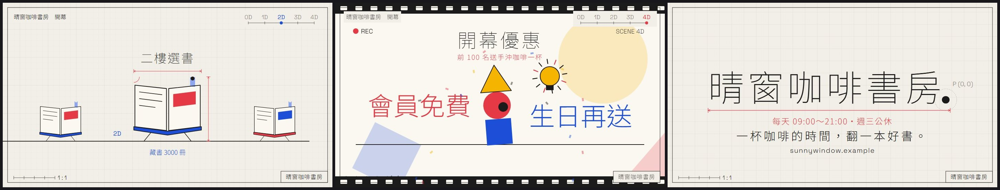

# 範本廣I_點線面：製圖紙上一個點一路升維——線勾出物件、面拼成色塊、體摺成方塊印出來、動起來鑽進片中片，最後收回成名稱的句點

> 來源：2026-10-09「廣告 30 風格」第 2 批第 18 支「設計課：點線面」（故事裝置：一個點→線→面→立體→動起來，幾何積木自己組成相機、平板、3D 印表機；原作講屏榮多媒體設計科＋影視動畫廣告班），使用者挑進純廣告收藏；2026-10-10 改成通用範本收進 skill（廣告範本第九號）。原作保留在本機 `02_試做/廣告30風格`（不在 skill 裡）。
> 觸發：使用者說「**範本廣I／廣I／點線面／升維廣告**」，或在選廣告範本時選廣I。
> 用法：**丟任何文本 → 照下方「內容欄位」寫成 `storyboard.json` → `engine/ad/make_ad.py 廣I <專案>` 一行出片**。沒有旁白；片長由內容多寡決定。

## 30 秒示範片

[](示範/示範.mp4)



示範片：[`示範/示範.mp4`](示範/示範.mp4)（範本直接用示範分鏡出的完整片，33.8 秒，1D 咖啡杯、2D 書本、3D 店面、有片中片）；示範分鏡：[`示範/storyboard.json`](示範/storyboard.json)（虛構的「晴窗咖啡書房」開幕，文本見 [`../../engine/ad/範例文本_小店開幕.md`](../../engine/ad/範例文本_小店開幕.md)）；沒有這個 skill 時用：[`提示詞_範本廣I完整版.md`](提示詞_範本廣I完整版.md)

## 長什麼樣
**整支在一張製圖紙上一鏡到底，主角是一個墨點**（彈出、跟拍子小跳、落地壓扁、5 層殘影），鏡頭跟著它走，格線比前景早 4 格動；右上角的維度尺 0D～4D 隨段落點亮，**每升一維多一種顏色、多一層樂器**。
**0D 點**：作圖十字線展開、點彈出、座標 `P (0, 0)`，開場小字、開場句、問句一筆一筆「寫」出來（前緣有紅色筆尖線）→ 點往後蓄力 →
**1D 線（紅）**：點衝出去拉出一條地平線，接著當筆尖**一筆一筆勾出物件的線稿**（每筆一聲麥克筆「刷」），落在亮點上「喀嚓」一閃，紅色部件亮起，尺寸線展開，物件上方寫出主標註、地平線下寫出小標註 →
**2D 面（藍）**：點描出物件外框 → 色面沿對角線「啪」地鋪滿 → 細節一格格彈出（每格一聲 blip）→ 左右滑出兩個縮小、換色的分身（殘影）→
**3D 體（黃）**：點在紙上畫出立方體展開圖 → 五個面一拍一拍摺起來（每面「啪」）成黃色方塊 → 平台、橫桿「喀」地裝上 → 點變成噴頭來回掃，**物件在方塊頂上擠出成 2.5D、一層層印出來**（等角投影自己算，不是真 3D）→
**4D 時間**：鏡頭拉遠成全景，衝擊一拍，所有物件跟拍子跳、滿場幾何積木彈跳、地平線變成彩色時間軸，上方寫出全景大字 → **點長成一個鏡頭（光圈葉片轉動），鏡頭鑽進去**：片中片——場記板拍下、標題寫出，四個積木演員跳進來、疊成一個角色，左邊寫出第一句口號，燈泡亮起寫出第二句，角色轉一圈噴彩紙 → 拉回全景 →
**收回**：黃→藍→紅→地平線依序縮進那個點 → **名稱一筆一筆寫出來，點被筆尖推著走，最後跳上去落在名稱後面當句點**（虛線圓＋`P (0, 0)` 呼應開場）→ 尺寸線、副標、標語、網址依序寫出。

## 適合
任何能說成「**從一個點開始，一步步長出幾樣東西，最後是我們的名字**」的內容：開幕、新店、新課程、研習、科系或社團招生、新產品、活動（三樣物件＝三個重點，片中片＝一個優惠或亮點）。乾淨、理性、設計感、有童趣的氣質。
不適合：重點超過 3 個（改用廣H、廣B）、要比較一堆數字（改用廣B）、情緒溫柔慢節奏的內容（改用廣E、廣G）、名稱超過 10 字（用簡稱，全名放副標）。

## 內容欄位（storyboard.json）
最外層：`name`（成片檔名）、`pace`（選填，預設 6；開場句＋問句超過 3.5×pace 字、或某維主標註＋小標註超過 2.5×pace 字，那一段多停 2 拍）。中文 1 字＝1 字級寬、英數 0.6、空白 0.3（字距另計）；字級在範圍內自動縮，縮到下限還放不下 `make_ad.py` 會停下來說哪個欄位、最多約幾字。畫面字級：所有標註 ≥ 34 px、主要字（開場句、主標註、片中片標題與口號、名稱、副標、標語）≥ 44 px。

| 區塊 | 欄位（中文字數上限約略） | 可省略 |
|---|---|---|
| `title` 左上角圖紙標題 | 一行（約 24 字，34 px） | 可省 |
| `head` 0D 開場 | `kicker` 小字（約 44 字）、`line` 開場句（**必備**，約 14 字、縮到底約 26 字）、`ask` 問句（約 41 字，灰字） | `kicker`、`ask` |
| `line` 1D 線稿（紅） | `object` 物件（見下方圖形庫）、`label` 主標註（物件上方，字級 88～56，最多約 21 字）、`note` 小標註（地平線下，約 23 字） | 四段最多省一段 |
| `plane` 2D 色面（藍） | 同上 | 四段最多省一段 |
| `solid` 3D 體（黃） | 同上 | 四段最多省一段 |
| `film` 4D 片中片 | `wide` 全景大字（約 31 字）、`title` 片中片標題（**必備**，約 18 字，也寫在場記板上）、`sub` 副標（約 39 字）、`words` 兩句口號（左、右各約 7 字，字級 150～96） | 整段可省（只剩全景跳動）；`wide`、`sub`、`words` 可省 |
| `end` 收尾 | `name` 名稱（**必備**，約 10 字，字級 210～120；點落在它後面當句點，右下角圖框也寫它）、`sub` 副標（紅，約 35 字）、`slogan` 標語（約 28 字）、`url` 網址或電話（約 68 個英數） | `sub`、`slogan`、`url` |

**圖形庫（`object` 可填）**：`camera` 相機、`tablet` 平板、`cup` 咖啡杯、`book` 書本、`shop` 店面、`computer` 電腦、`trophy` 獎盃、`calendar` 日曆（共 8 種，每維挑 1 個，可重複）。每個物件只定義一次（`timeline.py` 的 `OBJ`：一組折線部件，標了顏色與「外框／細節」），**每一維用該維的畫法**：1D 全部畫成線稿、2D 外框描出＋色面鋪色＋細節彈出（黃改淡藍，2D 只有紅藍）、3D 在方塊頂上擠出成 2.5D 一層層印出。要新增物件就在 `OBJ` 加一組部件（局部座標：x 置中、地面 y=0、寬 ≤ 620、高 ≤ 660）。
**為什麼改成圖形庫，不保留原作的相機／平板／3D 列印機／雷切機**：那四樣是設計科的設備，換成咖啡店或研習就對不上題；改成「挑一個跟內容有關的物件，用該維的畫法畫」，晴窗示範就能畫咖啡杯、書本、店面，研習能畫電腦、日曆，而「點→線→面→體」的升維結構、每維的招牌動作（筆尖勾線、對角線鋪色、展開圖摺方塊、噴頭列印）都留著。原作的雷切機併進 3D 的「列印」一個動作（每維 1 個物件，片長才收得進 35 秒）。

**畫面上的字全部來自 storyboard**；範本自己只有維度標籤 `0D`～`4D`、座標 `P (0, 0)`、比例尺 `1 : 1`、片場記號 `REC`／`SCENE 4D`／`TAKE 01`。尺寸線只畫線不標數字（原作的 480、300、54° 是設計科圖面，通用版不編造尺寸）。
**不要編造事實**：標註、片中片口號都要是文本裡有的；物件只是故事裝置（畫了咖啡杯不代表要寫咖啡）。取捨與改寫規則見 [`../../references/廣告範本工作流.md`](../../references/廣告範本工作流.md)。

片長（120 BPM，一拍 0.5 秒）＝0D 4 秒＋1D 約 5～5.5 秒＋2D 約 4.5～5 秒＋3D 約 5～5.5 秒（第一段多 1 拍拉線）＋4D 8 秒（含片中片 3.5 秒；省略片中片時 3 秒）＋收尾約 5 秒（名稱、句點、三行字，字多再停）。示範分鏡（三維都畫、有片中片）＝33.8 秒；換文本實測（省略 2D）＝31.7 秒；省略一維約短 2.5～5 秒。

## 原始提示詞
逐字保存在 [`原始提示詞_18.txt`](原始提示詞_18.txt)：「廣告 30 風格」第 2 批清單裡第 18 支那一列，加上第 2 批製作規範的「這批的要求」與「加分技法」。
**這個範本怎麼解讀它**：製圖紙上一鏡到底、墨點主角（殘影、壓扁、跟拍子跳）、點→線→面→體→動起來的升維、每升一維多一色（紅→藍→黃）多一層樂器（滴答→低音→和弦墊→鼓組→旋律全編制）、被「寫」出來的極細黑體字（Noto Sans TC 100／300）、展開圖摺成方塊、片中片積木演員、收回成名稱的句點、120 BPM 極簡打擊，全部照原作；通用化時把屏榮的字（「多媒體設計科　設計課：點·線·面」「設計課 第一堂：點」「一切，從一個點開始。」「專業攝影棚」「生生有平板」「從 2D 到 3D」「3D 列印機」「雷切機」「從靜態到動態」「影視動畫廣告班」「玩點子／找創意」、校名、標語、網址）全部改讀 storyboard，**物件從設計科四樣設備改成 8 種通用圖形庫**（見上），原作 60 秒收緊到約 30～34 秒（0D 8 秒→4 秒、每一維 10～12 秒→約 5 秒、4D 與片中片 10 秒→8 秒、收尾 8 秒→5 秒），四段（1D／2D／3D／片中片）最多可省一段；全景縮放、鏡頭鑽入點、積木位置依物件數自動算；「點動成線」等固定中文改成只留維度標籤；原作 `../kit` 的 AdShell、緩動、隨機搬進範本自己的 `kit.ts`，`@remotion/paths` 改成自己算折線長度（共用出片程式不必多裝套件）。
**一起修的小瑕疵**：原作部分標註字太小（座標 26、維度尺 28、小標 30 px），通用版所有標註 ≥ 34 px、主要字 ≥ 44 px（換算鏡頭縮放後的畫面 px）。

## 流程與品檢（自帶產線，見 [`../../references/廣告範本工作流.md`](../../references/廣告範本工作流.md)）
1. 讀文本 → 照上表寫 `storyboard.json`（每維挑一個物件）→ `python engine/timeline.py storyboard.json` 看預估片長與各段開始、結束格
2. **rundown 給使用者確認** ⛔（開場三行、每一維的物件與兩行標註、片中片的字、名稱、副標、標語、網址）
3. `python <skill>/engine/ad/make_ad.py 廣I <專案> --stills` → 看 `抽格/_總覽.jpg`
4. `python <skill>/engine/ad/make_ad.py 廣I <專案>`：時間表 → 配樂與音效 → 抽格 → 整支算圖 → 兩段式響度 → **最終品檢**（無旁白模式）
5. 照下表用連續格核對概念忠實度

**品檢說明**：示範片最終品檢全部通過（響度 −13.9 LUFS、峰值 −5.0 dBTP，預設參數；片長、靜止、突跳、光敏、F1／F2 字幕閃爍都通過）。換文本實測同樣全部通過（−13.9 LUFS、−4.9 dBTP）。本片的地平線與鏡頭推拉都在畫面中段，沒有東西掃過畫面最下緣，所以 F1／F2 沒有誤報；換文本後若出現，先逐格看是不是全景拉遠時積木或鑽入鏡頭時物件滑過下緣（那是設計，效果保留、門檻不放寬）。
**峰值**：刷聲、hat、喀聲的高頻雜訊在取樣點之間會冒出 +3～5 dB 的峰（第一版 wav 取樣峰值 −0.9 dB、真峰值卻 +4.9 dBTP，成片 −1.1 dBTP）。`music.py` 最後改成**真峰值**（4 倍超取樣）前瞻限幅，只壓最尖的幾毫秒（`PEAK_CUT` 8 dB），用預設參數出片峰值就留 2.9 dB 以上餘裕（示範 −5.0、換文本 −4.9 dBTP），不必加 `--limit`。
**字型**：只用 Noto Sans TC（繁體齊全，100／300／400，依 `allText` 只載入用到的字所在子集）與 Space Grotesk（英數），沒有日文字型，不會缺字。

**換文本實測**（2026-10-10）：用真實的研習行前通知（教師 AI 程式設計增能研習：115 年 9 月 30 日星期三 12:10－15:10、計 3 小時、限 30 名、電子大樓實習工場 3 樓、完全沒有程式基礎亦可參加、全程上機演練、電腦教室已預先安裝研習所需工具、實作一～四的單元名稱、海青工商資訊科電話），只換 storyboard、不改程式：**故意省略 2D**、物件改選 `computer`（1D）與 `calendar`（3D）、名稱 7 字、標語一整句 → 31.7 秒成片，全景只有兩個物件時自動放大（縮放 0.55）、鑽入點與積木位置跟著算，字都在框內；最終品檢全部通過，響度 −13.9 LUFS、峰值 −4.9 dBTP（預設參數）。實測時發現 3D 擠出會把日曆的細格線也擠成一排灰色擋板，已改成「細的開放線只畫在正面」。

## 概念忠實度檢查
| # | 招牌特徵 | 怎麼驗 | 現況 |
|---|---|---|---|
| 1 | 製圖紙一鏡到底：格線比前景早動、鏡頭跟著點走，段落之間沒有硬切 | 任意連續格 | ✅ |
| 2 | 墨點主角：彈出、跟拍子小跳、蓄力壓扁、落地壓扁、5 層殘影，全程帶路（拉線、筆尖、噴頭、鏡頭、句點） | 任意連續格 | ✅ |
| 3 | 1D：點當筆尖一筆一筆勾出物件線稿、閃一下紅色部件亮起、尺寸線展開 | 1D 段 | ✅（咖啡杯、電腦） |
| 4 | 2D：描外框 → 對角線鋪色「啪」→ 細節逐格彈出 → 左右分身（殘影、換色） | 2D 段 | ✅（書本） |
| 5 | 3D：展開圖五面一拍一拍摺成方塊 → 裝上平台與橫桿 → 噴頭來回、物件擠出成 2.5D 一層層印出 | 3D 段 | ✅（店面、日曆） |
| 6 | 4D：全景衝擊、物件與積木跟拍子跳、地平線變彩色時間軸 → 點長成鏡頭鑽入 → 片中片（場記板、積木演員疊成角色、燈泡、轉圈彩紙）→ 拉回 | 4D 段 | ✅ |
| 7 | 收回成點 → 名稱被寫出、點落在名稱後當句點 → 副標、標語、網址 | 最後 8 秒 | ✅ |
| 8 | 每升一維多一色（紅→藍→黃→全彩）、多一層樂器（滴答→低音→和弦墊→鼓組→旋律），收回時一層層退場、最後一聲滴答 | 聽成片＋右上維度尺 | ✅ |
| 9 | 畫面上的字全部來自 storyboard，物件可換、四段可省一段 | 換文本實測 | ✅ |

## 範本設定
| 項目 | 設定 |
|---|---|
| 引擎 | 自帶產線：`engine/timeline.py`（欄位檢查＋**8 種物件圖形庫**＋依段數與字數排事件、主角路徑段、鏡頭關鍵格、音效清單）、`engine/music.py`（配樂＋音效）、`engine/remotion/src/`（`Ad.tsx` 格線、地平線、積木、全景字、鏡頭與片中片、收回、名稱句點、圖框；`lib.tsx` 時間表型別、鏡頭、重擊、主角路徑、等角投影、寫字與尺寸線；`Objects.tsx` 0D 開場與 1D／2D／3D 三種畫法；`Film.tsx` 片中片；`kit.ts`、`fonts.ts`）；共用出片程式 `engine/ad/make_ad.py` |
| 畫面 | 1920×1080、30 fps；紙 #f2efe8、墨 #1b1b1b、格線 #d8d2c4、紅 #e63946、藍 #1d4ed8、黃 #f4b400；2.5D 等角投影與擠出自己算（不是真 3D） |
| 字型 | Noto Sans TC 100／300／400（只載入用到的字所在子集）＋Space Grotesk（英數） |
| 配樂 | numpy 合成 120 BPM 極簡打擊，C 大調 I–V–vi–IV：節拍器滴答 → 1D 加 sub 低音 → 2D 加和弦墊 → 3D 加鼓組（進 4D 前鼓花）→ 4D 16 分撥弦琶音＋鋼琴動機＋銅管＋弦樂、四拍 kick → 收回時一層層退場 |
| 音效 | 彈出、拉線刷、每一筆刷聲、快門閃光、鋪色啪＋低衝擊、細節 blip、分身咻、展開圖每面啪、組裝喀、列印嗡嗡、riser＋全景衝擊、鑽入咻、場記板喀、演員彈跳、疊起喀、燈泡叮、轉圈咻、拉回咻、收回吸入、名稱衝擊、句點叮、每行字刷聲、最後一聲滴答 |
| 旁白／字幕 | 無 |
| 響度 | 配樂先做真峰值前瞻限幅（`PEAK_CUT` 8 dB）→ 出片兩段式 loudnorm I −14、TP −2＋alimiter 0.75（預設參數） |

## 檔案
```
engine/timeline.py      storyboard → 時間表（直接執行可印出預估片長、各維開始結束、4D 與收尾的格）；OBJ＝物件圖形庫
engine/music.py         時間表 → public/music.wav
engine/remotion/src/    Ad.tsx、lib.tsx、Objects.tsx、Film.tsx、kit.ts、fonts.ts、Root.tsx、index.ts
示範/                   示範.mp4、poster.jpg、總覽.jpg、storyboard.json
原始提示詞_18.txt       逐字原文
提示詞_範本廣I完整版.md  沒有 skill 時貼給 AI 的完整提示詞
```
