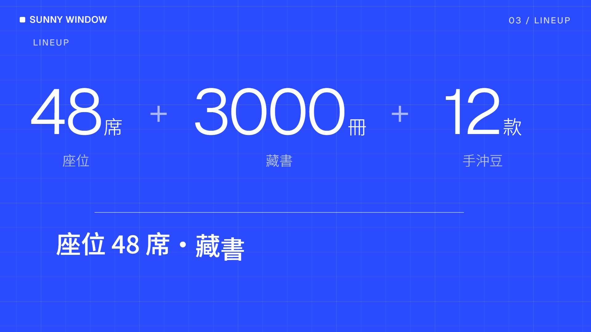
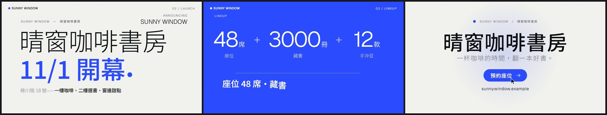

# 範本廣L_新創快剪：把主題包裝成一間新創的產品發表——輸入框打字下指令、Hero 大字、build-up 一拍一個硬切、鑽進游標點 DROP、卡片軌道、暗場指標牆、功能甩鏡、游標按下 CTA

> 來源：2026-10-09 研究 skillry.dev 的 Opus 5.5 熱門影片，照**人氣第 7 名**的提示詞（@deedydas「做一支給做 inference 的新創公司的現代、俐落、有衝擊力的影片」，26 秒，3,269 讚、34.8 萬觀看）試做「熱門 H3 新創公司快剪」（屏榮版，固定 26 秒），使用者挑進純廣告收藏；2026-10-10 改成通用範本收進 skill（廣告範本第十二號）。原作保留在本機 `02_試做/廣告30風格`（不在 skill 裡）。
> 觸發：使用者說「**範本廣L／廣L／新創快剪／產品發表廣告**」，或在選廣告範本時選廣L。
> 用法：**丟任何文本 → 照下方「內容欄位」寫成 `storyboard.json` → `engine/ad/make_ad.py 廣L <專案>` 一行出片**。沒有旁白；片長由內容多寡決定（示範片 33 秒，換文本實測 29 秒）。

## 30 秒示範片

[](示範/示範.mp4)



示範片：[`示範/示範.mp4`](示範/示範.mp4)（範本直接用示範分鏡出的完整片，33.0 秒：DROP 3 項（48 席／座位、3000 冊／藏書、12 款／手沖豆）、卡片 3 張、指標 3 個〔含劃掉換數字〕、功能 2 個）；示範分鏡：[`示範/storyboard.json`](示範/storyboard.json)（虛構的「晴窗咖啡書房」開幕，文本見 [`../../engine/ad/範例文本_小店開幕.md`](../../engine/ad/範例文本_小店開幕.md)）；沒有這個 skill 時用：[`提示詞_範本廣L完整版.md`](提示詞_範本廣L完整版.md)

## 長什麼樣
**米白 #F3F3EF 底＋80 px 細線格＋淡淡的噪點**，一個品牌藍 #2B4BFF＋中性灰階，英數用 Geist（細）、中文用思源黑體 Noto Sans TC（300／500）；左上一直有品牌小方塊＋品牌字，右上是「01 / PROMPT」這種段落編號；換段時背景格線比前景早 5 格先滑；動態模糊一律用殘影。120 BPM，一拍 15 格：
**輸入框**：大圓角輸入框一字一字打進一句指令（游標閃爍），按 Enter（按鈕變藍、縮一下），整個輸入框往上甩出 →
**Hero**：品牌小標＋一～兩行大字逐字上推（第二行品牌藍、粗一階、後面一顆藍點），副標遮罩上滑（後半段加粗），右上「Announcing＋品牌字」；鏡頭慢慢推近 →
**build-up**：DROP 的每一項各一拍：巨大細體數字（或關鍵字）＋緊貼的單位＋藍點，標籤另起一行淡色，甩進來、鏡頭重擊，小鼓越來越密 →
**鑽進游標點**：三圈藍色漣漪，一顆藍點一路放大成滿版藍底 →
**DROP**：藍底上「a ＋ b ＋ c」一拍砸一個（1.5 倍縮回），下方細線畫出、一行總結逐字上推 →
**產品線卡片**（可省）：卡片軌道從右邊滑進，一拍一拍停在游標下，停住的那張浮起、藍框、藍色小標 →
**指標牆**（可省）：暗場從右邊推進；數字吃角子老虎滾停，右邊圓環畫出（％ 照比例）；有「前一個值」時改成**劃掉換數字**（前值滾出、一刀劃掉、後值 1.6 倍砸下）；每個指標之間鏡頭往下捲一整個畫面 →
**功能**（可省）：每個功能一個畫面，左邊小標＋標題＋說明，右邊白色視窗裡的小動畫（晶片長出接腳、路線畫出、旋轉方塊＋層層堆疊、打勾清單），鏡頭往左甩 →
**CTA**：名稱逐字上推、標語、黑色按鈕浮出，游標移過去按下（變藍、漣漪），網址淡入。

## 適合
任何能說成「**一句主張＋1～3 個數字或關鍵字＋幾個產品／區域／單元＋幾個指標＋一個行動**」的內容：產品上市、新店開幕、活動或研習宣傳、課程招生、社團或科系介紹。現代、俐落、科技感，看完記得「一句主張＋一個按鈕」。
不適合：沒有任何數字也沒有清楚分項的感性故事（改用有故事裝置的範本）、需要解釋流程細節（每段只停 1～3 秒）、傳統或手作調性的題材（介面語彙會很突兀）。

## 內容欄位（storyboard.json）
最外層：`name`（成片檔名）、`pace`（選填，閱讀速度＝每秒幾個字，預設 7；越小每段停越久）、`labels`（選填，覆寫範本的英文介面小標，例 `{"metrics": "數據"}`；鍵：input、hero、drop、cards、metrics、features、cta、kicker、enter、feature）。中文 1 字＝1 字級寬、英數約 0.58；字級在範圍內自動縮，縮到下限還放不下 `make_ad.py` 會停下來說哪個欄位、最多約幾字。

| 區塊 | 欄位（字數上限約略） | 可省略 |
|---|---|---|
| `brand` 品牌 | `mark` 左上品牌字（**必備**，英文名或縮寫最好，約 28 個英數或 17 個中文；也用在 Hero 右上與 CTA 小標）、`name` 全名（約 30 字） | `name` |
| `input` 輸入框 | `prompt` 打進輸入框的一句話（**必備**，最多 26 個字元，56 px 起，約 18 字最好）、`placeholder` 還沒打字時的灰字、`hint` 左下小標（約 23 字或 31 個英數） | `placeholder`、`hint` |
| `hero` Hero | `lines` 大字 1～2 行（**必備**，每行中文約 11 字；字級 236 起自動縮，最後一行品牌藍）、`sub` 副標（灰）＋`subEm` 副標後半（黑、粗），兩段合計約 40 字、`kicker` 右上小字（預設 Announcing） | `sub`、`subEm`、`kicker` |
| `drop` DROP（**必備**） | `items` 1～3 項：`n` 數字或關鍵字（數字最多約 6 位、關鍵字 1～4 字）、`unit` 單位（緊貼數字，約 3 字）、`label` 標籤（單位下方另起一行、小一號淡色，約 10 字）、`en` 小標；`line` 下方總結一行（約 17 字）、`tag` 左上小標（預設 LINEUP） | `line`、`en`、`tag`；**文本沒有數字就用關鍵字，不要編數字** |
| `cards` 產品線卡片 2～4 張 | `title`＋`titleEm` 段標題（合計約 26 字，後半加粗）；`items`：`tag` 右上小標（約 7 字）、`name` 名稱（**必備**，約 7 字）、`en` 英文小字、`desc` 說明（最多 2 行、每行約 11 字，用換行 `\n` 或全形空白分行）、`hook` 底部藍色重點（約 12 字） | **整段可省**；卡片裡除了 `name` 都可省 |
| `metrics` 指標 2～4 個 | `items`：`value` 數字（**必備**，最多約 6 個字元，例 100、09:00、9/30）、`unit` 單位（`%` 時圓環照比例，其他畫滿一圈）、`prefix` 數字前的小字（例 前、限、最高）、`tag` 小標、`label` 說明（約 21 字）、`note` 補充（約 33 字）、**`from` 前一個值**（有寫就變成「劃掉換數字」：前值最多約 8 個數字或 5 字，後值約 4 個數字） | **整段可省**；**只用文本有的數字**；`from` 只在文本真的有「前→後」時用 |
| `features` 功能 2～4 個 | `items`：`title` 標題（**必備**，約 10 字）、`sub` 說明（約 28 字）、`tag` 小標、`vis` 右邊小動畫（`chip` 晶片／`route` 路線／`cube` 旋轉方塊／`check` 打勾清單；省略時依序輪流）、`icon` 晶片上的字（2 個中文或 3～4 個英數，預設 01、02…）、`route` 路線兩端的字（2 個，每端約 6 字，可省）、`checks` 打勾項目（1～3 項，每項約 9 字；省略時畫成灰色長條） | **整段可省** |
| `cta` 收尾（**必備**） | `name` 名稱（**必備**，約 9 字 190 px，最多約 15 字）、`slogan` 標語（約 24 字）、`button` 按鈕字（**必備**，約 10 字）、`url` 網址或電話（約 60 個英數） | `slogan`、`url` |

**產品線、指標、功能三段都可以省，但至少要留一段**（輸入框、Hero、DROP、CTA 必備；全省只有 11～13 秒，會被擋下）；省略時下一段直接從右邊推進來，段落編號自動重排。畫面上的字全部來自 storyboard；範本自己只有幾個英文介面小標（PROMPT、LAUNCH、LINEUP、PRODUCTS、METRICS、FEATURES、JOIN、Announcing、ENTER、Feature 0N，都可以用 `labels` 換掉）與 ＋、●、箭頭、勾勾圖形。**不要編造事實**；取捨與改寫規則見 [`../../references/廣告範本工作流.md`](../../references/廣告範本工作流.md)。

片長（120 BPM，一拍 0.5 秒＝15 格，所有事件都在拍上）＝輸入框 3 秒起（每字 5 格，指令長時加快）＋Hero 3 秒起（字多加停留）＋build-up 與 DROP 每項 1 拍×2＋2 拍（總結長時加停留）＋卡片每張 2 拍起＋指標每個 4 拍起（劃掉換數字 4 拍起）＋功能每個 2 拍起＋CTA 3 秒起（名稱標語長時加停留）。示範分鏡（DROP 3 項（48 席／座位、3000 冊／藏書、12 款／手沖豆）、卡片 3 張、指標 3 個含劃掉換數字、功能 2 個）＝33.0 秒；換文本實測（DROP 3 項、卡片 4 張、指標 2 個、省略功能）＝29.0 秒；只有必備段（輸入框、Hero、DROP、CTA）只排得出 11～13 秒，`timeline.py` 會停下來請你至少加一段（卡片、指標或功能），排不到 15 秒就不出片。

## 原始提示詞
逐字保存在 [`原始提示詞_H3.txt`](原始提示詞_H3.txt)：skillry.dev 人氣第 7 名的英文原文（一句話：給一間做 inference 的現代新創做一支 modern、slick、punchy 的影片；第二行指定 GSAP）與人氣資訊。
**這個範本怎麼解讀它**：新創影片＝產品發表會的介面語彙（AI 產品的輸入框下指令、Landing page 的 Hero、build-up 到 DROP 的音樂結構、產品卡片、指標牆、功能區塊、CTA 按鈕），俐落＝大量留白、細線格、一個品牌色、細體大數字；有衝擊力＝每個拍點硬切或重擊、殘影甩鏡。通用化時把屏榮的字（PRHS、屏東縣屏榮高級中學、「把國中生，變成有能力的人。」、遇見屏榮　預見未來、我們只做一個產品——有能力的人、6 條產品線＋1 個平台＋2 個實驗室＝6 科 1 群 2 特色、九科產品線卡片與科群標籤、繁星 80%、獎學金最高 24 萬、學費 26162→0 元、四個科別功能與晶片／赴日／3D 列印／證書圖、屏榮高中、立即加入、網址）全部改讀 storyboard；**DROP 1～3 項、卡片 2～4 張、指標 2～4 個、功能 2～4 個可變，卡片／指標／功能三段可省**（原作固定 3、9、3、4），版面依字數自動算（build-up 大字依數字＋說明寬度縮、DROP 一排依總寬縮、Hero 依最長一行縮），音樂段落依時間表伸縮。原作 `../kit` 的緩動、滾動數字搬進範本自己的 `kit.tsx`。
**和原作不同的地方**：
- 原作指標牆三種版面各綁一個屏榮數據（80% 圓環、24 萬對 10 萬長條、26162→0）；通用版只留兩種：一般指標＝滾動數字＋圓環（％ 照比例、其他畫滿），有 `from` 才是劃掉換數字。長條比較需要兩個同單位的數字，多數文本沒有，拿掉。
- 原作功能區的四張圖綁科別（AI 晶片、屏東→日本、3D 列印、合格證書）；通用版保留四種動畫，字改讀 storyboard（晶片上的字、路線兩端、打勾項目），沒有字就只有圖形。
- 原作卡片軌道 9 張連續捲過；通用版只有 2～4 張，改成一拍一拍停在游標下（每張停住時浮起變藍），每張都讀得到。
- 原作 ↑ → ⏎ 是字元；Geist 與思源黑體不一定有這些符號，通用版一律用 SVG 畫。
- 原作 Hero 右上的品牌字固定在第一行旁邊；通用版第一行可能很長，改成放在段落編號下方、大字上方。

## 流程與品檢（自帶產線，見 [`../../references/廣告範本工作流.md`](../../references/廣告範本工作流.md)）
1. 讀文本 → 照上表寫 `storyboard.json` → `python engine/timeline.py storyboard.json` 看預估片長與各段開始格
2. **rundown 給使用者確認** ⛔（輸入框指令、Hero 大字、DROP 各項、每張卡片、每個指標〔有沒有劃掉換數字〕、每個功能、CTA 名稱標語按鈕網址）
3. `python <skill>/engine/ad/make_ad.py 廣L <專案> --stills` → 看 `抽格/_總覽.jpg`
4. `python <skill>/engine/ad/make_ad.py 廣L <專案>`：時間表 → 配樂與音效 → 抽格 → 整支算圖 → 兩段式響度 → **最終品檢**（無旁白模式）
5. 照下表用連續格核對概念忠實度

**品檢說明**：示範片響度 −13.9 LUFS、峰值 −4.5 dBTP（預設參數，不加 `--limit`），片長、靜止（最長 2.75 秒，CTA 收尾）、突跳、光敏、F1／F2 **全部通過**；換文本實測 −13.9 LUFS、−4.2 dBTP，同樣全部通過。build-up 硬切、鑽進游標點、甩鏡、鏡頭重擊這些設計上的突跳在兩支片都沒有觸發 F1／F2，若換文本後出現，先逐格確認是不是這些設計（硬切、甩鏡、滿版藍圓擴張、暗場推進），是就寫進專案紀錄，不拿掉效果、不放寬門檻。
**峰值**：`music.py` 照廣J／廣K 做**真峰值**（4 倍超取樣）母帶：先用真峰值正規化，再前瞻限幅；實測同一套響度處理下 `PEAK_CUT` 0 dB 為 −2.9 dBTP（剛好過、餘裕太小）、1 dB 為 −3.1 dBTP（音訊單獨量），所以只壓 **1 dB**（點擊、衝擊的幾毫秒，音色不變）；預設參數出片示範 −4.5、換文本 −4.2 dBTP，都 ≤ −2，不必加 `--limit`。
**字型測試**：Geist 只有拉丁字，用 Geist 的地方一律串接 Geist → Noto Sans TC；Noto Sans TC 只載入 `allText` 用到的子集（`fonts.ts`）。`Root.tsx` 有一個 `FontTest` 合成（`npx remotion still src/index.ts FontTest 測試.png`），把 storyboard 用到的每個字排兩次（思源黑體、Geist 串接）：示範與換文本**全部正常顯示、沒有缺字方塊**；中文、全形標點（，。「」／～－）在 Geist 行裡都退回思源黑體，× ● · 正常。換文本後仍要看抽格：若有字變成方塊，就換掉那個字或改寫。

**換文本實測**（2026-10-10）：用真實的研習行前通知（教師 AI 程式設計增能研習：115 年 9 月 30 日星期三 12:10－15:10、計 3 小時、限 30 名、高雄市各級學校教師、電子大樓實習工場 3 樓、完全沒有程式基礎亦可參加、全程上機演練、實作一～四的單元名稱與時段、海青工商資訊科電話），只換 storyboard、不改程式：輸入框「用 AI 把想法變成可以用的工具」＋左下「Apps Script × Vercel 全端實作」、Hero「教師 AI 程式設計／增能研習」、DROP「3 小時／研習＋30 名／名額＋4 個／實作」＋「12:10－15:10　計 3 小時」、**卡片 4 張**（實作一～四：名稱、工具、內容、時段）、指標 2 個（9/30 星期三第 1 梯、限 30 名高雄市各級學校教師）、**省略功能段**、CTA「海青工商資訊科／完全沒有程式基礎亦可參加／請安心前來／(07) 581-9155 轉 660」 → 29.0 秒成片，畫面上的字都能在 PDF 找到出處、都在框內；欄位檢查第一次擋下 3 個太長的欄位（左下小標、兩張卡片說明），照提示改短後通過；最終品檢全部通過（−13.9 LUFS、−4.2 dBTP）。

## 概念忠實度檢查
| # | 招牌特徵 | 怎麼驗 | 現況 |
|---|---|---|---|
| 1 | 開場是 AI 產品的輸入框：一字一字打指令、游標閃、按 Enter 按鈕變藍、整個輸入框往上甩出（殘影） | 前 3 秒 | ✅ |
| 2 | Hero 大字逐字上推，最後一行品牌藍＋藍點，副標遮罩上滑，右上 Announcing | Hero 段 | ✅ |
| 3 | build-up 一拍一個硬切（巨大細體數字＋說明），小鼓越來越密、最後半拍抽空 | DROP 前 | ✅ |
| 4 | 鑽進游標點：漣漪＋藍圓放大成滿版，DROP 時「a ＋ b ＋ c」一拍砸一個 | DROP 段 | ✅ |
| 5 | 卡片軌道一拍一拍停在游標下，停住的卡浮起變藍 | 卡片段 | ✅ |
| 6 | 暗場指標牆：數字吃角子老虎滾停、圓環畫出、鏡頭往下捲；劃掉換數字 | 指標段（示範：原價→8 折） | ✅ |
| 7 | 功能每個一畫面、鏡頭往左甩，右邊視窗小動畫 | 功能段 | ✅ |
| 8 | CTA：名稱逐字上推、游標按下按鈕（變藍＋漣漪）、網址淡入 | 最後 3～5 秒 | ✅ |
| 9 | 細線格＋噪點、一個品牌色、Geist＋思源黑體；背景格線比前景早動；120 BPM 每一拍都有事 | 任意連續格＋配樂 | ✅ |
| 10 | 畫面上的字全部來自 storyboard，段落與數量可變、可省 | 換文本實測 | ✅ |

## 範本設定
| 項目 | 設定 |
|---|---|
| 引擎 | 自帶產線：`engine/timeline.py`（欄位檢查＋依段落與字數排拍點、背景格線滑動、段落編號、抽格）、`engine/music.py`（配樂＋音效）、`engine/remotion/src/`（`scenesA.tsx` 輸入框、Hero、build-up、DROP；`scenesB.tsx` 卡片軌道、指標牆、功能、CTA；`theme.tsx` 配色、格線、噪點、游標、甩鏡殘影、SVG 箭頭；`Ad.tsx` 藍底／暗場圖層與 HUD；`kit.tsx`、`fonts.ts`、`Root.tsx`〔`Ad`＋`FontTest`〕）；共用出片程式 `engine/ad/make_ad.py` |
| 畫面 | 1920×1080、30 fps；米白 #F3F3EF、墨黑 #0D0E12、品牌藍 #2B4BFF（暗場用淺藍 #7C93FF）、暗場 #23262E；80 px 細線格（每 4 格一條主線）＋噪點 |
| 字型 | Noto Sans TC 300／500（思源黑體，中文，只載入用到的子集）＋Geist 300／400／500（英數、大數字、介面小標；缺字退回思源黑體） |
| 配樂 | numpy 合成 120 BPM，A 小調 Am–F–C–G：輸入框暗琶音＋pad → Hero 低通四拍底鼓＋sub 貝斯 → build-up 小鼓加速＋riser → DROP 全編制（kick、hat、拍手、supersaw、reese 反拍）到 CTA → CTA pad＋電鋼琴和弦淡出 |
| 音效 | 鍵盤打字、Enter／按鈕點擊、重擊、咻、sub 下墜、柔咻、數字鎖定 blip、按鈕 blip |
| 旁白／字幕 | 無 |
| 響度 | 配樂先做真峰值正規化＋前瞻限幅（`PEAK_CUT` 1 dB）→ 出片兩段式 loudnorm I −14、TP −2＋alimiter 0.75（預設參數） |

## 檔案
```
engine/timeline.py      storyboard → 時間表（直接執行可印出預估片長與各段開始格）
engine/music.py         時間表 → public/music.wav
engine/remotion/src/    Ad.tsx、scenesA.tsx、scenesB.tsx、theme.tsx、kit.tsx、fonts.ts、Root.tsx、index.ts
示範/                   示範.mp4、poster.jpg、總覽.jpg、storyboard.json
原始提示詞_H3.txt       逐字原文＋人氣資訊
提示詞_範本廣L完整版.md  沒有 skill 時貼給 AI 的完整提示詞
```
