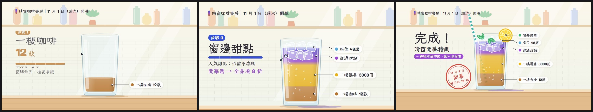

# 範本廣M_特調剖面：把主題包裝成一杯特調的食譜說明——空杯落在吧台、一層一層倒進去、左邊大標註用細線指向那一層、倒完縮成右邊小標籤，最後整杯變成剖面圖、蓋章、推到黑板收尾

> 來源：2026-10-09 研究 skillry.dev 的 Opus 5.5 熱門影片，照**人氣第 17 名**的提示詞（@Ror_Fly「用動態圖像做一支調酒食譜說明影片：從空杯到完成，材料與份量倒進杯子時顯示出來」，30 秒，1,034 讚、7.8 萬觀看）試做「熱門 H5 調飲料食譜」（屏榮版，固定 30 秒），使用者挑進純廣告收藏；2026-10-10 改成通用範本收進 skill（廣告範本第十三號）。原作保留在本機 `02_試做/廣告30風格`（不在 skill 裡）。
> 觸發：使用者說「**範本廣M／廣M／特調剖面／調飲料廣告**」，或在選廣告範本時選廣M。
> 用法：**丟任何文本 → 照下方「內容欄位」寫成 `storyboard.json` → `engine/ad/make_ad.py 廣M <專案>` 一行出片**。沒有旁白；片長由層數與字數決定（示範片 33.4 秒，換文本實測 38.1 秒）。

## 30 秒示範片

[](示範/示範.mp4)



示範片：[`示範/示範.mp4`](示範/示範.mp4)（範本直接用示範分鏡出的完整片，33.4 秒：5 層＝液體「一樓咖啡 12 款」、氣泡「二樓選書 3000 冊」、冰塊「座位 48 席」、浮層「窗邊甜點」＋顏色反應「開幕週 → 全品項 8 折」、裝飾「開幕優惠」3 行；完成「晴窗開幕特調」、蓋章「11 月 1 日／開幕／綠川街 18 號」、黑板收尾）；示範分鏡：[`示範/storyboard.json`](示範/storyboard.json)（虛構的「晴窗咖啡書房」開幕，文本見 [`../../engine/ad/範例文本_小店開幕.md`](../../engine/ad/範例文本_小店開幕.md)）；沒有這個 skill 時用：[`提示詞_範本廣M完整版.md`](提示詞_範本廣M完整版.md)

## 長什麼樣
**明亮的吧台插畫**：米白牆＋淡磁磚、層架上一排粉彩瓶罐與盆栽、斜斜的窗光，前景是木頭吧台；中文用霞鶩文楷 TC（手寫楷體），數字與英數用 Fredoka（圓體）。整支是**一個連續鏡頭**（背景視差層比前景早 5 格動），90 BPM lounge，一拍 20 格：
**開場**：一只空玻璃杯從上方掉到吧台（殘影、落地壓扁、鏡頭震一下、玻璃「叮」），左邊標題遮罩上滑：小膠囊＋一～兩行杯名（最後一行是各層顏色的漸層字）＋一行小字 →
**每一層**（2～7 層）：左邊大標註依序上滑——「步驟 N」膠囊、名稱大字、份量（Fredoka 大數字＋單位，可省）、倒入進度條、一句小字；**一條細線從標註伸出，終點的圓點釘在杯中正在倒的那一層**；鏡頭隨液面慢慢推近。五種型態各有自己的動作：
- **液體**：瓶子（小瓶／玻璃壺／小壺輪流）從右上進場、傾斜、液柱落下（咕嘟聲越倒越高），杯中長出一層新顏色
- **氣泡**：汽水瓶倒入，杯裡冒出上升的氣泡和一圈泡沫（嘶嘶聲）
- **浮層**：長柄匙伸進杯裡，液體倒在匙背上，浮在最上面
- **冰塊**：一顆一顆掉進杯裡（殘影、濺水、杯子晃、鏡頭小震、每顆一聲叮），標註下排一排小冰塊依序彈出
- **攪拌**：長柄匙轉圈（漩渦、每圈碰杯一聲），前面幾層的交界變柔
- **裝飾**（最後一層）：檸檬片「啵」一聲落在杯口、兩片薄荷葉飄下、吸管斜插進去，標註最多 3 行小字跟著一一出現

倒完那一層，**大標註往上收走、一條折線從那一層畫到右邊，小標籤（色點＋短名）滑進來釘住**；標籤高度照完成時各層的位置自動排開 →
**顏色反應**（可省）：指定的那一層倒完後，從交界開始慢慢變成另一個顏色（閃光音），標註多一行粗體說明 →
**完成**：鏡頭拉遠，整杯變成一張完整的剖面圖（右邊一排小標籤）＋「完成！」＋杯名＋小膠囊，紅色印章從 2.6 倍砸下（殘影、鏡頭重震） →
**黑板**：小標籤收走，杯子沿吧台滑出去，鏡頭往右推到牆上的黑板：粉筆框小膠囊、一行（重點字黃色加底線）、虛線畫出、名稱大字、黃色標語、網址電話。

## 適合
任何能說成「**一個名稱＋2～7 個依序疊起來的組成（區域、單元、步驟、特色、優惠）＋一個收尾行動**」的內容：新店開幕、課程或研習的單元流程、活動議程、產品由哪些部分組成、社團或科系「由什麼組成」。親切、明亮、手作感，看完記得「這杯（這件事）是由哪幾樣東西組成的」。
不適合：只有一句話沒有分項（改用一句話撐得住的範本）、分項之間沒有先後或組成關係的比較表、需要硬派科技感的題材。和 [廣F 職人食譜](../範本廣F_職人食譜/README.md) 的差別：廣F 是黑板粉筆＋手寫步驟（過程），廣M 是**杯子剖面圖＋標註線**（組成）。

## 內容欄位（storyboard.json）
最外層：`name`（成片檔名）、`pace`（選填，閱讀速度＝每秒幾個字，預設 7；越小每層停越久）、`labels`（選填，覆寫範本的介面字：`step` 步驟膠囊預設「步驟」、`done` 完成大字預設「完成！」）。中文 1 字＝1 字級寬、英數約 0.58；字級在範圍內自動縮，縮到下限還放不下 `make_ad.py` 會停下來說哪個欄位、最多約幾字。

| 區塊 | 欄位（字數上限約略） | 可省略 |
|---|---|---|
| `header` 左上頁首 | 一行（36 px，約 36 字） | 可省 |
| `title` 開場標題 | `lines` 杯名大字 1～2 行（**必備**，每行中文約 5 字 112 px，最多約 8 字；最後一行是漸層字）、`tag` 上方小膠囊（約 13 字）、`sub` 下方一行小字（約 14～18 字） | `tag`、`sub` |
| `layers` 每一層（**必備，2～7 層**，照倒入順序） | `kind` 型態（`liquid` 液體／`soda` 氣泡／`float` 浮層／`ice` 冰塊／`stir` 攪拌／`garnish` 裝飾；預設 liquid）、`name` 名稱（**必備**，約 6 字 92 px，最多約 9 字）、`amount` 份量數字＋`unit` 單位（數字最多約 7 位＋1～2 字單位）、`note` 一句小字（最多 2 行、約 29～37 字；可用 `\n` 換行）、`short` 右邊小標籤字（預設＝名稱＋份量，約 10～14 字）、`color` 顏色（`#RRGGBB`，省略時液體從預設色盤依序取：琥珀、玫瑰、金黃、靛藍、青綠、紫、橘）、`count` 冰塊顆數（3～6，預設 6）、`items` 裝飾層的小字 1～3 行（每行約 9～13 字，依序配檸檬片、薄荷葉、吸管） | 除了 `name` 都可省；**`amount` 只用文本有的數字，沒有就只寫名稱**；至少一層 liquid／soda／float；ice、garnish 各最多一層，garnish 只能放最後；stir 前面要有液體 |
| `react` 顏色反應 | `layer` 第幾層（1 起算，要是液體／氣泡／浮層）、`color` 變成什麼色（預設紫 #9B4FD0）、`text` 一行說明（約 13～16 字） | **整段可省** |
| `done` 完成 | `name` 杯名（預設＝標題大字，約 11～15 字）、`pill` 下方小膠囊（約 16～20 字） | 都可省 |
| `stamp` 印章 | `main` 章中間大字（約 4～5 字；**沒有 main 就不蓋章**）、`top`／`bottom` 上下小字（約 6～8 字） | **整段可省** |
| `board` 黑板（**必備**） | `name` 名稱大字（**必備**，約 5 字 156 px，最多約 8 字）、`tag` 粉筆框小膠囊（約 18 字）、`line`＋`em` 一行（em 是黃色加底線的重點，合計約 19～26 字）、`slogan` 黃色標語（約 12～18 字）、`url` 網址或電話（約 34～47 個英數） | 除了 `name` 都可省 |

畫面上的字全部來自 storyboard；範本自己只有「步驟」「完成！」兩個介面字（可用 `labels` 換掉）與冰塊、檸檬片、薄荷葉、吸管、瓶子、湯匙這些圖形。**不要編造事實**：「杯名」與「哪一項當哪一層」是範本的包裝，可以自己取（例：晴窗開幕特調），但份量數字、說明小字都要出自文本；取捨與改寫規則見 [`../../references/廣告範本工作流.md`](../../references/廣告範本工作流.md)。

片長（90 BPM，一拍 20 格，每一層的開始都落在拍上）＝開場標題 2.7 秒起（字多加停留）＋每一層的基本動作（液體／氣泡／浮層 5 拍、冰塊 2.7～3.3 秒、攪拌 3 拍、裝飾 4 拍）與「讀完這層標註的時間」取大（進位到整拍）＋顏色反應那層再加讀說明的時間＋完成 2 秒（有印章 2.5 秒）＋推鏡 0.9 秒＋黑板 2.7～4.7 秒。示範分鏡（5 層含顏色反應與裝飾、有印章）＝33.4 秒；換文本實測（6 層含攪拌，省略顏色反應與裝飾）＝38.1 秒。內容少到排不出 15 秒時 `timeline.py` 會停下來請你加層，不出片。示範片要 25～35 秒：層數多時把 `note` 改短或調大 `pace`。

## 原始提示詞
逐字保存在 [`原始提示詞_H5.txt`](原始提示詞_H5.txt)：skillry.dev 人氣第 17 名的英文原文（做一支 30 秒的調酒食譜動態圖像，說明影片風格，從空杯到完成，材料與份量倒進杯子時顯示出來）與人氣資訊。
**這個範本怎麼解讀它**：說明影片＝標註線、剖面圖、步驟編號這套圖解語彙；「材料＋份量倒進杯子時顯示」＝大標註與杯中那一層用細線連起來，倒完縮成小標籤，最後留下一張完整剖面圖。通用化時把屏榮的字（餐飲管理科・飲料調製、柑橘蝶豆漸層氣泡飲、無酒精特調、蜂蜜糖漿 15 ml、柳橙汁 90 ml、攪拌均勻、冰塊 6 顆、氣泡水 90 ml、蝶豆花茶 60 ml、遇到柑橘的酸變紫色、檸檬片・薄荷葉・吸管、證照示範章、三證照、學校名、標語、網址）全部改讀 storyboard；**層數 2～7 可變、六種型態可任意排列、顏色反應與印章可省**（原作固定 7 步），液體份量依層數平分杯子，鏡頭關鍵格、標籤高度、配樂段落都依時間表算。原作 `../kit` 的緩動、遮罩上滑、固定種子亂數搬進範本自己的 `kit.tsx`。
**和原作不同的地方**：
- 原作的液體漸層是手調的 4 組色標（柳橙由深到淺、攪拌後融合、加氣泡水變淡）；通用版每一層一個顏色、上端略淡，交界柔和；攪拌改成「讓前面幾層的交界變柔」，不再假設是哪兩種材料融合。
- 原作的顏色反應綁蝶豆花遇酸變紫；通用版是「任一層倒完後從交界往上變成指定顏色」＋一行說明，可省。
- 原作開場標題的「漸層」兩字是手指定的；通用版改成標題最後一行整行用各層顏色漸層。
- 原作右邊小標籤的高度手排；通用版照完成時各層的位置自動排開（彼此至少隔 74 px）。
- 原作的瓶子標貼是蜂蜜六角形、汽水瓶是檸檬圖；通用版改成該層顏色的圓點（不綁材料）。
- 配樂多一個慢速音量騎乘（3 秒滑動 RMS，最多 ±4 dB）：原作開場只有電鋼琴、高潮全樂團，響度範圍 9.6 LU，出片的 loudnorm 會退回動態模式、峰值只剩 −2.3 dBTP；騎乘後降到 9 以下，走線性模式。

## 流程與品檢（自帶產線，見 [`../../references/廣告範本工作流.md`](../../references/廣告範本工作流.md)）
1. 讀文本 → 照上表寫 `storyboard.json` → `python engine/timeline.py storyboard.json` 看預估片長與每一層的開始格
2. **rundown 給使用者確認** ⛔（杯名、每一層的型態／名稱／份量／小字、顏色反應、完成杯名、印章、黑板）
3. `python <skill>/engine/ad/make_ad.py 廣M <專案> --stills` → 看 `抽格/_總覽.jpg`
4. `python <skill>/engine/ad/make_ad.py 廣M <專案>`：時間表 → 配樂與音效 → 抽格 → 整支算圖 → 兩段式響度 → **最終品檢**（無旁白模式）
5. 照下表用連續格核對概念忠實度

**品檢說明**：示範片響度 −13.9 LUFS、峰值 −3.1 dBTP；換文本實測 −13.9 LUFS、−3.8 dBTP（都是預設參數，不加 `--limit`）；片長、靜止（最長 1.25 秒）、光敏都通過。**F1／F2 會報出來，是設計不是錯**：這個範本沒有字幕，品檢把畫面下方的白底深字小標籤（「一樓咖啡 12款」那排）當成字幕帶；逐格確認過——示範 F1 7 處（11.8～13.0 秒）全在冰塊每顆落下的鏡頭小震（震幅 5～9 px，連續格看得到頁首與層架一起平移），F2 1 處（22.7 秒）是氣泡層的白色氣泡升過吸管的深色條紋；換文本 F1 1 處（22.5 秒）與 F2 1 處（22.3 秒）在高潮那一拍的鏡頭重擊，F2 另 5 處（27.9～29.4 秒）在冰塊落下的鏡頭小震。換文本後若在別的時間點出現，先逐格確認是不是落杯、冰塊、高潮、檸檬片、蓋章這五種鏡頭震動或氣泡，是就寫進專案紀錄，不拿掉效果、不放寬門檻。
**峰值**：`music.py` 照廣J／廣L 做**真峰值**（4 倍超取樣）母帶：先慢速音量騎乘把響度範圍壓到 9 以下，再用真峰值正規化、前瞻限幅。實測（同一套兩段式響度＋alimiter 0.75）`PEAK_CUT` 0 dB 示範 −2.6、換文本 −3.1 dBTP（剛好過、餘裕太小），1 dB 為 −3.2／−3.8 dBTP，所以只壓 **1 dB**（冰塊叮、蓋章的幾毫秒，音色不變）；沒有騎乘時不論 PEAK_CUT 多少都卡在 −2.3～−2.5（loudnorm 退回動態模式，峰值由 alimiter 決定）。
**字型測試**：Fredoka 只有拉丁字，用 Fredoka 的地方一律串接 Fredoka → 霞鶩文楷 TC → Noto Sans TC；霞鶩文楷與 Noto Sans TC 都只載入 `allText` 用到的子集（`fonts.ts`）。`Root.tsx` 有一個 `FontTest` 合成（`npx remotion still src/index.ts FontTest 測試.png`），把 storyboard 用到的每個字排三次（楷體 400、700、Fredoka 串接）：示範與換文本**全部正常顯示、沒有缺字方塊**；中文、全形標點（，。：（）｜～＋→）在 Fredoka 行裡都退回楷體，數字與英數是 Fredoka。換文本後仍要看抽格：若有字變成方塊，就換掉那個字或改寫。

**換文本實測**（2026-10-10）：用真實的研習行前通知（教師 AI 程式設計增能研習：115 年 9 月 30 日星期三 12:10－15:10、計 3 小時、限 30 名、高雄市各級學校教師、電子大樓實習工場 3 樓、完全沒有程式基礎亦可參加、實作一～四的單元名稱與時段、資料庫觀念、海青工商資訊科電話），只換 storyboard、不改程式：標題「AI 程式設計／增能研習」＋「115 年 9 月 30 日（星期三）」、**6 層**＝液體「實作一：用 AI 生成第一個網頁 12:38–13:08」、氣泡「實作二：初階部署：GAS 上線」、**攪拌**「資料庫觀念：試算表就是資料庫」、液體「實作三：班級公告管理（核心）」、浮層「實作四：Vercel＋GitHub 部署」、冰塊「名額 30 名：高雄市各級學校教師」，**省略顏色反應與裝飾層**、液體顏色全用預設色盤；完成「AI 程式設計增能研習／完全沒有程式基礎亦可參加」、印章「計 3 小時／研習／12:10–15:10」、黑板「海青工商資訊科／電子大樓實習工場 3 樓／AI 增能研習／用 AI 把想法變成可以用的工具／(07) 581-9155 轉 660」 → 38.1 秒成片，畫面上的字都能在 PDF 找到出處、都在框內；欄位檢查一次通過。實測發現預設色盤前三色（琥珀、橘、金黃）相鄰太像，改成琥珀、玫瑰、金黃、靛藍…後重出。

## 概念忠實度檢查
| # | 招牌特徵 | 怎麼驗 | 現況 |
|---|---|---|---|
| 1 | 開場空杯掉到吧台（殘影、落地壓扁、鏡頭震、玻璃叮），左邊標題遮罩上滑、最後一行漸層字 | 前 3 秒 | ✅ |
| 2 | 每一層：左邊大標註「步驟 N＋名稱＋份量＋進度條＋小字」，細線終點釘在杯中正在倒的那一層 | 每一層中段 | ✅ |
| 3 | 倒完大標註收走、折線畫到右邊、小標籤滑進來釘住那一層 | 每一層結尾 | ✅ |
| 4 | 型態各有動作：瓶子傾倒液柱、氣泡上升＋泡沫、浮層倒在匙背、冰塊一顆顆落下濺水、攪拌漩渦、檸檬片薄荷葉吸管 | 示範（液體、氣泡、冰塊、浮層、裝飾）＋換文本（攪拌） | ✅ |
| 5 | 顏色反應：倒完後交界慢慢變色＋閃光音＋一行說明 | 示範第 4 層（開幕週 → 全品項 8 折） | ✅ |
| 6 | 完成：鏡頭拉遠成完整剖面圖（右邊一排標籤）＋完成！＋印章砸下 | 完成段 | ✅ |
| 7 | 杯子沿吧台滑出、鏡頭推到黑板：膠囊、重點字、名稱大字、標語、網址 | 最後 4 秒 | ✅ |
| 8 | 90 BPM lounge，倒水、冰塊、攪拌、氣泡、啵、沙沙、蓋章、咻都對準畫面；高潮全樂團進來 | 配樂 | ✅ |
| 9 | 畫面上的字全部來自 storyboard，層數、型態、顏色反應、印章可變可省 | 換文本實測 | ✅ |

## 範本設定
| 項目 | 設定 |
|---|---|
| 引擎 | 自帶產線：`engine/timeline.py`（欄位檢查＋依層數與字數排每一層的倒入、冰塊、攪拌、裝飾、顏色反應、完成、蓋章、推鏡、黑板時間與抽格）、`engine/music.py`（配樂＋音效）、`engine/remotion/src/`（`model.ts` 杯子幾何、每層液體帶、冰塊、鏡頭關鍵格；`parts.tsx` 背景、吧台、杯子、液體、瓶子、湯匙、裝飾、黑板；`Ad.tsx` 標題、大標註、指線、小標籤、完成、印章、黑板字、`FontTest`；`kit.tsx`、`fonts.ts`、`Root.tsx`、`index.ts`）；共用出片程式 `engine/ad/make_ad.py` |
| 畫面 | 1920×1080、30 fps；牆 #FBF6EA→#EEF3EA、吧台木色 #E3BC8E、墨色 #2A2833、黑板 #2F4A40、印章紅 #D8473B；液體預設色盤 #E59A2E、#E0607E、#E8B21E、#3550D9、#2FB3A8、#7A4FC8、#FF8A1F，冰塊 #5AA9D6、攪拌 #E58A3A、裝飾 #3FAE6A、顏色反應預設 #9B4FD0 |
| 字型 | 霞鶩文楷 TC 400／700（中文，只載入用到的子集）＋Fredoka 500／600（數字、英數、網址；缺字退回楷體，再退回 Noto Sans TC 子集） |
| 配樂 | numpy 合成 90 BPM，F 大調 Fmaj9–Am7–Dm9–Bbmaj7：開場電鋼琴長和弦＋沙鈴 → 第一層起電鋼琴切分、sub 低音、刷鼓、反拍腳踏鈸、沙鈴十六分 → 高潮（顏色反應那層，沒有就最後一層液體）起全樂團＋弦樂墊＋顫音琴旋律到「完成」→ 黑板前收成長和弦＋顫音琴琶音淡出 |
| 音效 | 落杯悶響＋玻璃叮、倒液體（越滿越高）、氣泡嘶嘶、冰塊叮＋濺水、攪拌碰杯、riser＋高潮衝擊、顏色反應閃光音、檸檬片啵、薄荷葉沙沙、吸管咻＋叮、蓋章、推鏡咻 |
| 旁白／字幕 | 無 |
| 響度 | 配樂先做慢速音量騎乘（LRA < 9）＋真峰值正規化＋前瞻限幅（`PEAK_CUT` 1 dB）→ 出片兩段式 loudnorm I −14、TP −2＋alimiter 0.75（預設參數） |

## 檔案
```
engine/timeline.py      storyboard → 時間表（直接執行可印出預估片長與每一層的開始格）
engine/music.py         時間表 → public/music.wav
engine/remotion/src/    Ad.tsx、model.ts、parts.tsx、kit.tsx、fonts.ts、Root.tsx、index.ts
示範/                   示範.mp4、poster.jpg、總覽.jpg、storyboard.json
原始提示詞_H5.txt       逐字原文＋人氣資訊
提示詞_範本廣M完整版.md  沒有 skill 時貼給 AI 的完整提示詞
```
