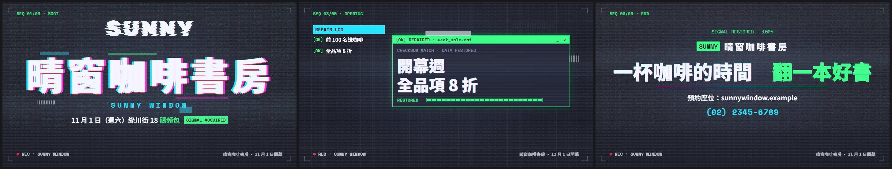

# 範本廣N_數位故障：訊號被干擾的螢幕——資訊不是「出現」，是「解碼成功」：亂碼、色版錯開、撕裂，然後在拍點鎖定；換章時畫面切成 20 條撕裂、新舊兩章穿插、RGB 色版爆開再收回

> 來源：2026-10-09「廣告 30 風格」第 1 批第 02 支（同一句 showreel 母提示詞「做一支 60 秒、展現你是多厲害動態設計師的作品集短片，使出全力」，每支換一種視覺語言；02＝數位故障 Glitch），屏榮版固定 60 秒 7 章，第 1 批 10 支裡留下的 4 支之一；2026-10-10 改成通用範本收進 skill（廣告範本第十四號）。原作保留在本機 `02_試做/廣告30風格`（不在 skill 裡）。
> 觸發：使用者說「**範本廣N／廣N／數位故障／故障風廣告**」，或在選廣告範本時選廣N。
> 用法：**丟任何文本 → 照下方「內容欄位」挑章、寫成 `storyboard.json` → `engine/ad/make_ad.py 廣N <專案>` 一行出片**。沒有旁白；片長由章數與字數決定（示範片 30.1 秒，換文本實測 41.5 秒）。

## 30 秒示範片

[](示範/示範.mp4)



示範片：[`示範/示範.mp4`](示範/示範.mp4)（範本直接用示範分鏡出的完整片，30.1 秒、11.8 MB：5 章＝開場「SIGNAL LOST → SUNNY 解碼 → 晴窗咖啡書房＋SUNNY WINDOW＋11 月 1 日（週六）綠川街 18 號開幕」、頻道切換「一樓咖啡／二樓選書／窗邊甜點」、錯誤修復「前 100 名送手沖咖啡一杯／開幕週全品項 8 折／會員免費加入、生日當月再送一杯」、數字鎖定「座位 48 席＋3000 冊、12 款兩張小卡」、收尾「一杯咖啡的時間　翻一本好書」）；示範分鏡：[`示範/storyboard.json`](示範/storyboard.json)（虛構的「晴窗咖啡書房」開幕，文本見 [`../../engine/ad/範例文本_小店開幕.md`](../../engine/ad/範例文本_小店開幕.md)）；沒有這個 skill 時用：[`提示詞_範本廣N完整版.md`](提示詞_範本廣N完整版.md)

## 長什麼樣
**被干擾的監視螢幕**：深灰藍底 #1d1f2a＋中央略亮、像素點格、靜態掃描線＋慢慢下移的亮帶；螢光綠 #39ff88、洋紅 #ff2bd6、青 #22e4ff、紅 #ff3b5c 四色。中文用 Noto Sans TC 700／900，介面字與數字用 Space Mono，故障大字用 Rubik Glitch，頻道 OSD 用 VT323。四角固定角標：**上方章節標籤**（SEQ 02/05 · CHANNEL）、**下方靜止 REC 標**與右下一行小字（下方 180 px 不放會快速變化的東西，雪花、資料流都在 y 880 以上淡出）。phonk 110 BPM，一拍 16.36 格，每一章都從拍上開始。
**所有字都是「解碼」出來的**：先跳亂碼（中文跳「訊號解碼錯誤資料損壞…」、英數跳 A–Z 0–9 #%&@），一個字一個字在拍上鎖定；鎖定那一拍 RGB 三色版錯開、橫向切條位移再收回。數字一律吃角子老虎滾動、一位一位停。
**章型**（storyboard 挑要用的章、順序可換）：
- **open 開場**（必備，第一章）：紅色「!! SIGNAL LOST」錯誤視窗＋NO SIGNAL 故障字＋解碼進度條，雪花慢慢退 → 縮寫用故障字一個字母一拍解碼（可省），縮小上移 → 名稱大字半拍一字鎖定（切條＋色版）→ 英文一行、全名一行＋綠色「SIGNAL ACQUIRED」→ 最後 4 拍鏡頭推近、資料損壞色塊變多
- **layers 數字組合**：1～3 個面板依序展開，每個「數字（滾動鎖定）＋單位＋名單逐行解碼」，面板標題 DECODING → [ OK ]；最後整組撕裂收走，合成一行大字（例：3 小時 30 名 4 個實作）
- **channels 頻道切換**：2～9 個項目像轉台，每台一開始雪花＋畫面上捲＋切條，右上 VT323「CH01」與頻道格、TUNING... → PLAY，小標籤、名稱大字、英文、一句話、框線重點依序出現；底下彩條測試圖淡淡墊底
- **errors 錯誤修復**：1～4 個亮點，每個先以紅／洋紅「!! ERROR 0x01 · DATA CORRUPTED」視窗彈出、字是亂碼且一直撕裂，一拍後變綠「[OK] REPAIRED」、字一個個鎖定、進度條填滿；左邊 REPAIR LOG 一條一條 [OK] 累積
- **numbers 數字鎖定**：1～2 個大數字（300 px 等寬字，一位一位滾停、每停一位色版爆一下），上方一行、下方一句＋「ADDR 0x… // LOCKED」；最後一個數字可帶 1～2 張小數字卡橫向展開
- **status 系統狀態**：一個系統視窗由上往下展開，2～6 列「項目（解碼）／說明／狀態框」逐列滑入，狀態框先轉圈 [ / ]，一拍後亮起；全部亮起標題列變綠，「ALL SYSTEMS ONLINE」＋最後一行
- **logo 收尾**（必備，最後一章）：滿畫面雪花、資料損壞色塊、22 條撕裂、色版 46 px 錯開，6 拍內慢慢收斂；縮寫小框＋名稱、兩段標語（第二段綠色）逐字鎖定、漸層線拉開、一行小字、網址；上方「SIGNAL RESTORED · 100%」；結尾前一個小故障點

**招牌轉場**（每次換章，前 4 格～後 5 格）：畫面切成 20 條，每條各自橫移（最多 420 px），新舊兩章的切條隨機穿插（越接近換章點新章比例越高），整格 RGB 三色版分離濾鏡爆開 30 px 再收回，換章那 2 格整個畫面跳動；偶爾有幾條洋紅／青／綠的色條。
**其他故障**：非轉場時 7% 的格「跳格」（停在前一格，最後 100 格不跳）；每小節第 3 拍有 2 格輕微撕裂（收尾章不做）。

## 適合
任何想要「**科技感、駭客感、有點叛逆**」的短廣告：資訊科、電子科、程式或 AI 研習、電競社、科技產品、數位活動、資安宣導；也適合把一般活動做得很搶眼（示範的咖啡店）。內容要能拆成幾個「一眼看得懂的資訊塊」：名稱、幾個數字、幾個項目、幾個亮點、幾列狀態。
不適合：溫馨、柔和、需要慢慢讀長句的題材（故障會讓人覺得粗暴）；需要照片或人物的內容；光敏感族群為主的場合（雖然大面積閃光每秒 ≤3 次、品檢通過，但整支都在抖）。和 [廣L 新創快剪](../範本廣L_新創快剪/README.md) 的差別：廣L 是乾淨的新創產品發表（白底、游標、卡片），廣N 是**被干擾的訊號＋解碼鎖定**。

## 內容欄位（storyboard.json）
最外層：`name`（成片檔名）、`pace`（選填，閱讀速度＝每秒幾個字，預設 7；越小每章停越久；英數算半個字）、`hud`（選填：`left` 左下 REC 後面的字，英數為佳約 20 字元；`right` 右下一行小字，中文約 25 字）、`labels`（選填，覆寫範本的介面字，見下）、**`chapters`（必備，3～7 章，建議 4～6 章）**。
中文 1 字＝1 字級寬、英數約 0.58～0.6；字級在範圍內自動縮，縮到下限還放不下 `make_ad.py` 會停下來說哪個欄位、最多約幾字。每一章都可以加 `label`（上方角標的章名，英數 16 字元內，預設見表）。

| 章 `type`（預設角標） | 欄位（字數上限約略） | 可省略 |
|---|---|---|
| `open` 開場（BOOT）**必備，只能放第一章** | `name` 名稱大字（**必備**，250 px，中文最多約 10 字）、`abbr` 縮寫（故障字 340 px，**只能英數**，最多 6 個）、`en` 英文一行（約 37～55 個英數）、`full` 全名或一句話（約 30～40 字） | `abbr`（省略就直接解碼名稱，開場短 4 拍）、`en`、`full` |
| `layers` 數字組合（INDEX） | `panels` **1～3 個面板**：`n` 數字（**必備，只用文本的數字**；3 個面板時每個最多約 3 位數）、`unit` 單位（1～3 字）、`names` 名單 0～6 行（3 個面板時每行約 13 字，2 個約 23 字）；`sub` 合成後下方一行（約 40～60 字元） | `unit`、`names`、`sub` |
| `channels` 頻道切換（CHANNEL） | `items` **2～9 個**：`name` 名稱大字（**必備**，200 px，中文最多約 11 字）、`tag` 上方色塊小標（約 20 字）、`en` 英文一行（約 30～40 個英數）、`line` 一句話（約 26～36 字）、`hook` 框線重點（約 30～40 字） | 除了 `name` 都可省 |
| `errors` 錯誤修復（ERROR LOG） | `items` **1～4 個**：`lines` 大字 1～2 行（**必備**，104 px，每行中文最多約 15 字）、`short` 左邊修復紀錄（約 11～14 字，預設＝第一行）、`file` 視窗標題的檔名（英數、底線，24 字元內，預設 item_01…） | `short`、`file` |
| `numbers` 數字鎖定（DATA） | `items` **1～2 個**：`value` 數字（**必備，只用文本的數字**，可含 . , : /，最多 7 字元）、`unit` 單位（1～3 字）、`head` 數字上方一行（約 13～27 字）、`badge` 上方英文小框（英數 22 字元）、`note` 數字下方一句（約 20～29 字）；`cards` 小數字卡 0～2 張（跟在最後一個數字）：`value`（最多 6 字元）、`unit`、`label` 說明（約 15～20 字） | 除了 `value` 都可省；整個 `cards` 可省 |
| `status` 系統狀態（SYSTEM） | `rows` **2～6 列**：`label` 項目（**必備**，約 4～5 字）、`desc` 說明（約 20～27 字）、`state` 狀態框（約 5～11 字／英數 9～19 個，預設 ONLINE）；`title` 視窗右上標題（約 19～25 字）、`welcome` 全部亮起後的一行（約 22～30 字） | 除了 `label` 都可省 |
| `logo` 收尾（END）**必備，只能放最後一章** | `name` 名稱（**必備**，60 px，約 17～26 字）、`slogan` 標語 1～2 段（**必備**，150 px，兩段合計中文最多約 18 字；第二段綠色）、`badge` 名稱左邊英文小框（英數 10 字元）、`line` 標語下方一行（約 38～53 字）、`url` 網址或電話（約 44～67 個英數） | `badge`、`line`、`url` |

`labels` 可覆寫的介面字（預設是通用的英文螢幕介面，換成中文也可以）：`lostTitle`「!! SIGNAL LOST · ERR 0x00」、`noSignal`「NO SIGNAL」、`decoding`「DECODING」、`lostMsg`「訊號中斷　正在嘗試重新解碼」、`source`「> DECODING SOURCE //」、`acquired`「SIGNAL ACQUIRED」、`layer`「LAYER」、`ok`「[ OK ]」、`tuning`「TUNING...」、`play`「PLAY」、`repairLog`「REPAIR LOG」、`error`「!! ERROR」、`corrupted`「DATA CORRUPTED」、`repaired`「[OK] REPAIRED」、`repairing`「REPAIRING」、`restoredMsg`「CHECKSUM MATCH · DATA RESTORED」、`fixing`「FIXING」、`restored`「RESTORED」、`locked`「LOCKED」、`status`「SYSTEM STATUS」、`allOk`「ALL SYSTEMS ONLINE」、`signalRestored`「SIGNAL RESTORED · 100%」、`rec`「REC」、`seq`「SEQ」。

畫面上的字全部來自 storyboard；範本自己只有上面這些介面字、亂碼字池、十六進位資料流與「CH01」頻道號。**不要編造事實**：哪一項放哪一章、狀態框寫什麼是包裝，可以自己取，但數字、名稱、說明都要出自文本；`numbers`、`layers` 的數字**只用文本有的數字**（可以數文本的項目，例：實作一～四 → 4 個實作）；取捨與改寫規則見 [`../../references/廣告範本工作流.md`](../../references/廣告範本工作流.md)。
**怎麼挑章**：名稱一定進 open；有 2～3 個能並列的數字 → layers；有一串同類項目（區域、科別、單元、課程）→ channels；有 1～4 個「亮點、優惠、特色」→ errors；有一兩個特別大的數字 → numbers；有時間、地點、對象、交通這類生活資訊 → status；最後 logo 放名稱＋標語＋網址電話。同一種章可以用兩次（例：兩段 channels），但建議 4～6 章。

片長（110 BPM，一拍 16.36 格，每章長度都是整拍）：open 12～16 拍起（有縮寫多 4 拍，字多加停留）、layers 每個面板 3 拍起＋合成 4 拍起、channels 每台 1.75 拍起（字多加長）、errors 每個 3 拍起、numbers 每個數字「鎖完最後一位＋3 拍」起（有小卡再加）、status「1＋列數×2 拍＋最後一行」、logo 10 拍起；都依讀字量（中文 1、英數 0.5）加長。示範分鏡（5 章）＝30.1 秒；換文本實測（5 章）＝41.5 秒。內容少到排不出 15 秒時 `timeline.py` 會停下來請你加章，不出片。示範片要 25～35 秒：章多時把句子改短或調大 `pace`。

## 原始提示詞
逐字保存在 [`原始提示詞_02.txt`](原始提示詞_02.txt)：showreel 母提示詞（make a dynamic 60-second motion graphics video that shows what an incredible motion designer you are, like it's your showreel for a résumé. go all out.）、30 風格清單第 1 批第 02 列（數位故障 Glitch：RGB 色版分離、畫面撕裂成條、跳格硬切、資料碎片；MTV、Nine Inch Nails；Glitch hop 110）、第 1 批製作規範（結構、硬規則）與原作配樂設定。
**這個範本怎麼解讀它**：「go all out」＝每一章換一種故障手法、轉場本身就是招牌；原作把它落地成「訊號被干擾的螢幕」這個故事裝置——開場訊號中斷、內容一塊一塊被解碼、最後訊號恢復。通用化時把屏榮的字（PRHS、屏榮高中、PING RONG HIGH SCHOOL、屏東縣屏榮高級中學、6 科 1 群 2 特色與各科名單、9 個科別的英文名／特色／亮點、日籍教師等 5 個亮點、全面免學費 26162 元、獎學金 24 萬、80%、3.4 萬、交通車宿舍游泳池等 6 列生活資訊、歡迎加入屏榮、遇見屏榮　預見未來、優質屏榮　歡迎你加入、網址、PRHS-TV、屏榮高中 · 數位故障）全部改讀 storyboard；**7 個章型由 storyboard 挑選、順序可換、可省略、項目數可變**，每章長度依字數算；原作 import 的 `../kit`（節拍、緩動、Roller）與 `ad02/kit.tsx`（色版、切條、亂碼、雪花、色塊、資料流、錯誤視窗、進度條）搬進範本自己的 `kit.tsx`。
**和原作不同的地方**：
- 原作固定 7 章、每章 16 拍（4 小節）、60 秒；通用版章型可挑、長度依內容（示範 5 章 30 秒）。開場、數字組合、頻道、錯誤、數字、狀態、收尾各章內部的拍點（第幾拍解碼、第幾拍鎖定）照原作，只有「每一項停多久」依字數伸縮。
- 原作的頻道每台固定 1.75 拍（約 1 秒，9 台快閃）；通用版每台至少 1.75 拍、字多就加長到讀得完（項目少的時候不會一閃而過）。
- 原作數字章固定「免學費 26162 元＋獎學金 24 萬＋兩張小卡」；通用版是 1～2 個大數字依序鎖定、小卡可省，有小卡時版面往上收讓位置。原作的英文小框「FREE TUITION」改成選填的 `badge`。
- 原作狀態列的「冷氣 ON」特別判斷用中文字型；通用版狀態框一律用 Space Mono 串接 Noto Sans TC，中文自動退回黑體。
- 原作的亂碼解碼會把標點也打亂；通用版的空白與中文標點（，。：（）・～…）不跳亂碼，句子比較好讀。
- **配樂拆出來**：原作是共用 `ad_audio.py` 呼叫 `make_music.arrange('phonk', 110, 'Am')` 排到 60 秒；範本自己的 `engine/music.py` 只照搬 phonk 分支（808 長音滑降、Trap 滾奏 Hi-hat、牛鈴旋律、第 3 拍拍手＋小鼓、開場與結尾的長和弦墊底）與原作的音效（開頭重擊、換章前一小節 riser＋換章重擊、收尾前兩小節 riser＋重擊、強度 1.0）與混音（master_chain×0.6、音效×0.8、尾巴 1.4 秒淡出），段落與換章點讀時間表。另外**加了章內事件音效**（字鎖定的短嗶、修復／上線的雙音、轉台與錯誤視窗彈出的數位雜訊、合成一行與第二個數字的小重擊），原作只有換章音效。清單寫「Glitch hop 110」，原作實際用 phonk 110 BPM，照原作。
- **母帶**（原作沒有）：原作開場只有長和弦墊底，比全編制低 16 LU（響度範圍 17），出片的 loudnorm 會退回動態模式；通用版把開場墊底拉高 12 dB（`INTRO_GAIN`，音色不變），再做慢速音量騎乘、16 kHz 低通（`AAC_LP`）、拍手＋小鼓起音整理（`soft_attack`）、真峰值正規化與前瞻限幅（`PEAK_CUT` 1 dB）。

## 流程與品檢（自帶產線，見 [`../../references/廣告範本工作流.md`](../../references/廣告範本工作流.md)）
1. 讀文本 → 挑章、照上表寫 `storyboard.json` → `python engine/timeline.py storyboard.json` 看預估片長與每一章的開始格
2. **rundown 給使用者確認** ⛔（每一章的型別與畫面上的字）
3. `python <skill>/engine/ad/make_ad.py 廣N <專案> --stills` → 看 `抽格/_總覽.jpg`（每章中段、每個換章點後 3 格、收尾）
4. `python <skill>/engine/ad/make_ad.py 廣N <專案>`：時間表 → 配樂與音效 → 抽格 → 整支算圖 → 兩段式響度 → **最終品檢**（無旁白模式）
5. 照下表用連續格核對概念忠實度

**品檢說明**：示範片響度 −14.0 LUFS、峰值 −4.7 dBTP；換文本實測 −13.9 LUFS、−3.8 dBTP（都是預設參數，不加 `--limit`）；片長、靜止（最長 0.75 秒）、光敏都通過。**F1／F2 兩支都是 0**：下方 180 px 只有靜止的 REC 標與右下小字，雪花、資料流、色塊都在 y 880 以上淡出，品檢的字幕帶量不到閃爍。**F11 畫面突跳**示範 50 處、換文本 48 處，是設計（`--jumps-by-design`）：報告列出的例子兩支都在開場 2.1～6.4 秒，逐格看過——SIGNAL LOST 視窗撕裂退場、縮寫與名稱逐字解碼時每格換種子的切條位移、每拍（名稱段每半拍）的色版脈衝，亂碼一格一換；其餘來源是換章前 4 格～後 5 格的撕裂轉場、非轉場的 7% 跳格、每小節第 3 拍的 2 格小撕裂、頻道切換那一格的上捲（都是原作的手法）。換文本後若別的地方報突跳，先逐格確認是不是這幾種，是就寫進專案紀錄，不拿掉效果、不放寬門檻。
**峰值**：`music.py` 從配樂源頭處理——①開場墊底拉高 12 dB（響度範圍 17 → 7.4～7.7，出片 loudnorm 走線性模式）；②慢速音量騎乘；③母帶 16 kHz 低通；④拍手＋小鼓起音整理（`soft_attack`：前 2.5 ms 短淡入、前 12 ms 的 6.5 kHz 以上瞬間收一點、同拍落下整體 −1.4 dB，聽感幾乎不變）；⑤4 倍超取樣真峰值正規化＋前瞻限幅只壓最尖的 1 dB。預設參數出片：示範 −4.7、換文本 −3.8 dBTP。技術備註：沒有④時換文本出片 −2.3 dBTP——AAC 編碼器在一下拍手＋小鼓的瞬間起音（16.4 秒，編碼前只有 −6.9 dB）產生 4.6 dB 的預回音突波（誤差集中在 7.7 kHz），突波大小隨分框位置變，配樂端量不到，所以從起音形狀根治。
**字型測試**：Space Mono、Rubik Glitch、VT323 只有拉丁字，用它們的地方一律串接 → Noto Sans TC；Noto Sans TC 只載入 `allText`（storyboard 的字＋介面字＋亂碼字池）用到的子集（`fonts.ts`）。`Root.tsx` 有一個 `FontTest` 合成（`npx remotion still src/index.ts FontTest 測試.png`），把用到的每個字用五種字型串接各排一次：示範與換文本**全部正常顯示、沒有缺字方塊**；中文、全形標點在三個拉丁字型的行裡都退回黑體，英數是各自的字型。換文本後仍要看抽格：若有字變成方塊，就換掉那個字或改寫。

**換文本實測**（2026-10-10）：用真實的研習行前通知（教師 AI 程式設計增能研習：115 年 9 月 30 日星期三 12:10－15:10、計 3 小時、限 30 名、高雄市各級學校教師、電子大樓實習工場 3 樓（設有電梯）、電腦教室已預先安裝、完全沒有程式基礎亦可參加、全程上機演練、實作一～四的時段與內容、海青工商資訊科電話），只換 storyboard、不改程式，**章的組合與順序都和示範不同**：open「AI → AI 程式設計增能研習＋Google Antigravity 2.0 × Apps Script × Vercel＋日期時間」→ **layers**「3 小時／30 名／4 個實作」＋「完全沒有程式基礎亦可參加」→ **status**「研習資訊」5 列（日期、時間、地點、對象、軟體）＋「全程上機演練，請安心前來」→ channels（實作一～四，標籤是各自時段）→ logo「海青工商資訊科／用 AI 把想法　變成可以用的工具／電子大樓實習工場 3 樓／(07) 581-9155 轉 660」 → 41.5 秒成片，畫面上的字都能在 PDF 找到出處（不放講師姓名、手機、E-mail）、都在框內；欄位檢查一次通過。實測後把讀字量改成英數算半個字（英文副標太長會把開場拖到 12 秒），面板章的停留改成可以跨到後面的面板（面板解碼後一直留在畫面上），48.0 → 41.5 秒。

## 概念忠實度檢查
| # | 招牌特徵 | 怎麼驗 | 現況 |
|---|---|---|---|
| 1 | 資訊不是出現而是「解碼成功」：亂碼跳動、一字一字在拍上鎖定，鎖定時色版錯開＋切條 | 每一章的大字 | ✅ |
| 2 | 換章招牌轉場：前 4 格～後 5 格切成 20 條撕裂、新舊兩章切條穿插、RGB 色版爆開再收回 | 每個換章點前後連續格 | ✅ |
| 3 | 跳格（停在前一格）、每小節第 3 拍 2 格小撕裂、雪花、資料損壞色塊、十六進位資料流、掃描線 | 連續格 | ✅ |
| 4 | 開場 SIGNAL LOST 錯誤視窗 → 縮寫解碼 → 名稱鎖定＋SIGNAL ACQUIRED | 前 8 秒 | ✅ |
| 5 | 章型各有手法：面板逐層解碼合成一行、轉台 CH01、錯誤視窗修復＋REPAIR LOG、數字吃角子老虎、狀態列逐列上線 | 示範（頻道、錯誤、數字）＋換文本（面板、狀態、頻道） | ✅ |
| 6 | 收尾全畫面故障收斂成名稱、標語、網址＋SIGNAL RESTORED | 最後 5 秒 | ✅ |
| 7 | 固定角標：上方章節標籤、下方靜止 REC；下方 180 px 不放快速變化的字 | 每格；品檢 F1／F2＝0 | ✅ |
| 8 | phonk 110 BPM：開場只有墊底、第二章起 808＋Trap Hi-hat＋牛鈴；換章 riser＋重擊；字鎖定、修復、轉台都有音效 | 配樂 | ✅ |
| 9 | 畫面上的字全部來自 storyboard，章型可挑、順序可換、項目數可變 | 換文本實測 | ✅ |

## 範本設定
| 項目 | 設定 |
|---|---|
| 引擎 | 自帶產線：`engine/timeline.py`（欄位檢查＋依章型與字數排每一章的長度、章內解碼／鎖定拍點、音效事件與抽格）、`engine/music.py`（配樂＋音效）、`engine/remotion/src/`（`Ad.tsx` 換章撕裂轉場、跳格、小撕裂、背景、掃描線、角標、`FontTest`；`chA.tsx` open、layers、channels；`chB.tsx` errors、numbers、status、logo；`kit.tsx` 節拍、緩動、Roller 與故障元件；`fonts.ts`、`Root.tsx`、`index.ts`）；共用出片程式 `engine/ad/make_ad.py` |
| 畫面 | 1920×1080、30 fps；底 #1d1f2a、面板 #272b3c、綠 #39ff88、洋紅 #ff2bd6、青 #22e4ff、紅 #ff3b5c、白 #f4f6ff、灰 #9aa0c4、墨 #141620 |
| 字型 | Noto Sans TC 700／900（中文，只載入用到的子集）＋Space Mono 400／700（介面字、數字、網址）＋Rubik Glitch（縮寫、NO SIGNAL）＋VT323（頻道 OSD）；三個拉丁字型缺字都退回 Noto Sans TC |
| 配樂 | numpy 合成 phonk 110 BPM A 小調（Am–F–C–G 每兩小節換）：第一章長和弦墊底＋反拍 Hi-hat → 第二章起 808 長音滑降（每小節 3 下）、第 3 拍拍手＋小鼓、十六分 Hi-hat＋隔小節 32 分滾奏、方波牛鈴旋律 → 最後兩小節回到墊底、1.4 秒淡出 |
| 音效 | 開頭重擊、換章前一小節 riser＋換章重擊、收尾前兩小節 riser＋重擊（原作）；字鎖定短嗶、修復／上線雙音、轉台與錯誤彈出數位雜訊、合成一行與第二個數字的小重擊（範本加） |
| 旁白／字幕 | 無 |
| 響度 | 配樂先拉高開場墊底（`INTRO_GAIN` 12 dB）＋慢速音量騎乘（LRA < 9）＋16 kHz 低通＋拍手小鼓起音整理＋真峰值正規化＋前瞻限幅（`PEAK_CUT` 1 dB）→ 出片兩段式 loudnorm I −14、TP −2＋alimiter 0.75（預設參數） |

## 檔案
```
engine/timeline.py      storyboard → 時間表（直接執行可印出預估片長與每一章的開始格）
engine/music.py         時間表 → public/music.wav
engine/remotion/src/    Ad.tsx、chA.tsx、chB.tsx、kit.tsx、fonts.ts、Root.tsx、index.ts
示範/                   示範.mp4、poster.jpg、總覽.jpg、storyboard.json
原始提示詞_02.txt       逐字原文（母提示詞、第 1 批清單第 02 列、第 1 批製作規範、原作配樂設定）
提示詞_範本廣N完整版.md  沒有 skill 時貼給 AI 的完整提示詞
```
