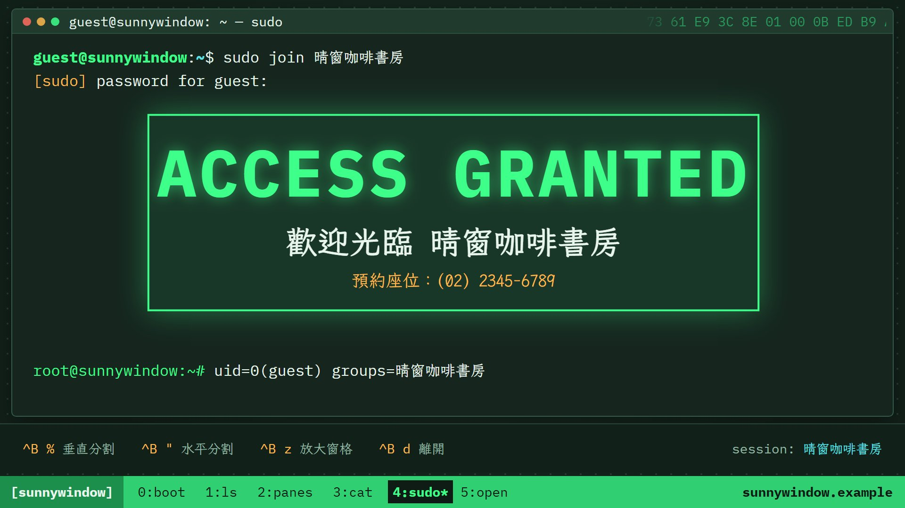
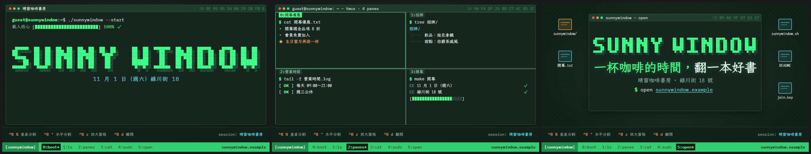

# 範本廣R_駭客終端：有人在終端機打指令查詢你的主題——BIOS 開機、ASCII 方塊大字、ls、tmux 分割窗格、cat、systemctl、sudo join → ACCESS GRANTED，指令在拍點上按 Enter；換章用 clear 往上捲、視窗最小化、窗格分割與放大、最後縮成 logo 視窗，tech house 126 BPM

> 來源：2026-10-09「廣告 30 風格」第 1 批第 09 支（同一句 showreel 母提示詞「做一支 60 秒、展現你是多厲害動態設計師的作品集短片，使出全力」，每支換一種視覺語言；09＝終端機駭客 Terminal，《駭客軍團》片頭感），屏榮版固定 60 秒 8 章，第 1 批 10 支裡留下的 4 支之一；2026-10-10 改成通用範本收進 skill（廣告範本第十七號）。原作保留在本機 `02_試做/廣告30風格`（不在 skill 裡）。
> 觸發：使用者說「**範本廣R／廣R／駭客終端／終端機廣告**」，或在選廣告範本時選廣R。
> 用法：**丟任何文本 → 照下方「內容欄位」挑章、寫成 `storyboard.json` → `engine/ad/make_ad.py 廣R <專案>` 一行出片**。沒有旁白；片長由章數與字數決定（示範片 32.9 秒，換文本實測 40.5 秒）。

## 30 秒示範片

[](示範/示範.mp4)



示範片：[`示範/示範.mp4`](示範/示範.mp4)（範本直接用示範分鏡出的完整片，32.9 秒、4.3 MB：5 章＝boot「BIOS 自檢捲過一樓咖啡／二樓選書／窗邊甜點／座位 48 席／藏書 3000 冊／手沖豆 12 款 → ./sunnywindow --start → ASCII 方塊大字 SUNNY WINDOW → 11 月 1 日（週六）綠川街 18 號開幕 → 晴窗咖啡書房」→（clear 往上捲）ls「ls -l ./sunnywindow/：一樓咖啡 [1F] # 招牌飲品：桂花拿鐵、二樓選書 [2F] # 藏書 3000 冊、窗邊甜點 [窗邊] # 人氣甜點：伯爵茶戚風、✓ 3 directories · 三個區域一次逛完」→（窗格分割，上一章被推擠）tmux 4 格「開幕優惠／招牌／營業時間／開幕：make → BUILD SUCCESS OPEN」→（最後一格放大）cat「開幕.txt：48 席、3000 冊滾動停住；手沖豆 12 款、開幕送手沖咖啡一杯 100 名」→（視窗最小化再展開）end「sudo join 晴窗咖啡書房 → ●●●●●● → 驗證 → ACCESS GRANTED 歡迎光臨 晴窗咖啡書房 → 縮成 logo 視窗：SUNNY WINDOW、一杯咖啡的時間，翻一本好書、$ open sunnywindow.example」）；示範分鏡：[`示範/storyboard.json`](示範/storyboard.json)（虛構的「晴窗咖啡書房」開幕，文本見 [`../../engine/ad/範例文本_小店開幕.md`](../../engine/ad/範例文本_小店開幕.md)）；沒有這個 skill 時用：[`提示詞_範本廣R完整版.md`](提示詞_範本廣R完整版.md)

## 長什麼樣
**一台電腦的終端機與 tmux**：墨綠灰終端機底（#16261f）、磷光綠字（#3dff8a）、琥珀（#ffb84d）與青（#5ce1e6）點綴；全螢幕視窗有標題列（三個圓點、`使用者@主機: ~ — 指令`、右邊平滑往左捲的十六進位資料流）。整支是「有人在打指令查詢某個主題」：提示字元 `guest@主機:~$`、指令逐字打出（每個字一聲鍵盤）、**在拍點上按 Enter**（那一行閃一下綠光）、資訊都以指令輸出出現（一行行從右滑入、數字吃角子老虎滾動、文字進度條）。英數用 IBM Plex Mono，中文用霞鶩文楷 Mono TC；名稱用 6×7 兩格粗筆畫的 **ASCII 方塊大字**由左往右解碼掃描出現（名稱沒有英數就改用楷體大字掃描）。tech house 126 BPM，一拍 14.29 格，**每一章從小節頭開始、長度是整小節**。畫面最下方 180 像素是**靜止的 tmux 狀態列**（快捷鍵提示、session 名稱、`[主機]`、每章一個視窗名、網址），只在換章那格改高亮。
**章型**（storyboard 挑要用的章、順序可換）：
- **boot 開機自檢**（必備，第一章）：BIOS 自檢快速捲動（標題「主機-BIOS (C) 名稱」、0～10 行自檢＋PASS、login 行）→ `./主機 --start` → 載入核心進度條 → ASCII 方塊大字掃描 → 一行副標逐字打出 → 全名滑入
- **whoami ASCII 大字＋資訊**：`whoami` → `neofetch`（左邊小 ASCII 名稱掃描、右邊 2～6 列「鍵：值」一列列滑入、8 色色塊）→ `echo $SLOGAN` → 標語大字逐字打出
- **ls 清單**：`ls -l 目錄` → 2～9 列像資料夾一樣滑入（drwxr-xr-x、使用者、4096、名稱/、[標籤]、# 說明）→ `✓ N directories · 統計` → 反白一列列往下掃
- **tmux 四窗格**：分割線把畫面推成 2～4 個窗格（**上一章留在左上窗格被推擠**），每格同時跑一個指令（清單 ▸／tree ├──／`[ OK ]` 紀錄／make 編譯＋進度條＋BUILD SUCCESS），作用中窗格（綠框）跟著拍子輪流；**章末最後一格放大成全螢幕**接下一章
- **cat 數字查詢**：`cat 檔案` → 1～2 個 TUI 細框大數字吃角子老虎滾動停住 → 0～3 列小數字（單位是 % 時畫成進度條）
- **status systemctl 狀態**：`systemctl status 對象` → 2～6 個服務一個個亮起（● 名稱.service — 說明／Active: 狀態／備註），右側 htop 監控條與滾動負載圖、ping 視窗
- **end sudo join → ACCESS GRANTED → logo**（必備，最後一章）：`sudo join 名稱` → `[sudo] password for 使用者:` → 密碼框 ●●●●●● → 驗證中進度條＋3 個 ✓ → **ACCESS GRANTED** 大框彈出（反白一次）＋歡迎大字＋琥珀小字 → `root@主機:~# uid=0(使用者) groups=…` → **整個終端機縮成一個視窗**（桌面與檔案圖示露出來）：ASCII 名稱、標語、副標、`$ open 網址`

**招牌轉場**（換章點）：`clear` 打完按 Enter、整個畫面逐行由下往上捲走（clear）／視窗高度收成一行標題列、下一章再展開（minimize）／**進 tmux 一律窗格分割**（上一章被分割線推擠）、**出 tmux 一律最後一格放大合併**；其他換章點 clear、minimize 輪流（每章可用 `transition` 指定）；最後一章的 ACCESS GRANTED 之後整個終端機縮成 logo 視窗。章首邊框亮一下（小面積）。

## 適合
任何想要「**科技感、解謎感、像在駭進系統查資料**」的短廣告：資訊科系與程式課程招生、程式／AI 研習、黑客松、科技社團、資安或 IT 活動、軟體或 App 上市，也能拿來包裝一般店家或活動（用「查詢」的口吻把資訊一條條叫出來，最後 ACCESS GRANTED＝歡迎加入）。內容最好有「一個名字（最好有英文或英數縮寫，能拼成 ASCII 大字）＋幾個並列項目（ls、tmux）＋一兩個數字（cat）＋行動呼籲（網址或電話）」。
不適合：需要照片或真人的內容（只有終端機文字與介面）；溫馨、柔和、典雅的題材（這是深色螢光綠的駭客風）；資訊量很大要逐條細讀的通知。和 [廣N 數位故障](../範本廣N_數位故障/README.md) 的差別：廣N 是訊號壞掉的故障美學，廣R 是**乾淨的終端機操作：打字、按 Enter、輸出、窗格**。

## 內容欄位（storyboard.json）
最外層：`name`（成片檔名）、`host`（主機名，小寫英數與 -，最多 18 個字元；沒寫就用 boot 的 `ascii` 轉小寫去空白，例 SUNNY WINDOW → sunnywindow；名稱沒有英數時**一定要寫**，可取文本裡的英文名、網域或工具名）、`user`（提示字元的使用者，預設 guest）、`session`（狀態列右上 session 名稱，預設＝boot 的 `title`）、`url`（狀態列右下與 status 的 ping 對象，預設＝end 的 `url`；沒網址可放電話）、`pace`（選填，閱讀速度＝每秒幾個字，預設 7；英數算半個字）、`labels`（選填，覆寫範本的介面字，見下）、**`chapters`（必備，3～7 章，建議 4～6 章）**。
中文 1 字＝1 字級寬、英數約 0.6；字級在範圍內自動縮，縮到下限還放不下 `make_ad.py` 會停下來說哪個欄位、最多約幾字。boot 以外的章（tmux 前後除外）可以加 `transition`（`clear` 或 `minimize`）指定進這一章的轉場。

| 章 `type` | 欄位（字數上限約略） | 可省略 |
|---|---|---|
| `boot` 開機自檢 **必備，只能放第一章** | `title` 名稱（**必備**；有 `ascii` 時是大字下方的全名，40～64 px、約 26 字；沒有 `ascii` 時名稱本身當楷體大字，96～200 px、約 17 字）、`ascii` ASCII 方塊大字（英文字母、數字、空白、- . ! +，最多約 12 個字，空白算半個）、`sub` 大字下方一行逐字打出（28～40 px，約 55 個英數或 26 字）、`bios` 自檢行 0～10 行（字串或 `{text, status}`，status 預設 PASS；每行約 34 字）、`cmd` 開機指令（預設 `./主機 --start`） | 除了 `title` 都可省 |
| `whoami` ASCII 大字＋資訊 | `info` **2～6 列** `{key（約 4 字）, value（約 22 字）}`、`slogan` 標語大字逐字打出（64～116 px，約 15～26 字）、`ascii`（預設＝boot 的 `ascii`；都沒有就用 boot 的 `title` 楷體字） | `slogan`、`ascii` |
| `ls` 清單 | `dir` 目錄（預設 `./主機/`）；`items` **2～9 列**：`name` 名稱（**必備**，約 16 字）、`tag` 方括號標籤（約 8 字）、`note` # 說明（依前兩欄寬度，約 20～34 字）；`summary` 統計列後面的字（約 40 字） | 除了 `name` 都可省 |
| `tmux` 四窗格（**不能放第一或最後一章、不能連續兩章**） | `panes` **2～4 格**：`label` 窗格名稱（**必備**，約 9 字）、`style`（`list` 清單 ▸、`tree` 樹狀、`log` `[ OK ]` 紀錄、`make` 編譯＋進度條＋BUILD SUCCESS；預設依序輪流）、`cmd` 指令（預設依 style：`cat 名稱.txt`、`tree 名稱/`、`tail -f 名稱.log`、`make 名稱`）、`lines` 輸出 **1～5 行**（4 格時每行約 26 字；3 格時最下面一格是全寬）、`star` 最後一行（★ 琥珀色；make 接在 BUILD SUCCESS 後面）。每格連指令最多 7 行（2 格時 16 行） | `style`、`cmd`、`star` |
| `cat` 數字查詢 | `file` 檔名（預設 `主機.txt`）；`boxes` **1～2 個**：`n` 大數字（**必備，只用文本的數字**，可含 . , : / %，最多 7 字元）、`unit` 單位（1～2 字）、`label` 框上標籤、`pre` 數字上方小字、`note` 框底小字；`rows` 0～3 列：`label`（**必備**，約 19 字）、`n` 數字、`unit`（寫 `%` 時畫成進度條，數字要 0～100）、`note` | 除了 `n`、`rows[].label` 都可省 |
| `status` systemctl 狀態 | `unit` 查詢對象（預設＝主機）；`items` **2～6 個**：`name` 服務名稱（**必備**，自動加 .service）、`desc` 說明（名稱＋說明合計約 30 字）、`state` 狀態（預設 active (running)）、`note` 備註（約 34 字；有 note 的服務最多約 4 個）；`monitor` 監控條標籤 0～4 個（每個約 4 字；預設取服務名稱前 4 字）、`ping`（`false` 拿掉 ping 視窗，沒有網址時建議拿掉） | 除了 `items[].name` 都可省 |
| `end` sudo join → logo **必備，只能放最後一章** | `slogan` logo 視窗標語（**必備**，56～100 px，約 11～21 字；第一個全形逗號、頓號或全形空白前面是綠色）、`join` sudo join 的對象（預設＝boot 的 `title`）、`welcome` ACCESS GRANTED 下方大字（預設「歡迎加入 `join`」，約 18～27 字）、`sub` 琥珀小字（約 34 字）、`checks` 驗證中的 ✓ 0～3 項（預設 身分驗證、權限確認、加入 `join`）、`full` 標語下方一行（約 29～41 字）、`url` `$ open` 後面逐字打出（約 30 個英數）、`ascii`（預設＝boot 的 `ascii`） | 除了 `slogan` 都可省 |

`labels` 可覆寫的介面字：`vsplit`「垂直分割」、`hsplit`「水平分割」、`zoom`「放大窗格」、`detach`「離開」、`session`「session:」、`loadCore`「載入核心」、`total`「total」、`dirs`「directories」、`password`「PASSWORD」、`pwFor`「password for」、`verify`「驗證中」、`check1`「身分驗證」、`check2`「權限確認」、`join`「加入」、`granted`「ACCESS GRANTED」、`welcome`「歡迎加入」、`running`「active (running)」、`success`「✓ BUILD SUCCESS」、`monitor`「[ htop ]」、`ping`「[ ping ]」、`load`「load」、`pass`「PASS」、`ok`「OK」、`reply`「reply from」、`login`「login:」、`bios`「BIOS」、`post`「POST」、`open`「open」。

畫面上的字全部來自 storyboard；範本自己只有上面這些介面字、指令字（ls -l、tmux、cat、systemctl status、sudo join、whoami、neofetch、echo $SLOGAN、clear、ping、tree、tail -f、make、CC、drwxr-xr-x、4096、uid=0、seq=、100% 進度條）與裝飾性的十六進位資料流。**不要編造事實**：自檢行、清單、窗格、服務、驗證項目的字都取自文本；`cat` 的數字**只用文本有的數字**；主機名用文本裡的英文名或英數（店名英文、網域、工具名）。取捨與改寫規則見 [`../../references/廣告範本工作流.md`](../../references/廣告範本工作流.md)。
**怎麼挑章**：名稱一定進 boot（有英文名就寫 `ascii`）；很多「鍵：值」的基本資料（日期、時間、地點、名額）→ whoami；2～9 個並列項目（科別、區域、課程、商品）→ ls；2～4 組各有幾行細節的項目（課程單元、分店、方案）→ tmux；一兩個主數字 → cat；要準備的事、設備、服務、營業狀態 → status；最後 end 放「加入／歡迎」＋標語＋網址或電話。

片長（126 BPM，一拍 14.29 格，每章長度進位到整小節＝4 拍＝1.9 秒）：boot 約 12 拍（自檢行越多、副標越長越久）、whoami 約 12～20 拍（依資訊列與標語字數）、ls「每列 0.75～1.25 拍＋約 5 拍」、tmux 約 12 拍（依最長那一格的行數）、cat 約 12 拍、status「每個服務 1～1.75 拍＋約 4 拍」、end 約 20～22 拍（ACCESS GRANTED 之後縮成 logo 視窗，logo 停到片尾、最後 1.4 秒配樂淡出）；**出場要 clear 的章會多留 2.6 拍打 clear 與捲走**。示範分鏡（5 章）＝32.9 秒；換文本實測（5 章）＝40.5 秒。內容少到排不出 15 秒時 `timeline.py` 會停下來請你加章，不出片。示範片要 25～35 秒：章多時把句子改短、少放項目或調大 `pace`。

## 原始提示詞
逐字保存在 [`原始提示詞_09.txt`](原始提示詞_09.txt)：showreel 母提示詞（make a dynamic 60-second motion graphics video that shows what an incredible motion designer you are, like it's your showreel for a résumé. go all out.）、30 風格清單第 1 批第 09 列（終端機駭客 Terminal：黑底綠字、游標打字、指令跑出科系、ASCII 拼出校名；《駭客軍團》片頭；清單寫 Darksynth 128，原作實際做成 tech house 126）、第 1 批製作規範（結構、硬規則）、原作配樂設定與原作程式開頭註解。
**這個範本怎麼解讀它**：「go all out」＝每一章換一種終端機指令與輸出樣式（自檢、方塊字、清單、窗格、計數、服務、提權），每個換章點用一種「終端機操作」當轉場；原作把它落地成「有人在打指令查詢這間學校」這個故事裝置。通用化時把屏榮的字（PRHS、PRHS-BIOS v11.4、屏東縣屏榮高級中學、PING RONG HIGH SCHOOL、future_student、遇見屏榮　預見未來、6 科 1 群 2 特色、9 個科別與標語、4 個窗格的科別亮點、獎學金 24 萬、免學費 26162、繁星 80%、幼保 3.4 萬、交通車宿舍游泳池、prhs.ptc.edu.tw、權限：學生、桌面圖示科別／獎學金.txt…）全部改讀 storyboard；**8 章改成 7 種章型由 storyboard 挑選、順序可換、可省略、項目數可變**，每章長度依字數算；原作 import 的 `../kit`（節拍、緩動、Roller、pulse、rnd01）搬進範本自己的 `kit.tsx`，原作 `ad09/ui.tsx` 搬成 `ui.tsx`（狀態列、提示字元改讀 timeline），`ad09/subsets.ts`（寫死的字型分塊）改成 `fonts.ts` 依 `allText` 自動算。

**和原作不同的地方**：
- 原作固定 8 章、每章 4 小節、60 秒；通用版章型可挑、長度依內容（示範 5 章 32.9 秒），每章仍是整小節、從小節頭開始，章內打字、Enter、輸出的拍點照原作，「每一列停多久」依字數伸縮。
- 原作第 7、8 章（sudo join → ACCESS GRANTED、logo 視窗）合成一個 end 章型：縮成 logo 視窗的那一刻落在偶數拍上，配樂的 logo 重擊與 riser 對準它，狀態列在那一刻切到「open」。原作第 1 章（BIOS＋ASCII PRHS）＝boot，第 2 章 whoami＋neofetch＋標語＝whoami。
- **ASCII 方塊大字**：原作只畫了 P R H S 四個字；通用版用同一種 6×7、兩格粗筆畫補齊 A–Z、0–9 與 - . ! +，名稱沒有英數時改用楷體大字做同樣的由左往右解碼掃描。方塊與陰影、文字進度條原作是字型裡的 █ ░，通用版改用 div 格子畫（不依賴字型有沒有這些符號，換字型或缺字都不會變）。
- tmux 原作固定 4 格；通用版 2～4 格（2 格左右分、3 格下面一格全寬），每格的輸出樣式（清單、tree、`[ OK ]`、make）可選。原作窗格裡的 `[證照] … PASS` 改成 systemd 式的 `[ OK ] …`（不需要每行有分類字）。
- 原作 BIOS 寫了 CPU 126 MHz、MEM 65536K、ping time=12.3 ms 這類**裝飾用的假數字**；通用版拿掉（BIOS 只列文本的字，ping 只顯示 `seq=1 ok`），避免畫面上出現文本沒有的數字。ls 的檔案大小原作是 4.0K、8.2K…，通用版一律 `4096`（真實 `ls -l` 資料夾的大小），`total` 是真的項目數。
- 換章轉場：原作第 1、5 章結尾 clear、第 2、6 章結尾最小化、第 3→4 章分割、第 4→5 章放大；通用版規則化——進 tmux 一律分割、出 tmux 一律放大，其他換章點 clear、minimize 輪流。clear 那一行若在內容下方放不下（內容太高），先像真的終端機整頁往上推一行再捲走。
- **配樂拆出來**：原作是共用 `ad_audio.py` 的 `build('09')` 呼叫 `make_music.arrange('techhouse', …)` 排到 60 秒；範本自己的 `engine/music.py` 只照搬 tech house 分支用到的樂器（每兩小節換和弦的墊底、四拍大鼓、第 2、4 拍拍手、反拍 open hi-hat、16 分音符反拍 closed hi-hat、切分 sub 低音、16 分音符撥弦琶音）、原作的音效（開頭重擊、換章前一小節 riser＋換章重擊、logo 前兩小節 riser＋重擊、強度 0.9）與混音（master_chain×0.6、音效×0.8、尾巴 1.4 秒淡出），段落與換章點讀時間表。另外**加了終端機音效**：每個打出來的字一聲鍵盤（音高略不同）、Enter 的「咚嗒」、輸出行與數字停住的嗶、BIOS 開機嗶一聲、ACCESS GRANTED 重擊＋主和弦琶音、轉場的咻（原作只有換章音效）。
- **母帶**（原作沒有）：換章那拍的大鼓（×0.6）與拍手（×0.7）降一點、落在換章點的 Enter 降一點、打擊樂與重擊起音整理（`soft_attack`）、開場墊底拉高（`INTRO_GAIN` 2.2）、慢速音量騎乘、16 kHz 低通（`AAC_LP`）、真峰值正規化（`PEAK_CUT` 0，前瞻限幅保留但不壓）。

## 流程與品檢（自帶產線，見 [`../../references/廣告範本工作流.md`](../../references/廣告範本工作流.md)）
1. 讀文本 → 挑章、照上表寫 `storyboard.json` → `python engine/timeline.py storyboard.json` 看預估片長、每一章的開始格與轉場
2. **rundown 給使用者確認** ⛔（每一章的型別與畫面上的字）
3. `python <skill>/engine/ad/make_ad.py 廣R <專案> --stills` → 看 `抽格/_總覽.jpg`（每章中段、每個換章點前後、收尾）
4. `python <skill>/engine/ad/make_ad.py 廣R <專案>`：時間表 → 配樂與音效 → 抽格 → 整支算圖 → 兩段式響度 → **最終品檢**（無旁白模式）
5. 照下表用連續格核對概念忠實度

**品檢說明**：示範片響度 −14.0 LUFS、峰值 −3.9 dBTP；換文本實測 −14.0 LUFS、−4.4 dBTP（都是預設參數，不加 `--limit`）；片長、靜止（最長 3.5／4.0 秒，都是 logo 視窗停到片尾）、光敏、黑畫面都通過，**F1、F2 兩支都是 0**。下方 180 px 的狀態列整支不動，只有換章那格的視窗高亮換一格；clear 轉場捲走的是視窗裡的內容（視窗下緣 y 886 以上），不會掃過狀態列。換文本後若 F1／F2 報在換章點，逐格確認是狀態列高亮換格就不用改。**F11 畫面突跳**（`--jumps-by-design`）示範 6 處、換文本 4 處，逐格看過都是設計：1.1～1.3 秒＝BIOS 自檢捲完硬切到開機畫面（原作）、9.1～9.3 秒＝ls 統計列出現後反白一列列往下掃（每列 3 格，原作）、tmux 第 1 拍的水平分割線推上來與第 2 拍左上窗格從上一章換成新指令（原作）、end 的密碼框彈出（原作）。
**峰值**：`music.py` 從配樂源頭處理——①換章那拍的大鼓與拍手降一點、落在換章點的 Enter 降一點；②重擊、大鼓、拍手、hi-hat、音效的起音整理（`soft_attack`：前 1～4 ms 短淡入、前 4～20 ms 的高頻瞬間收一點）；③開場墊底拉高（`INTRO_GAIN` 2.2，開機章只有暗的墊底＋反拍 hi-hat）；④慢速音量騎乘；⑤母帶 16 kHz 低通；⑥4 倍超取樣真峰值正規化。做完這些已經夠低，前瞻限幅 `PEAK_CUT` 設 0（不壓）。模擬（兩段式響度＋AAC，只有聲音）：`PEAK_CUT` 0 → −4.2／−4.4、0.5 → −4.5／−4.6 dBTP；實際出片 0 → −3.9／−4.4 dBTP，響度範圍 5.6／4.0 LU（< 9，loudnorm 走線性模式）。
**字型測試**：IBM Plex Mono 只有拉丁字，用它的地方一律串接 → 霞鶩文楷 Mono TC → Noto Sans TC；霞鶩文楷 Mono TC 與 Noto Sans TC 只載入 `allText`（storyboard 的字＋介面字＋指令字＋數字符號）用到的子集（`fonts.ts`）。`Root.tsx` 有一個 `FontTest` 合成（`npx remotion still src/index.ts FontTest 測試.png`），把用到的每個字用霞鶩文楷 Mono TC（單獨）、Noto Sans TC（單獨）、實際的兩條串接各排一次：示範與換文本**全部正常顯示、沒有缺字方塊，楷體那一行也沒有退回別的字型**（中文、全形標點、★ ✓ ● ├ └ ▸ ─ … 都在霞鶩文楷 Mono TC 裡）。換文本後仍要看抽格：若有字變成方塊，就換掉那個字或改寫。

**換文本實測**（2026-10-10）：用真實的研習行前通知（教師 AI 程式設計增能研習：115 年 9 月 30 日星期三 12:10－15:10、計 3 小時、電子大樓實習工場 3 樓（設有電梯）、限 30 名、Google Antigravity 2.0 × Apps Script × Vercel、實作一～四、課前準備、完全沒有程式基礎亦可參加、建議提前 10 分鐘到校、海青工商資訊科電話），只換 storyboard、不改程式，**章的組合與順序都和示範不同、走到示範沒走的分支**（名稱沒有英數 → 楷體大字掃描、`host` 用 PDF 的工具名 antigravity、whoami、3 格 tmux、status 不放 ping）：boot「BIOS：Google Antigravity 2.0／Apps Script／Vercel／電腦教室已預先安裝研習所需工具 → 楷體大字 教師 AI 程式設計增能研習 → 115 年 9 月 30 日（星期三）12:10－15:10」→（clear）whoami「日期／時間（計 3 小時）／地點／電梯／名額 限 30 名 → echo $SLOGAN 完全沒有程式基礎亦可參加」→（分割）tmux 3 格「實作一 用 AI 生成第一個網頁 12:38–13:08／實作二 初階部署：GAS 上線、手機掃碼開啟／實作三 make 班級公告管理（核心）、資料即時同步 → BUILD SUCCESS 實作四：Vercel＋GitHub 部署」→（放大）status「systemctl status 課前準備：Google帳號.service 可正常登入（建議使用學校網域帳號）、手機.service、工具.service 無須自行安裝任何軟體、基礎.service 沒有程式基礎亦可參加（全程上機演練）」→（最小化）end「sudo join 增能研習 → ✓ 確認可正常登入的 Google 帳號／攜帶個人智慧型手機／全程上機演練，請安心前來 → ACCESS GRANTED 期待與您在研習現場相見、建議提前 10 分鐘到校 → logo：教師 AI 程式設計增能研習、用 AI 把想法變成可以用的工具、海青工商資訊科　(07) 581-9155 轉 660」→ 40.5 秒成片，畫面上的字都能在 PDF 找到出處（不放講師與承辦人姓名、手機、E-mail）、都在框內；欄位檢查一次通過。實測時找到並修正：標語分色原本也在半形空白切開（「用 AI…」只有「用」變綠），改成只在全形逗號、頓號、全形空白、分號、冒號切。

## 概念忠實度檢查
| # | 招牌特徵 | 怎麼驗 | 現況 |
|---|---|---|---|
| 1 | 墨綠灰終端機、磷光綠字、琥珀與青點綴；標題列三圓點＋使用者@主機＋十六進位資料流 | 任一格 | ✅ |
| 2 | 指令逐字打出、在拍點上按 Enter（那一行閃綠光）、資訊都以指令輸出出現 | 每章開頭的連續格＋配樂 | ✅ |
| 3 | ASCII 方塊大字由左往右解碼掃描（沒有英數時楷體大字同樣掃描） | 示範 boot／logo、換文本 boot | ✅ |
| 4 | 換章招牌轉場：clear 逐行往上捲走、視窗最小化再展開、tmux 窗格分割（上一章被推擠）與放大合併 | 每個換章點前後連續格 | ✅（兩支都有四種） |
| 5 | sudo join → 密碼 → 驗證 → ACCESS GRANTED → 終端機縮成 logo 視窗、桌面圖示露出 | 最後一章 | ✅ |
| 6 | 數字吃角子老虎滾動、文字進度條、監控條跟拍子跳 | 示範 cat、換文本 status | ✅ |
| 7 | 最下方 180 px 靜止 tmux 狀態列，只在換章那格改高亮 | 品檢 F1、F2＝0 | ✅ |
| 8 | tech house 126 BPM：開機章暗墊底＋反拍 hi-hat，第二章起四拍大鼓＋拍手＋低音＋琶音；換章 riser＋重擊；鍵盤、Enter、ACCESS GRANTED 音效對準畫面 | 配樂 | ✅ |
| 9 | 畫面上的字全部來自 storyboard，章型可挑、順序可換、項目數可變 | 換文本實測 | ✅ |

## 範本設定
| 項目 | 設定 |
|---|---|
| 引擎 | 自帶產線：`engine/timeline.py`（欄位檢查＋依章型與字數排每一章的長度（整小節）、每一行指令的打字與 Enter 拍點、輸出行登場拍點、轉場種類、音效事件與抽格）、`engine/music.py`（配樂＋音效）、`engine/remotion/src/`（`Ad.tsx` 換章轉場（clear、最小化、縮成 logo）、桌面、`FontTest`；`chA.tsx` boot、whoami、ls、tmux（分割與放大）；`chB.tsx` cat、status、end、logo 視窗；`ui.tsx` 提示字元、打字、游標、ASCII 方塊字（A–Z 0–9）、楷體掃描、進度條、視窗框、十六進位資料流、tmux 狀態列；`kit.tsx` 節拍、緩動、Roller；`fonts.ts`、`Root.tsx`、`index.ts`）；共用出片程式 `engine/ad/make_ad.py` |
| 畫面 | 1920×1080、30 fps；終端機底 #16261f、桌面 #12201a、磷光綠 #3dff8a、琥珀 #ffb84d、青 #5ce1e6、白 #e8f5ec；視窗 24,18 起 1872×868，狀態列 y ≥ 900 |
| 字型 | IBM Plex Mono 400／700（英數、指令）＋霞鶩文楷 Mono TC 400／700（中文，只載入用到的子集）＋Noto Sans TC 700（備援，只載入用到的子集）；ASCII 方塊字與進度條用 div 畫 |
| 配樂 | numpy 合成 tech house 126 BPM F 小調（make_music 的 techhouse 編曲）：第一章每兩小節換和弦的暗墊底＋反拍 hi-hat → 第二章起四拍大鼓、第 2、4 拍拍手、反拍 open hi-hat、16 分音符 closed hi-hat、切分 sub 低音、16 分音符撥弦琶音 → 最後兩小節回到墊底、1.4 秒淡出 |
| 音效 | 開頭重擊、換章前一小節 riser＋換章重擊、logo 前兩小節 riser＋重擊（原作）；每個字的鍵盤聲、Enter、輸出行與數字停住的嗶、BIOS 開機嗶、ACCESS GRANTED、轉場的咻（範本加） |
| 旁白／字幕 | 無 |
| 響度 | 配樂同拍疊加降一點＋起音整理＋開場墊底拉高＋慢速音量騎乘＋16 kHz 低通＋真峰值正規化（`PEAK_CUT` 0）→ 出片兩段式 loudnorm I −14、TP −2＋alimiter 0.75（預設參數）；實測 −3.9／−4.4 dBTP |

## 檔案
```
engine/timeline.py      storyboard → 時間表（直接執行可印出預估片長、每一章的開始格與轉場）
engine/music.py         時間表 → public/music.wav
engine/remotion/src/    Ad.tsx、chA.tsx、chB.tsx、ui.tsx、kit.tsx、fonts.ts、Root.tsx、index.ts
示範/                   示範.mp4、poster.jpg、總覽.jpg、storyboard.json
原始提示詞_09.txt       逐字原文（母提示詞、第 1 批清單第 09 列、第 1 批製作規範、原作配樂設定與程式開頭註解）
提示詞_範本廣R完整版.md  沒有 skill 時貼給 AI 的完整提示詞
```
