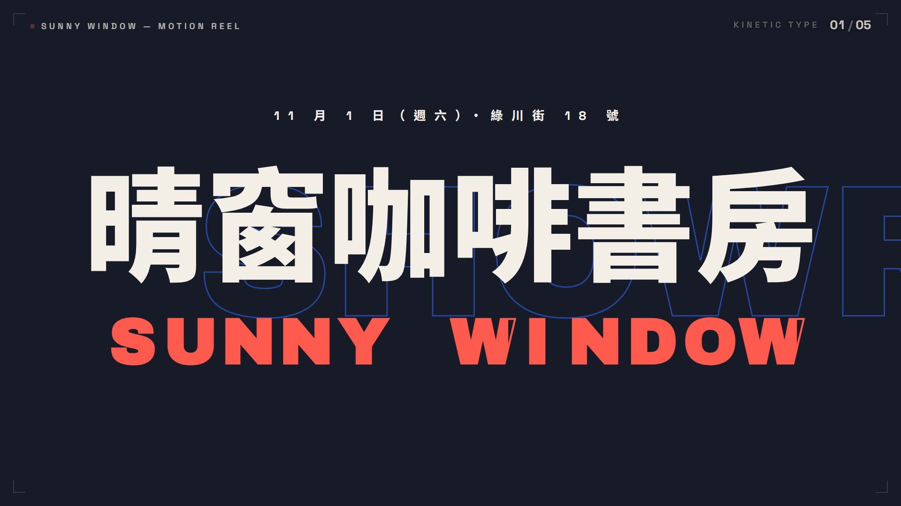
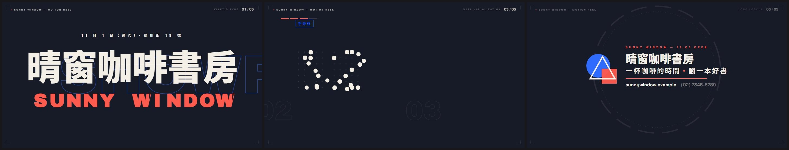

# 範本廣S_技法巡禮：動態設計作品集 showreel 的 60 秒版——每一章炫一種動態設計手法（字體動態、字體拆解、數據視覺化、瑞士格線、2.5D 等角、線條路徑、形狀變形、LOGO 定格），右上角標出技法名，章與章之間的轉場各不相同，tech house 128 BPM

> 來源：2026-10-09 使用者提供的 showreel 提示詞 60 秒版（「make a dynamic 60-second motion graphics video that shows what an incredible motion designer you are…go all out.」，和 skillry.dev 人氣第 1 名 @stephanlivera 的 15 秒版是同一句），本機試做「60 秒動態設計作品集_屏榮」（固定 8 章 60 秒）；2026-10-10 改成通用範本收進 skill（廣告範本第十九號）。原作保留在本機 `02_試做/屏榮招生/風格合集/video`（`src/styles/Showreel.tsx`＋`showreel/`、`showreel_audio.py`，不在 skill 裡）。
> 觸發：使用者說「**範本廣S／廣S／技法巡禮／動態設計作品集**」，或在選廣告範本時選廣S。
> 用法：**丟任何文本 → 照下方「內容欄位」挑章、寫成 `storyboard.json` → `engine/ad/make_ad.py 廣S <專案>` 一行出片**。沒有旁白；片長由章數與字數決定（示範片 32.8 秒，換文本實測 43.1 秒）。

## 30 秒示範片

[](示範/示範.mp4)



示範片：[`示範/示範.mp4`](示範/示範.mp4)（範本直接用示範分鏡出的完整片，32.8 秒、6.7 MB：5 章＝KINETIC TYPE「晴窗咖啡書房／SUNNY WINDOW／11 月 1 日（週六）・綠川街 18 號」→（斜向色條）TYPE DECONSTRUCT「一杯咖啡・一本好書」→（珊瑚圓點擦除）DATA VISUALIZATION 4 個面板「座位 48 席（堆疊柱）、二樓選書 3000 冊（吃角子老虎＋印章「書」）、手沖豆 12 款（點陣）、開幕週全品項 8 折（環形圖）」→（橫向切片）SWISS GRID SYSTEM 6 張卡「一樓咖啡、二樓選書、窗邊甜點、每天 09:00～21:00、會員免費加入、預約座位」→（鏡頭穿越「窗邊甜點」卡片）LOGO LOCKUP「晴窗咖啡書房／一杯咖啡的時間・翻一本好書／網址、電話」）；示範分鏡：[`示範/storyboard.json`](示範/storyboard.json)（虛構的「晴窗咖啡書房」開幕，文本見 [`../../engine/ad/範例文本_小店開幕.md`](../../engine/ad/範例文本_小店開幕.md)）；沒有這個 skill 時用：[`提示詞_範本廣S完整版.md`](提示詞_範本廣S完整版.md)

## 長什麼樣
**一支動態設計師的作品集**：深藍墨底 #171a27＋電光藍 #2f6bff＋螢光珊瑚 #ff5a4e＋暖白 #f4efe6，中文 Noto Sans TC 900、數字與英文大字 Archivo Black、小標 Space Grotesk。每一章炫一種手法，**右上角固定標出技法名＋章號「03 / 05」**（換章時技法名上下捲動、章號滾動），左上角一行固定小字「名稱 — MOTION REEL」（跟著拍子閃的珊瑚小點），四角細框線；畫面最下方 180 px 只有靜止的角標。tech house 128 BPM（一拍 14.0625 格），**每一章從小節頭開始、長度是整小節**，關鍵動作都落在拍點。
**章型**（storyboard 挑要用的章、順序可換、可省略；開場與 LOGO 必備）：
- **open KINETIC TYPE**（必備，第一章）：中央細線畫開、兩端小標 → 藍圓、珊瑚方塊、白三角框依拍點彈出，每拍硬切一個背景大字（MOTION／DESIGN／SHOW／REEL），形狀螺旋收攏撞在一起 → 爆開（震波環、碎片、單次閃白）→ 名稱大字一字一字從 2.4 倍彈下（上下兩半切片位移）、英文縮寫描邊飛出排好再由左往右填色、上方小字、背景巨大描邊字 SHOWREEL 橫移 → 整群推近
- **type TYPE DECONSTRUCT**：兩行字逐字砸入（第一行上下交錯、第二行從右斜滑入）→ 合併成一行、中間一顆珊瑚圓點 → 描邊／填色波浪、切片位移、逐字翻轉、重點字以外退暗＋底線 → 炸散，只剩圓點放大
- **data DATA VISUALIZATION**：2～4 個面板排成一列，每個面板結束時甩鏡（橫移＋歪斜）到下一個；面板有 4 種：`ring` 環形圖、`bars` 堆疊柱、`slot` 吃角子老虎數字格＋印章、`dots` 粒子聚成點陣數字；左上進度刻度、背景面板編號大字視差移動
- **grid SWISS GRID SYSTEM**：12 欄格線畫出 → 3～9 張卡片依拍點從左右滑入 → 波浪翻面（背面是說明）再翻回 → 每拍重排版面、輪流放大一張 → 其他卡片縮走，聚焦的那張變成格線平面圖
- **iso 2.5D ISOMETRIC**：2D 平面圖 → 整個世界轉 45°、壓扁、長出高度變成等角場景（平面多邊形畫法：逐層長高的塔、雷射描星形的平台、燈與相機腳架、懸浮平板）→ 2～4 個標註引線一拍一個，鏡頭推近再橫移；「從 2D 到 2→3D」數字滾動
- **lines LINES & PATHS**：晶片描邊 → 裝飾走線點亮 → 2～6 條走線一拍一條通往標籤（左右交替）→ 晶片通電、晶圓格點亮、脈衝沿線跑、鏡頭推近 → 描線畫出英文字標再填色
- **morph SHAPE MORPH**：右側色塊每段由下往上換色（藍→珊瑚→白→藍），圖示依拍點一個變一個、最後變成圓；左側每段換一組字（色塊小標、大標、—項目），舊的往上滑出
- **logo LOGO LOCKUP**（必備，最後一章）：同心環每拍收縮、**前面各章的數字與名稱**＋幾何形狀螺旋收斂、每拍硬切一個詞 → 重擊（閃白、震動、震波環、碎片）→ 三個幾何形狀組成 logo、英文小字、名稱、標語、底線、網址電話，虛線外環慢慢轉

**招牌轉場**（每個換章點一種，相鄰不重複）：斜向色條掃過 `bars`、上一章的圓點放大成珊瑚圓再以圓形擦除打開 `dot`、8×5 方格磚依對角線長出再縮掉 `tiles`、鏡頭穿越聚焦的卡片 `through`、珊瑚與藍兩層液態波浪上漲 `wave`、橫向切片左右交錯滑入 `slices`、上一章的主圖形放大成白圓再從中心開洞穿越 `zoom`。自動規則：**type 之後用 dot（從那顆圓點擦開）、grid 之後用 through（穿越聚焦的卡片）、進 logo 用 zoom**，其他依 bars → slices → wave → tiles → dot 輪流（不和上一個重複）；每章可用 `transition` 指定。

**和 [廣K 紅點作品集](../範本廣K_紅點作品集/README.md) 的差別**（同一句 showreel 提示詞的兩種解讀）：廣K 是 **15 秒版**——米白紙底、一顆紅點從頭帶到尾的單一快剪，所有段落由同一個主角串成一條不斷的線、每拍整個畫面推一下震一下。廣S 是 **60 秒版的「技法巡禮」**——深藍墨底、沒有貫穿全片的主角，**每一章換一種動態設計手法、角落標技法名**，章與章之間用 7 種不同的招牌轉場切換。兩者配色（米白紅 vs 深藍墨珊瑚藍）、字型（宋體＋Anton vs 黑體＋Archivo Black）、結構（一條線 vs 章節目錄）都不同，畫面不會像。

## 適合
任何想要「**炫技、作品集感、資訊分成幾種面向**」的短廣告：開幕、活動或研習宣傳、科系或社團招生、產品上市、年度成果。內容最好有「名稱＋一句可拆兩行的標語＋幾個數字＋幾個項目或流程」：數字給 data、項目給 grid、流程給 lines、地點給 iso、分段重點給 morph。
不適合：需要照片或真人的內容（純圖形與文字）；沉穩、溫暖、手作感的題材（這是深色科技感的 showreel）；只有一句標語（內容太少，最短也要約 15 秒）；資訊很多、要逐條細讀的通知（每章停留短）。

## 內容欄位（storyboard.json）
最外層：`name`（成片檔名）、`pace`（選填，閱讀速度＝每秒幾個字，預設 7；越小每章停越久；英數算半個字）、`hud`（選填，左上角固定小字，預設「open 的 `mark`（沒有就 `title`）— MOTION REEL」；`""` 拿掉）、`labels`（選填，覆寫範本的介面字，見下）、**`chapters`（必備，3～8 章，示範 25～35 秒約 5～6 章）**。
中文 1 字＝1 字級寬、英數約 0.6；字級在範圍內自動縮，縮到下限還放不下 `make_ad.py` 會停下來說哪個欄位、最多約幾字。第一章以外每章都可以加 `transition`（`bars`、`dot`、`tiles`、`through`、`wave`、`slices`、`zoom`）。

| 章 `type` | 欄位（字數上限約略） | 可省略 |
|---|---|---|
| `open` KINETIC TYPE **必備，只能放第一章** | `title` 名稱大字（**必備**，1～8 字，300～120 px，中文最多約 8 字）、`mark` 英文縮寫或英文名（描邊飛入再填色，最多 12 個字元）、`kicker` 名稱上方小字（日期地點等，約 26 字）、`tag` 細線左端小標（約 25 個英數） | 除了 `title` 都可省 |
| `type` TYPE DECONSTRUCT | `line1`、`line2` 兩行字（**必備**，各 1～6 字，合起來最好 4～10 字；中間會插一顆圓點）、`hi` 重點字（寫出要標珊瑚色的字，例「咖啡書」；其餘退暗；不寫就不退暗） | `hi` |
| `data` DATA VISUALIZATION | `panels` **2～4 個**，每個 `kind`＋欄位（**數字只用文本有的**，可含 . , : / % + -）：<br>`ring` 環形圖：`n`（**必備**，約 5 位數）、`unit`（`%` 時環照比例畫，其他畫滿一圈）、`tag` 小標框、`head` 數字下方一行（約 13 字）、`center`／`centerSub` 環中央大字／小字（約 6／11 字）、`n2`＋`unit2`＋`pre2` 第二個數字（`unit2` 為 % 時多一圈內環）、`note` 說明（約 21 字）<br>`bars` 堆疊柱：`n`（**必備**，約 4 位數）、`unit`（1～2 字，彈出）、`tag`、`head` 數字上方一行（約 10 字）、`note`（約 22 字）<br>`slot` 吃角子老虎：`n`（**必備**，最多 6 位）、`unit`（1～2 字）、`head` 上方大字（約 12 字，`hi` 寫出要標珊瑚色的字）、`note` 下方說明（約 34 字，數字自動標白）、`stamp` 圓形印章（1～2 字）<br>`dots` 點陣數字：`n`（**必備**，最多 4 字元）、`unit`（1～2 字）、`unit2` 直排珊瑚小字（1～3 字）、`tag`、`head`（約 23 字）、`note`（約 33 字） | 每個面板除了 `n` 都可省；`kind` 省略時依序 ring、bars、slot、dots |
| `grid` SWISS GRID SYSTEM | `head` 標題（約 20 字，數字自動用 Archivo Black 標色）；`items` **3～9 張卡**：字串或 `{name 卡片名稱（**必備**，約 11 字）, note 說明（約 17 字，翻面時是背面大字）, color ink／blue／coral}`；`focus` 最後聚焦第幾張（從 0 算，預設中間那張，接「鏡頭穿越卡片」） | `head`、`note`、`color`、`focus` |
| `iso` 2.5D ISOMETRIC | `head` 標題（**必備**，約 11 字）、`sub` 珊瑚色副標（約 24 字）、`items` **2～4 個**標註（每個約 13～16 字，依位置） | `sub` |
| `lines` LINES & PATHS | `head` 標題（**必備**，約 20 字）、`items` **2～6 個**標籤（每個約 10～13 字，左右交替）、`chip` 晶片上的字（英數約 4 個或中文 2 字）、`mark` 最後描線字標（英數約 14 個；省略時用 open 的 `mark`，設 `""` 就不畫） | `chip`、`mark` |
| `morph` SHAPE MORPH | `groups` **1～4 段**：`tag` 色塊小標（約 23 字）、`title` 大標 1～2 行（**必備**，每行約 10 字）、`items` 0～3 條項目（每條約 20 字）、`icon` 1～2 個圖示（`plane`、`globe`、`mountain`、`cup`、`badge`、`house`、`heart`、`bag`、`trophy`；不寫就依序輪流） | 除了 `title` 都可省 |
| `logo` LOGO LOCKUP **必備，只能放最後一章** | `name` 名稱（**必備**，84～54 px，約 13～20 字）、`en` 名稱上方英文小字（約 45 個英數）、`slogan` 標語（約 19 字，「・」自動標珊瑚色）、`url` 網址、`tel` 電話（同一行，合計約 32 個英數）、`words` 重擊前每拍硬切的大字 0～4 個（每個約 7 字） | 除了 `name` 都可省 |

`labels` 可覆寫的介面字：`reel`「MOTION REEL」（左上角與開場細線右端）、`words`「MOTION DESIGN SHOW REEL」（開場硬切大字，空格分開最多 4 個）、`marquee`「SHOWREEL」（開場背景描邊字）、`typeSub`「TYPE / DECONSTRUCT / REBUILD」、`grid`「GRID SYSTEM」（卡片數自動接在後面）、`iso`「從 2D 到」、`circuit`「CIRCUIT / PATH」、`morph`「SHAPE / MORPH」；設成 `""` 就不顯示。8 個技法名（KINETIC TYPE…）是範本的章節標籤，不能改。
LOGO 章螺旋收斂的元素**自動取自前面各章**（data 的「數字＋單位」、grid 的短名稱，最多 5 個）＋幾何形狀（圓、方塊、三角、卡片（顯示 grid 的 `head` 或 open 的 `title`）、立方體、晶片、飛機、圓環、柱狀圖），不用另外寫。

畫面上的字全部來自 storyboard；範本自己只有上面這些介面字、8 個技法名、章號與數字刻度。**不要編造事實**：數字只用文本有的數字；英文縮寫可以是文本的英文名或直譯；取捨與改寫規則見 [`../../references/廣告範本工作流.md`](../../references/廣告範本工作流.md)。
**怎麼挑章**：名稱一定進 open；標語拆兩行進 type；2～4 個數字 → data（座位數、冊數、名額、折扣、時數）；3～9 個並列項目 → grid；一個地點、場所或設備＋幾個特點 → iso；流程、單元、時段 → lines；1～4 組「小標＋重點＋說明」（課前準備、三大特色）→ morph；最後 logo 放名稱、標語、網址電話。

片長（128 BPM，一拍 14.0625 格，每章長度進位到整小節＝4 拍＝1.875 秒；最後一章不進位）：open 12 拍起、type 12 拍起（每字半拍砸入）、data 每個面板 4 拍起、grid 12～16 拍起（依卡片數與字數）、iso 12 拍起、lines「標籤數＋8～10」拍起、morph 每段 4 拍起、logo「4～5＋6」拍起。章內停留時間依字數伸縮（`pace`），動作本身照原作速度（開場與等角章的前段動作壓縮成原作的一半，仍落在半拍上）。示範分鏡（5 章）＝32.8 秒；換文本實測（5 章，文字較多）＝43.1 秒。內容少到排不出 15 秒時 `timeline.py` 會停下來請你加章，不出片。示範片要 25～35 秒：章多時把句子改短、少放項目或調大 `pace`。

## 原始提示詞
逐字保存在 [`原始提示詞_showreel.txt`](原始提示詞_showreel.txt)：make a dynamic 60-second motion graphics video that shows what an incredible motion designer you are, like it's your showreel for a résumé. go all out.
**這個範本怎麼解讀它**：「showreel for a résumé」＝作品集短片，不講內容、蒙太奇式展示手法；「go all out」＝每章換一種技法、轉場本身也是亮點；「60-second」＝原作 8 章×4 小節。原作把它落地成「技法巡禮」：8 章依序展示 8 種動態設計手法，角落標技法名。通用化時把屏榮的字（PRHS、屏東縣屏榮高級中學、遇見屏榮・預見未來、PRHS — MOTION REEL 2026、普通科／繁星推薦 80%／50%、獎學金 24 萬、全面免學費 26162 元、幼保 3.4 萬起跳、6 科・1 群・2 特色班與 9 個科別卡片、多媒體設計科攝影棚的 4 個標註、電機與電子群 6 個學習主題、4 個科別的色塊文字、網址與電話、收尾的 12 個元素）全部改讀 storyboard；**固定 8 章改成 8 種章型由 storyboard 挑選**（開場與 LOGO 必備、中間 6 種可挑可換順序可省略），每章的項目數可變、長度依字數算；原作的 `showreel/kit.tsx` 搬進範本的 `kit.tsx`（補齊點陣字的 0～9 與符號、加時間伸縮），`showreel_audio.py` 改寫成範本自己的 `engine/music.py`。
**和原作不同的地方**：
- **片長**：原作固定 60 秒、每章 7.5 秒；通用版 5～6 章約 25～35 秒，每章仍是整小節、從小節頭開始。為了縮短，開場與等角章的「前段動作」（形狀彈出、硬切大字、平面圖轉等角）用時間伸縮壓成原作的一半（每拍的事變成每半拍，仍對齊拍點），「停留讀字」的段落依字數伸縮；字體拆解章改成每字半拍砸入（原作每字一拍）；LOGO 章的重擊從第 8 拍提前到第 4～5 拍。
- **轉場跟著章走**：原作 7 個轉場依固定順序寫死（圓點擦除要從第 2 章的圓點、穿越卡片要從第 4 章的聚焦卡片、圖形放大要從第 7 章的圓）。通用版每章帶自己的「錨點」（type 的圓點、morph 的圖形中心、其他章畫面中央），dot 與 zoom 從上一章的錨點開始；through 從 grid 聚焦的卡片穿越（其他章前面指定時用畫面中央的框）；轉場依相鄰章自動挑，相鄰不重複。
- **數據面板**：原作 4 個面板各寫死一種；通用版 2～4 個面板，每個可選 4 種之一，欄位都可省；堆疊柱的片數＝數字（6～30 的整數時）否則 24 片；環形圖只有單位是 % 時照比例畫，其他畫滿一圈（不把非百分比的數字畫成比例）。
- **格線卡片數**：原作 9 張（3×3 → 4×3 每拍放大一張）；通用版 3～9 張，4 張用 2×2、5 張以下重排用 4×2、6 張以上用 4×3；重排次數 3～5 次依卡片數與片長。
- **等角場景的物件**：原作的 3D 列印機、雷射切割機、攝影棚燈與相機、平板是多媒體設計科的設備；通用版保留同樣的造形當抽象的等角場景，標註文字改讀 storyboard。
- **線條章**：走線與標籤列數依標籤數（2～6 個、1～3 列）；下方裝飾走線最低到 y 800（原作 860），因為通電後鏡頭推近 1.22 倍，原作的走線端點與脈衝會進到下方 180 px——換文本第一次出片品檢 F1 報在 22.1 秒（脈衝跑到走線盡頭消失），已修正。
- **形狀變形**：原作 4 段固定 9 次變形；通用版 1～4 段，每段 1～2 個圖示（9 種圖示庫），最後一律變成圓（接圖形放大轉場）。
- **收尾元素**：原作 12 個收斂元素寫死；通用版自動取前面各章的數字與短名稱＋幾何形狀。
- **配樂拆出來**：原作是 `showreel_audio.py` 呼叫 `make_music.arrange('techhouse', 128, 'Am', 60 秒, …)`；範本自己的 `engine/music.py` 照搬 tech house 用到的樂器、原作音效（開頭重擊 0.6、換章前一小節 riser 0.35＋換章重擊 0.55、logo 前 riser 0.3＋重擊 0.7）與混音（master_chain×0.6、音效×0.8），段落、換章點與 logo 重擊讀時間表；另外**加了章內事件音效**（形狀彈出、硬切大字、爆開、逐字砸入、數字停住、印章、甩鏡與翻面），原作只有換章音效。
- **母帶**（原作只有整體正規化）：換章那拍的大鼓與拍手降一點、落在換章點的事件音效降一點、打擊樂與重擊起音整理（`soft_attack`）、開場墊底拉高（`INTRO_GAIN` 2.2）、慢速音量騎乘、16 kHz 低通（`AAC_LP`）、4 倍超取樣真峰值正規化；前瞻限幅 `PEAK_CUT` 0（不壓）。

## 流程與品檢（自帶產線，見 [`../../references/廣告範本工作流.md`](../../references/廣告範本工作流.md)）
1. 讀文本 → 挑章、照上表寫 `storyboard.json` → `python engine/timeline.py storyboard.json` 看預估片長、每一章的開始格與轉場
2. **rundown 給使用者確認** ⛔（每一章的章型、技法名與畫面上的字）
3. `python <skill>/engine/ad/make_ad.py 廣S <專案> --stills` → 看 `抽格/_總覽.jpg`（每章中段、每個換章點、收尾）
4. `python <skill>/engine/ad/make_ad.py 廣S <專案>`：時間表 → 配樂與音效 → 抽格 → 整支算圖 → 兩段式響度 → **最終品檢**（無旁白模式）
5. 照下表用連續格核對概念忠實度

**品檢說明**：示範片響度 −14.0 LUFS、峰值 −3.6 dBTP；換文本實測 −14.0 LUFS、−4.1 dBTP（都是 `make_ad.py` 預設參數）；片長、靜止（最長 3.0／4.25 秒，是 LOGO 定格的停留）、光敏、黑畫面都通過。**示範 F1、F2 都是 0**。換文本 **F1 1 處（35.6 秒）是設計**：進 LOGO 的 `zoom` 轉場，白圓蓋滿全畫面後在換章那一格從中心開洞，下方字幕帶從「全白」變成「白＋深色圓弧」，逐格看過是原作的圖形放大穿越，不是字幕閃爍（`zoom`、`bars`、`tiles`、`wave`、`slices` 這類整個畫面的轉場經過下方 180 px 是設計；換文本後若 F1／F2 報在換章點前後 15 格內，逐格確認是轉場就不用改）。**F11 畫面突跳**（`--jumps-by-design`）示範 5 處、換文本 6 處，逐格看過都是原作手法：0.97 秒＝形狀依拍點彈出、1.9 秒＝每拍硬切背景大字、換章點前後＝斜向色條掃入、LOGO 章＝zoom 白圓開始放大與重擊閃白（全片只有開場爆開與 LOGO 重擊兩次閃白）。
**峰值**：`music.py` 從配樂源頭處理——①換章那拍的大鼓、拍手降一點，落在換章點與 logo 重擊上的事件音效降一半；②重擊、大鼓、拍手、hi-hat 與事件音效的起音整理（`soft_attack`：前 1～4 ms 短淡入、前 4～20 ms 的高頻瞬間收一點）；③開場墊底拉高（`INTRO_GAIN` 2.2；第一章只有墊底＋hi-hat，響度範圍太大時出片的 loudnorm 會退回動態模式）；④慢速音量騎乘；⑤母帶 16 kHz 低通；⑥4 倍超取樣真峰值正規化；前瞻限幅 `PEAK_CUT` 0（不壓也已在 −3 dBTP 以下）。預設參數出片：示範 −3.6、換文本 −4.1 dBTP。
**字型測試**：Archivo Black、Space Grotesk 只有拉丁字，用它們的地方一律串接 → Noto Sans TC；Noto Sans TC 只載入 `allText`（storyboard 的字＋介面字＋技法名＋數字符號）用到的子集（`fonts.ts`）。`Root.tsx` 有一個 `FontTest` 合成（`npx remotion still src/index.ts FontTest 測試.png`），把用到的每個字用三種字型串接各排一次：示範與換文本**全部正常顯示、沒有缺字方塊**；中文、全形標點、● ・ — ～ × 在兩個拉丁字型的行裡都退回黑體，英數是各自的字型。換文本後仍要看抽格：若有字變成方塊，就換掉那個字或改寫。

**換文本實測**（2026-10-10）：用真實的研習行前通知（教師 AI 程式設計增能研習：115 年 9 月 30 日星期三 12:10－15:10、計 3 小時、限 30 名、電子大樓實習工場 3 樓（設有電梯）、Google Antigravity 2.0 × Apps Script × Vercel、實作一～四、課前準備、全程上機演練、海青工商資訊科電話），只換 storyboard、不改程式，**章的組合與順序都和示範不同**（示範用 open、type、data、grid、logo；換文本用 open、iso、lines、morph、logo，8 種章型兩支合起來全用到；轉場示範 bars、dot、slices、through，換文本 bars、tiles（指定）、slices、zoom）：open「AI 程式設計／APPS SCRIPT／115 年 9 月 30 日（星期三）12:10－15:10／海青工商資訊科」→（斜向色條）iso「電子大樓實習工場 3 樓／設有電梯，可搭乘電梯上樓／標註：限 30 名、計 3 小時、全程上機演練、已預先安裝研習所需工具」→（方格磚）lines「當日課程流程／晶片 AI／實作一：用 AI 生成網頁、實作二：GAS 上線、實作三：班級公告管理、實作四：Vercel 部署／描線字標 APPS SCRIPT」→（橫向切片）morph 三段「課前準備 Google 帳號（確認可正常登入、建議使用學校網域帳號）、課前準備 個人智慧型手機（掃描 QR Code 測試網頁部署成果）、完全沒有程式基礎 亦可參加（全程上機演練、請安心前來）」→（圖形放大穿越）logo「教師 AI 程式設計增能研習／GOOGLE ANTIGRAVITY 2.0 × APPS SCRIPT × VERCEL／用 AI 把想法變成可以用的工具／海青工商資訊科 (07) 581-9155 轉 660」→ 43.1 秒成片，畫面上的字都能在 PDF 找到出處（不放講師與承辦人姓名、手機、E-mail）、都在框內；欄位檢查一次通過。實測時找到並修正：線條章通電推近後下方走線進到字幕帶（F1 2 → 1，剩下的是 zoom 轉場，見上）。

## 概念忠實度檢查
| # | 招牌特徵 | 怎麼驗 | 現況 |
|---|---|---|---|
| 1 | 深藍墨底＋電光藍＋螢光珊瑚＋暖白；四角細框線、左上固定小字 | 任一格 | ✅ |
| 2 | 每章一種動態設計手法，右上角標技法名＋章號滾動 | 每章中段 | ✅（兩支合起來 8 種章型全用到） |
| 3 | 開場幾何形狀依拍點彈出、硬切大字、螺旋收攏爆開成名稱大字（切片位移）＋描邊縮寫填色 | 示範、換文本 0～5 秒連續格 | ✅ |
| 4 | 字體拆解：逐字砸入、合併成一行、描邊填色波浪、切片、翻轉、退暗、炸散留圓點 | 示範第 2 章 | ✅ |
| 5 | 數據視覺化：面板甩鏡、環形圖、堆疊柱、吃角子老虎＋印章、粒子聚成點陣 | 示範第 3 章 | ✅ |
| 6 | 瑞士格線：12 欄格線、卡片滑入、波浪翻面、每拍重排、聚焦一張穿越 | 示範第 4 章 | ✅ |
| 7 | 2.5D 等角（平面畫法）、走線點亮與脈衝、形狀變形與色塊換色 | 換文本第 2～4 章 | ✅ |
| 8 | 每個換章點一種招牌轉場、相鄰不重複 | 每個換章點前後連續格 | ✅（7 種在兩支裡全出現） |
| 9 | LOGO：全片元素螺旋收斂、每拍硬切一個詞、重擊出 lockup 定格 | 兩支最後 7 秒 | ✅ |
| 10 | tech house 128 BPM：第一章墊底＋hi-hat、第二章起全編制；換章 riser＋重擊；章內事件音效對準畫面 | 配樂 | ✅ |
| 11 | 下方 180 px 只放靜止角標 | 品檢 F1、F2（轉場除外） | ✅ |
| 12 | 畫面上的字全部來自 storyboard，章型可挑、順序可換、項目數可變 | 換文本實測 | ✅ |

## 範本設定
| 項目 | 設定 |
|---|---|
| 引擎 | 自帶產線：`engine/timeline.py`（欄位檢查＋依章型與字數排每章長度（整小節）、章內拍點與時間伸縮、轉場種類、音效事件與抽格）、`engine/music.py`（配樂＋音效）、`engine/remotion/src/`（`Ad.tsx` 7 種招牌轉場、HUD、`FontTest`；`chA.tsx` open、type；`chB.tsx` data、grid；`chC.tsx` iso、lines；`chD.tsx` morph、logo；`kit.tsx` 節拍、緩動、時間伸縮、Roller、形狀變形、點陣字；`fonts.ts`、`Root.tsx`、`index.ts`）；共用出片程式 `engine/ad/make_ad.py` |
| 畫面 | 1920×1080、30 fps；深藍墨 #171a27、電光藍 #2f6bff、螢光珊瑚 #ff5a4e、暖白 #f4efe6 |
| 字型 | Noto Sans TC 700／900（中文，只載入用到的子集）＋Archivo Black（數字、英文大字）＋Space Grotesk 500／700（小標、介面字）；兩個拉丁字型缺字都退回 Noto Sans TC |
| 配樂 | numpy 合成 tech house 128 BPM A 小調（make_music 的 techhouse 編曲）：第一章每兩小節換和弦的墊底＋反拍 hi-hat → 第二章起四拍大鼓、第 2、4 拍拍手、反拍 open hi-hat、16 分 closed hi-hat、切分 sub 低音、16 分撥弦琶音 → 最後兩小節回到墊底、1.4 秒淡出 |
| 音效 | 開頭重擊、換章前一小節 riser＋換章重擊、LOGO 前 riser＋重擊（原作）；形狀彈出、硬切大字、爆開、逐字砸入、數字停住、印章、甩鏡與翻面的咻（範本加） |
| 旁白／字幕 | 無 |
| 響度 | 配樂同拍疊加降一點＋起音整理＋開場墊底拉高＋慢速音量騎乘＋16 kHz 低通＋真峰值正規化（`PEAK_CUT` 0）→ 出片兩段式 loudnorm I −14、TP −2＋alimiter 0.75（預設參數）；實測 −3.6／−4.1 dBTP |

## 檔案
```
engine/timeline.py        storyboard → 時間表（直接執行可印出預估片長、每一章的開始格與轉場）
engine/music.py           時間表 → public/music.wav
engine/remotion/src/      Ad.tsx、chA.tsx、chB.tsx、chC.tsx、chD.tsx、kit.tsx、fonts.ts、Root.tsx、index.ts
示範/                     示範.mp4、poster.jpg、總覽.jpg、storyboard.json
原始提示詞_showreel.txt   逐字原文（60 秒 showreel 提示詞）
提示詞_範本廣S完整版.md    沒有 skill 時貼給 AI 的完整提示詞
```
